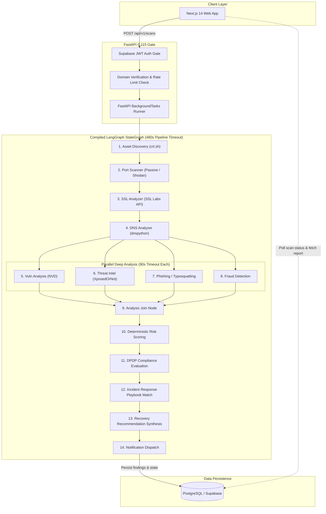

<div align="center">

  

  # Qelvix

  ### AI-Powered Cybersecurity for Indian MSMEs
  **"See. Understand. Secure."**

  <p align="center">
    <em>An external attack surface intelligence platform built for small and medium businesses — passive perimeter discovery, deterministic risk scoring, and plain-language AI remediation.</em>
  </p>

  <p align="center">
    <a href="https://github.com/vanshdigitals/Qelvix-AI/actions"></a>
    <a href="https://python.org"></a>
    <a href="https://fastapi.tiangolo.com"></a>
    <a href="https://langchain-ai.github.io/langgraph/"></a>
    <a href="https://nextjs.org"></a>
    <a href="https://www.typescriptlang.org"></a>
    <a href="https://supabase.com"></a>
    <a href="#license"></a>
  </p>

  <p align="center">
    <a href="#why-qelvix">Why Qelvix</a> •
    <a href="#how-qelvix-works">How It Works</a> •
    <a href="#core-capabilities">Capabilities</a> •
    <a href="#rules-decide-ai-explains">The Core Principle</a> •
    <a href="#security-scan-pipeline">Scan Pipeline</a> •
    <a href="#ai-architecture">AI Architecture</a> •
    <a href="#quick-start">Quick Start</a> •
    <a href="#documentation-hub">Docs Hub</a>
  </p>

</div>

---

## Why Qelvix

India's 63+ million Micro, Small, and Medium Enterprises (MSMEs) are digitizing rapidly — moving invoicing to the cloud, managing web storefronts, and adopting modern SaaS tools. However, their cybersecurity reality remains alarming:

* **Enterprise tools are inaccessible:** Platforms like Tenable, Qualys, and CrowdStrike require six-figure budgets, complex network setups, and dedicated SecOps teams that MSMEs cannot afford.
* **Cryptic vulnerability reports:** Traditional scanners produce dense, 50-page PDF reports filled with raw CVE numbers and technical jargon that non-technical business owners cannot interpret.
* **Rising compliance obligations:** With the enforcement of India's **Digital Personal Data Protection (DPDP) Act, 2023** and **CERT-In directives**, businesses face strict accountability for data breaches and configuration oversights.
* **Lack of actionable guidance:** Finding an issue is only half the battle. Small teams need direct, step-by-step guidance on how to fix DNS misconfigurations, patch expired TLS certificates, or prevent email domain spoofing.

**Qelvix solves this through non-intrusive external perimeter scanning.** By analyzing only what is publicly observable from the internet, Qelvix discovers an organization's digital attack surface without installing invasive agent software, calculates an objective risk score using deterministic rules, and uses AI to explain findings in plain language.

---

## How Qelvix Works

```
   ┌──────────────────────────────┐
   │     Primary Domain Input     │  Customer enters their organizational domain
   └──────────────┬───────────────┘
                  │
                  ▼
   ┌──────────────────────────────┐
   │  DNS TXT Domain Verification │  Random cryptographic token verified via dnspython
   └──────────────┬───────────────┘  (Prevents unauthorized scanning of arbitrary domains)
                  │
                  ▼
   ┌──────────────────────────────┐
   │   Passive Perimeter Probe    │  Subdomains (crt.sh), DNSSEC/SPF/DMARC (DNS),
   │   (13-Agent LangGraph DAG)   │  TLS Grade (SSL Labs), Breaches (XposedOrNot)
   └──────────────┬───────────────┘
                  │
                  ▼
   ┌──────────────────────────────┐
   │  Deterministic Risk Engine   │  Severity mapped via explicit rules;
   │   (0–100 Mathematical Score) │  Zero LLM influence on risk score or severity
   └──────────────┬───────────────┘
                  │
                  ▼
   ┌──────────────────────────────┐
   │ Dual-Model AI Explanation    │  Gemini Flash (primary) / Llama 3.1 NIM (fallback)
   │ (Business Impact & Runbooks) │  Translates findings into non-technical language
   └──────────────┬───────────────┘
                  │
                  ▼
   ┌──────────────────────────────┐
   │ Findings & Action Dashboard  │  Prioritized remediation steps, DPDP readiness
   │   (+ Email / WhatsApp Alert) │  indicators, and incident response playbooks
   └──────────────────────────────┘
```

1. **Domain Claim & Verification:** An organization signs up and proves domain ownership by publishing a unique DNS TXT record (`_qelvix-verify.<domain>`). Scans cannot be triggered against unverified domains.
2. **Passive External Scanning:** Once verified, a scan triggers a compiled **LangGraph `StateGraph`** with 13 agent nodes running against the domain. Probes query public records and APIs (Certificate Transparency logs, DNS resolvers, Qualys SSL Labs, breach corpora) with zero intrusive packet injection.
3. **Deterministic Evaluation:** Python rule engines turn raw probe data into structured findings with strict severity ratings (Critical, High, Medium, Low) and calculate a deterministic 0–100 risk score.
4. **AI-Powered Plain Language Explanation:** An LLM generates executive summaries, non-technical business impacts, and actionable remediation steps for the pre-calculated findings.
5. **Dashboard & Notification:** Results are stored in PostgreSQL and rendered on the Next.js dashboard, with automated alerts dispatched via transactional email.

---

## Rules Decide. AI Explains.

The foundational design philosophy of Qelvix is strict architectural separation between **security decisions** and **language generation**:

```
┌──────────────────────────────────────────┐     ┌──────────────────────────────────────────┐
│         SECURITY DECISION LAYER          │     │            EXPLANATION LAYER             │
│        (Deterministic Python Code)       │     │               (Generative AI)            │
│                                          │     │                                          │
│  • Computes finding severity             │ ──► │  • Translates technical jargon           │
│  • Calculates 0–100 risk score           │     │  • Explains business impact to owners    │
│  • Evaluates DPDP checklist conditions   │     │  • Generates step-by-step fix guides     │
│  • Enforces rate limits & timeouts       │     │  • Formats executive notification alerts │
│                                          │     │                                          │
│  100% Deterministic & Mathematically     │     │  Prompted ONLY on top of verified,       │
│  Auditable (Zero Hallucinations)         │     │  pre-calculated facts                    │
└──────────────────────────────────────────┘     └──────────────────────────────────────────┘
```

### Why This Separation Matters

* **No Non-Deterministic Severity:** Vulnerability scoring must be reproducible. An missing DMARC record or an expired SSL certificate should never be rated "Medium" one day and "Critical" the next because of prompt variation or LLM drift.
* **Elimination of Prompt Injection:** Because the LLM does not determine findings, severity, or scores, malicious content discovered in external DNS records or banner strings cannot trick the model into suppressing findings or lowering an organization's risk score.
* **Auditability & Compliance:** Regulatory frameworks (including DPDP Act 2023) require verifiable, explainable compliance assessments. Qelvix's risk formula is a transparent mathematical function, not a black-box model output.

```python
# From backend/app/rules/risk_rules.py:
# The risk score is 100% mathematical — the LLM has zero scoring authority.
raw_score = (
    (counts["critical"] * 25)
    + (counts["high"] * 10)
    + (counts["medium"] * 4)
    + (counts["low"] * 1)
)
risk_score = min(100, raw_score)
```

---

## Core Capabilities

Every capability listed below is verified against the active codebase:

| Capability | Status | Mechanism / Source | What It Does |
|---|:---:|---|---|
| **Domain Ownership Verification** | Verified Live | `dnspython` resolver challenge | Verifies DNS TXT record before any scan is permitted. Prevents scanning unowned targets. |
| **Email Security (SPF / DMARC)** | Verified Live | `dns_service.py` & `dns_rules.py` | Detects missing or misconfigured SPF records, DMARC policies (`p=none` vs `p=reject`), and spoofing risks. |
| **Cryptographic Posture (TLS/SSL)** | Verified Live | Qualys SSL Labs API & `ssl_rules.py` | Assesses certificate validity, expiration dates, protocol support (TLS 1.2/1.3), and SSL grades (A+ to F). |
| **Perimeter Asset Discovery** | Verified Live | `crt.sh` Certificate Transparency logs | Passively discovers public subdomains without brute-force DNS guessing or port flooding. |
| **Breach Intelligence** | Verified Live | XposedOrNot public API | Checks if corporate domain emails appear in verified public breach collections. |
| **Deterministic Risk Engine** | Verified Live | `risk_rules.py` formula | Generates a 0–100 mathematical risk score and risk bands (Low, Medium, High, Critical). |
| **AI Translation & Remediation** | Verified Live | Gemini Flash (Primary) / Llama 3.1 (Fallback) | Generates plain-English business impact descriptions and step-by-step fix guides. |
| **DPDP Technical Indicators** | Verified Live | `dpdp_rules.py` (Observable Controls) | Assesses observable technical indicators against DPDP Act 2023 data security principles. |
| **Incident Response Runbooks** | Verified Live | Local YAML playbooks | Maps detected breach or DNS hijacking states to actionable incident playbooks. |
| **Threat Intelligence Feeds** | Partial | VirusTotal / AbuseIPDB clients | Integrated external clients; rules being updated to match live response schemas. |
| **CVE Vulnerability Analysis** | Partial | National Vulnerability Database (NVD) | NVD CPE lookup client implemented; software inventory mapper in progress. |
| **Transactional Email Delivery** | Partial | Resend API client | Automated scan completion emails sent when `notification_email` is configured. |
| **WhatsApp Notifications** | Stubbed | LLM Message Generator (`notification.py`) | Message formatting is generated by LLM; WhatsApp Cloud API webhook stubbed for local testing. |

---

## Security Scan Pipeline

Scans are orchestrated asynchronously using a compiled **LangGraph `StateGraph`** with built-in per-agent timeout boundaries:



### Pipeline Resilience
* **Per-Agent Isolation:** Every agent is wrapped in an `asyncio.wait_for` boundary with a strict **90-second timeout**. If an external provider (such as SSL Labs or crt.sh) is degraded or slow, that individual agent fails gracefully without crashing the pipeline.
* **Scan Completion Guarantee:** A scan in Qelvix *always completes*. Downstream risk scoring and reporting run on all successfully gathered findings, with degraded agents cleanly noted in the error log.

---

## AI Architecture

Qelvix uses a resilient, multi-key generative chain specifically restricted to the **Explanation Layer**:

```
[Deterministic Findings] ──► [Gemini 1.5 Flash (Key #1)] ──► [Success: Plain Language Output]
                                     │ (Quota / 429 Failover)
                                     ▼
                             [Gemini 1.5 Flash (Key #2)] ──► [Success: Plain Language Output]
                                     │ (Provider Outage Failover)
                                     ▼
                             [NVIDIA NIM (Llama-3.1-8b)] ──► [Success: Plain Language Output]
```

* **Primary Provider:** Google Gemini (`gemini-3.6-flash`) via an OpenAI-compatible interface with automatic secondary-key failover.
* **Secondary Fallback:** NVIDIA NIM (`meta/llama-3.1-8b-instruct`) hosted inference.
* **Sampling Settings:** `temperature: 0.0` across all prompts to minimize creative drift and maintain consistent remediation guidance.

---

## Security & Tenant Privacy

Qelvix is built with strict boundary controls to protect organizational privacy and prevent abuse:

1. **Mandatory Domain Ownership Verification:** An organization cannot initiate scans against third-party domains. Scans are locked until the owner creates a designated DNS TXT challenge record.
2. **Strict Multi-Tenant Scoping:** All database queries are filtered by `org_id` derived from the validated Supabase JWT session. Users can only read and mutate assets belonging to their organization.
3. **Passive & Non-Intrusive:** Qelvix performs **zero invasive penetration testing**. No port fuzzing, exploit payloads, brute-force logins, or Denial of Service probes are ever directed at target systems.
4. **Rate Limiting:** Sliding-window rate limiters prevent scan flooding (defaulting to 1 active scan per organization at a time) and protect external threat APIs from quota exhaustion.
5. **Database Architecture:** Built on PostgreSQL with Row-Level Security (RLS) migration policies. While migrations define Postgres RLS, the FastAPI application pooler connects via dedicated async sessions enforcing explicit tenant boundaries at the dependency level.

---

## DPDP Readiness

Qelvix includes a dedicated machine-evaluable indicator for India's **Digital Personal Data Protection (DPDP) Act, 2023**:

* Evaluates observable technical safeguards:
  * **Section 8(5) - Reasonable Security Safeguards:** Assesses TLS encryption strength in transit, modern cipher configurations, and absence of known unencrypted endpoints.
  * **Email Perimeter Defense:** Verifies SPF, DKIM, and DMARC enforcement to prevent executive and organizational impersonation.
  * **Breach Exposure Alerts:** Scans verified breach collections to detect compromised employee credentials.

> [!IMPORTANT]
> **Regulatory Disclaimer:** Qelvix provides technical assessment indicators based solely on externally observable network signals. It does **not** constitute legal advice, regulatory certification, or an official declaration of compliance with the DPDP Act or any other data privacy standard. Complete compliance requires internal governance, data flow audits, and legal counsel.

---

## Tech Stack

### Backend
* **Runtime:** Python 3.11+
* **Web Framework:** FastAPI 0.115 (ASGI with Uvicorn)
* **Agent Orchestration:** LangGraph 0.2.61 & LangChain Core
* **Database ORM:** SQLAlchemy 2.0 (Asyncio) with asyncpg driver
* **Schema Migrations:** Alembic 1.14
* **Security & Auth:** PyJWT (RS256 via Supabase JWKS) & Pydantic v2 Settings

### Frontend
* **Framework:** Next.js 14.2 (App Router)
* **UI Library:** React 18 & TypeScript 5.7
* **Styling:** Tailwind CSS 3.4
* **Motion & Charts:** Framer Motion 11 & Recharts 2.15
* **Client Auth:** `@supabase/ssr` & `@supabase/supabase-js`

### External Probes & Telemetry
* **DNS Resolution:** `dnspython`
* **SSL / TLS Evaluation:** Qualys SSL Labs API
* **Asset Discovery:** `crt.sh` Certificate Transparency Search
* **Breach Intelligence:** XposedOrNot API
* **Generative AI:** Google Gemini & NVIDIA NIM (Llama 3.1)
* **Notifications:** Resend (Email)

---

## Repository Structure

```text
Qelvix-AI-Web-MVP/
├── backend/
│   ├── app/
│   │   ├── main.py              # FastAPI factory, CORS, router registration
│   │   ├── config.py            # Pydantic Settings (strict environment validation)
│   │   ├── database.py          # Async SQLAlchemy engine & session factory
│   │   ├── dependencies.py      # JWT authentication, Org scoping, role checks
│   │   ├── rate_limit.py        # In-process per-organization sliding window
│   │   ├── worker.py            # execute_and_save (LangGraph scan orchestrator)
│   │   ├── routers/             # auth, org, scans, findings, compliance, dashboard
│   │   ├── agents/              # 13 LangGraph agent nodes + state.py + pipeline.py
│   │   ├── rules/               # Deterministic scoring and severity evaluation rules
│   │   ├── services/            # External API clients (DNS, SSL Labs, Gemini, etc.)
│   │   ├── models/              # SQLAlchemy models (Organization, Scan, Finding, Asset)
│   │   └── schemas/             # Pydantic request and response schemas
│   ├── migrations/              # Alembic revisions (schema, tables, indexes)
│   ├── playbooks/               # Incident response YAML playbooks
│   └── tests/                   # Pytest test suite (health, auth, scoring, LLM)
├── frontend/
│   ├── app/                     # Next.js App Router (marketing, auth, dashboard)
│   ├── components/              # Dashboard components, findings list, navigation
│   ├── lib/                     # API client, Supabase browser/server clients
│   ├── middleware.ts            # Route protection and session cookie refresh
│   └── tests/                   # Vitest component tests & Playwright E2E specs
├── docs/                        # Complete technical architecture and specifications
├── .github/workflows/           # 7-Gate CI pipeline (ci.yml)
├── docker-compose.yml           # Local PostgreSQL 15 & Redis 7 services
└── README.md                    # This document
```

---

## Quick Start

### Prerequisites
* **Python:** 3.11 or higher
* **Node.js:** 20.x or higher
* **Docker:** For local PostgreSQL and Redis services
* **Supabase Project:** Required for authentication (or local Supabase CLI)

### 1. Clone Repository & Start Local Infrastructure
```bash
git clone https://github.com/vanshdigitals/Qelvix-AI.git
cd Qelvix-AI-Web-MVP

# Start local PostgreSQL 15 and Redis 7 containers
docker compose up -d postgres redis
```

### 2. Configure & Start Backend
```bash
cd backend

# Create virtual environment and install dependencies
python -m venv .venv
source .venv/bin/activate  # On Windows: .venv\Scripts\activate
pip install -r requirements-dev.txt

# Configure environment
cp ../.env.example .env
```

Ensure your `backend/.env` contains valid keys (see [Environment Variables](#environment-variables)):
```bash
# Run database migrations
alembic upgrade head

# Start FastAPI development server
uvicorn app.main:create_app --factory --reload --port 8000
```
Backend API will be available at `http://localhost:8000` with interactive OpenAPI documentation at `http://localhost:8000/docs`.

### 3. Configure & Start Frontend
In a separate terminal:
```bash
cd frontend

# Install Node dependencies
npm ci

# Configure frontend environment
cat <<EOF > .env.local
NEXT_PUBLIC_SUPABASE_URL=https://your-project.supabase.co
NEXT_PUBLIC_SUPABASE_ANON_KEY=your-supabase-anon-key
NEXT_PUBLIC_API_URL=http://localhost:8000
EOF

# Start Next.js development server
npm run dev
```
Frontend application will be accessible at `http://localhost:3000`.

---

## Environment Variables

### Backend (`backend/.env`)
| Variable | Required | Description |
|---|:---:|---|
| `DATABASE_URL` | Yes | Async PostgreSQL connection string (`postgresql+asyncpg://...`) |
| `SUPABASE_URL` | Yes | Base URL of your Supabase instance |
| `SUPABASE_SERVICE_KEY` | Yes | Supabase Service Role Key for backend administration |
| `SECRET_KEY` | Yes | Cryptographic secret for session and token signing |
| `NVIDIA_API_KEY` | Yes | NVIDIA NIM API key for secondary LLM fallback |
| `GEMINI_PRIMARY_API_KEY` | Optional | Primary Google Gemini API key for AI explanations |
| `RESEND_API_KEY` | Optional | Resend API key for transactional email reports |
| `SHODAN_API_KEY` | Optional | Shodan API key for passive IP and open-port lookup |
| `VIRUSTOTAL_API_KEY` | Optional | VirusTotal API key for domain threat reputation |
| `ABUSEIPDB_API_KEY` | Optional | AbuseIPDB API key for IP abuse confidence scoring |

### Frontend (`frontend/.env.local`)
| Variable | Required | Description |
|---|:---:|---|
| `NEXT_PUBLIC_SUPABASE_URL` | Yes | Public Supabase project URL |
| `NEXT_PUBLIC_SUPABASE_ANON_KEY` | Yes | Public Supabase Anonymous Key |
| `NEXT_PUBLIC_API_URL` | Optional | Backend API base URL (defaults to `http://localhost:8000`) |

---

## Testing & CI Pipeline

Every pull request and push to `main` is gated by **7 independent automated checks** defined in [`.github/workflows/ci.yml`](.github/workflows/ci.yml):

* **Gate 1 · Lint & Type-check:** `ruff` formatting, strict `mypy` type validation, `eslint`, and `tsc --noEmit`.
* **Gate 2 · Unit Tests:** Backend `pytest` suite (running against live test Postgres/Redis containers) and frontend `vitest` component tests.
* **Gate 3 · Accessibility (a11y):** Automated `axe-core` accessibility checks via Playwright.
* **Gate 4 · End-to-End Testing:** Playwright browser smoke tests across critical user flows.
* **Gate 5 · Performance Budget:** Automated Lighthouse CI auditing core Web Vitals.
* **Gate 6 · Contract Snapshot:** Verifies that committed OpenAPI specifications and TypeScript interfaces match current API schemas with zero drift.
* **Gate 7 · Supply Chain Security:** `detect-secrets` credential audit, Python `pip-audit`, and `npm audit`.

To run tests locally:
```bash
# Backend test suite
cd backend && pytest

# Frontend unit & component tests
cd frontend && npm run test

# Frontend type validation
cd frontend && npm run typecheck
```

---

## Documentation Hub

Comprehensive, ground-level documentation for Qelvix is maintained in the [`docs/`](docs/) directory:

| Document | Scope |
|---|---|
| [`docs/README.md`](docs/README.md) | Verified system status, reading order, and engineering guide |
| [`docs/ARCHITECTURE.md`](docs/ARCHITECTURE.md) | Request and scan lifecycle, LangGraph orchestration, LLM trust boundary |
| [`docs/API.md`](docs/API.md) | Complete router specification, authentication dependencies, and org scoping |
| [`docs/DATA_MODEL.md`](docs/DATA_MODEL.md) | PostgreSQL schemas, foreign keys, indexes, and Row-Level Security policies |
| [`docs/AGENTS.md`](docs/AGENTS.md) | Complete guide to all 13 LangGraph scanning agents and degradation handling |
| [`docs/RULES.md`](docs/RULES.md) | Deterministic severity rules, mathematical risk scoring, and thresholds |
| [`docs/SECURITY.md`](docs/SECURITY.md) | Threat model, authentication, DNS verification, and tenant isolation |
| [`docs/DEVELOPMENT.md`](docs/DEVELOPMENT.md) | Local development setup, environment variables, migrations, and CI gates |
| [`docs/KNOWN_GAPS.md`](docs/KNOWN_GAPS.md) | Honest inventory of stubs, partial integrations, and technical debt |

---

## Roadmap

### Current (Verified Working)
- [x] Server-owned DNS TXT domain verification challenge.
- [x] 13-agent compiled LangGraph execution graph with resilient per-node timeouts.
- [x] External passive telemetry: DNS health, SPF/DKIM/DMARC, Qualys SSL Labs, crt.sh subdomains, XposedOrNot breaches.
- [x] 100% deterministic mathematical risk scoring (0–100).
- [x] Multi-key Gemini Flash + NVIDIA NIM Llama 3.1 plain-language AI explanation layer.
- [x] Multi-tenant Next.js dashboard with live findings, asset views, and scan history.
- [x] 7-gate automated CI pipeline.

### Next (In Progress / Partial)
- [ ] Celery worker background queue separation for high-concurrency scaling.
- [ ] Complete parser alignment for VirusTotal and AbuseIPDB threat telemetry.
- [ ] Automated end-to-end test suite for Resend transactional email reports.
- [ ] Real-time WebSocket scan progress streaming to frontend dashboard.
- [ ] Automated PDF executive security summary export.

### Future (Planned)
- [ ] Bidirectional WhatsApp chatbot for scan notifications and interactive remediation support.
- [ ] Portfolio / multi-tenant dashboard for Chartered Accountants & MSME industry associations.
- [ ] Automated recurring scan schedules and perimeter drift alerts.
- [ ] DPDP compliance audit log exports and vendor risk assessment workflows.

---

## Contributing

Contributions to Qelvix are welcome! Please ensure that:
1. All changes adhere to the **"Rules decide. AI explains."** principle — never introduce LLM-generated severity or scores.
2. Code passes all local linting and type-checking (`ruff`, `mypy --strict`, `npm run typecheck`).
3. New routes or data model changes are accompanied by corresponding tests and documentation updates in `docs/`.

---

## Security

If you discover a security vulnerability within Qelvix, please send an email to **security@qelvix.com** (or open a confidential GitHub Security Advisory) rather than filing a public issue. We will review and address reported vulnerabilities promptly.

---

## License

This project is licensed under the [MIT License](LICENSE) &copy; 2026 Vansh Gupta.
