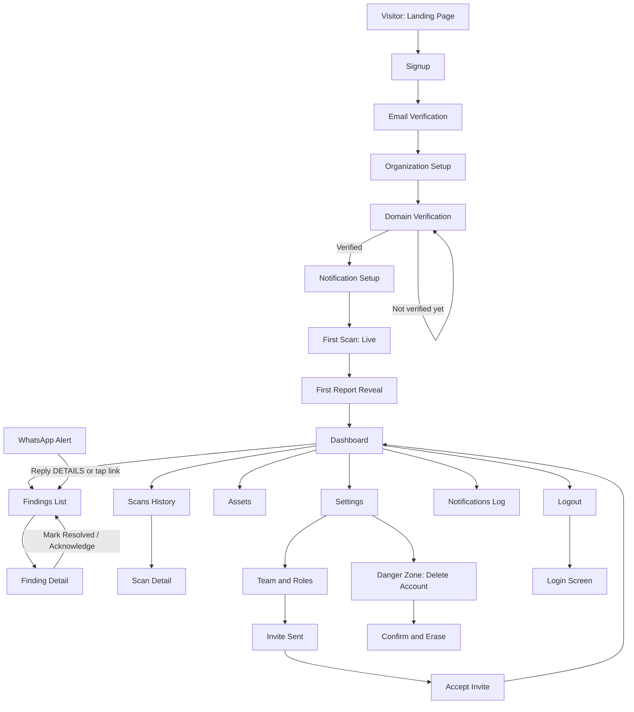
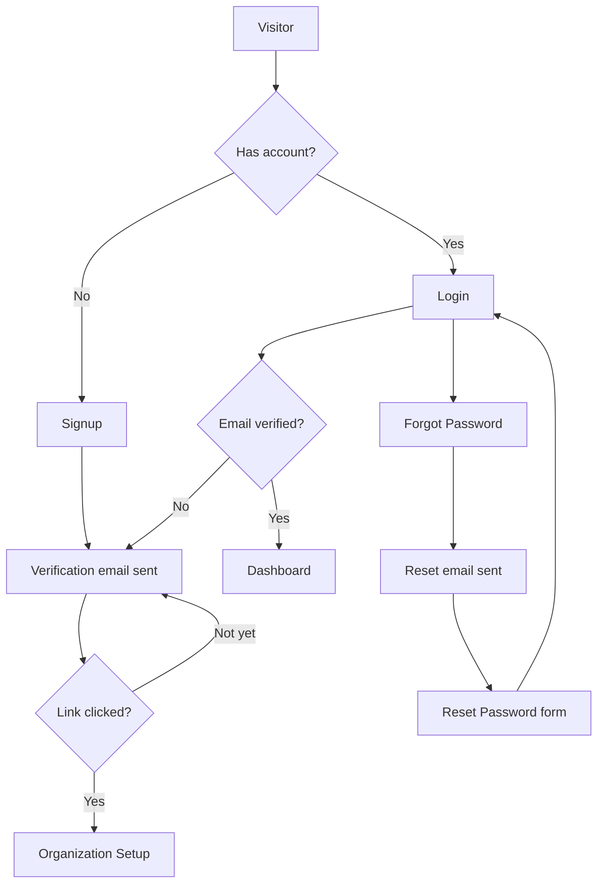
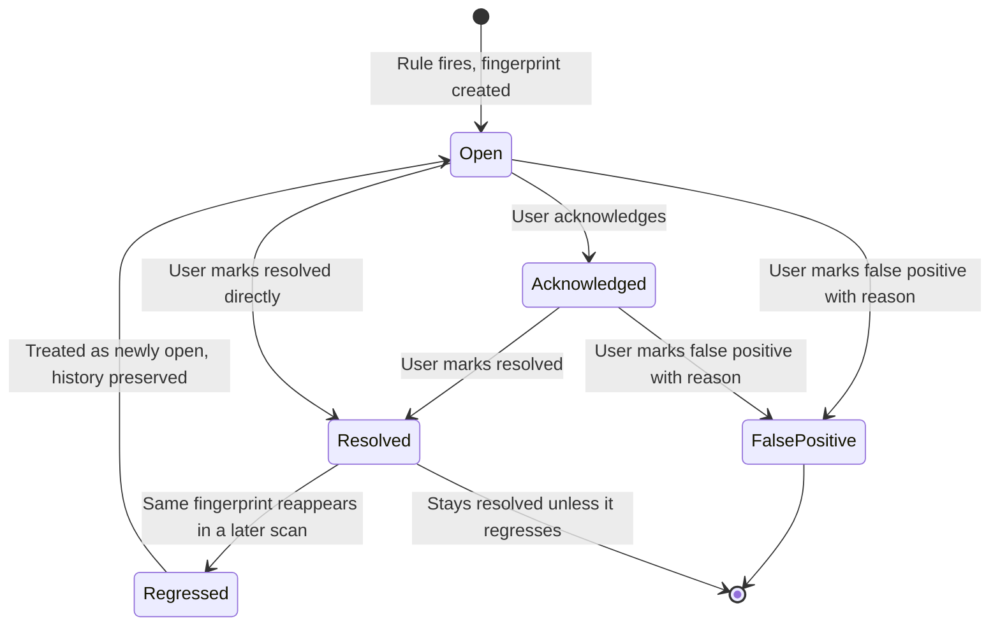
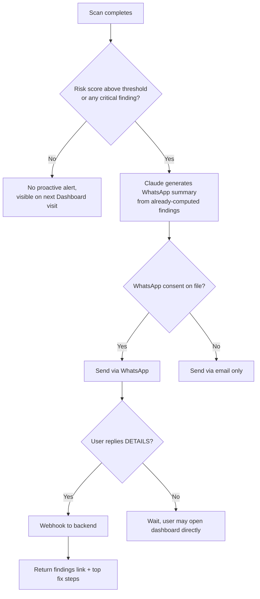
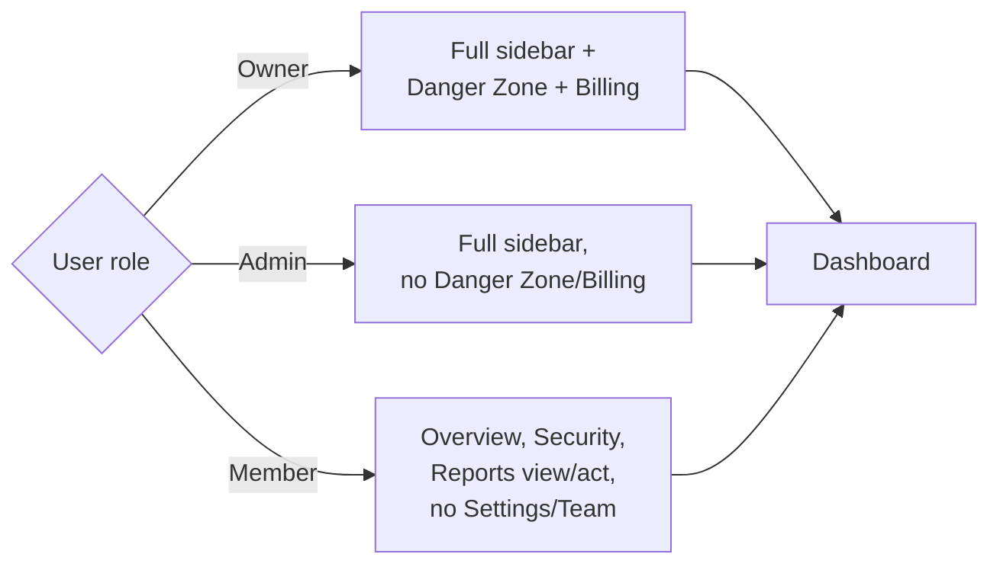

# 01: Product Blueprint

This is the foundation document. Every other file in this set (`02` through `07`) implements what's decided here. If a later document conflicts with this one, this one wins unless a critical architectural issue is found, at which point this document gets fixed first, not worked around downstream.

## How to Read This Document

Qelvix has roughly 30 screens across marketing, auth, onboarding, and the core application. Specifying all 30 at maximum depth would make this document unusable: a wall of repeated headings nobody actually reads. So screens are tiered by how much product-defining decision-making they carry:

- **Tier 1 (full specification).** The screens where the product is won or lost: Landing Page, Signup, Domain Verification, the Onboarding sequence, Dashboard, Findings List, Finding Detail, live Scan view, Settings. Full layout, states, components, API/DB touchpoints, edge cases, and wireframe hierarchy.
- **Tier 2 (working specification).** Screens with real but more conventional design decisions: Login, Password Reset, Email Verification, Org Setup, Assets, Scan History, Compliance, Reports, Team & Roles, Profile. Purpose, layout, key states, API/DB touchpoints, notable edge cases. No wireframe walkthrough, since the pattern is standard.
- **Tier 3 (inventory entry).** Screens that exist but don't carry novel design decisions at this stage: Pricing, About, Contact, Legal, Docs, Status, Billing, API Keys, Audit Log, Help Center, 404, Maintenance, Accept Invite, MFA Setup. Listed with purpose, phase, and owning document. Detailed later, once the Tier 1/2 patterns they'll reuse are locked.

Wireframe hierarchy is folded into each Tier 1 screen's own section rather than repeated as a separate document-wide pass: the "what does the user see first" question only has a real answer in the context of that screen's actual layout.

Diagrams here cover product and UX flow (auth, onboarding, scan lifecycle, finding lifecycle, navigation, permissions). Backend, database, deployment, and CI/CD diagrams live in `03_BACKEND.md`, `04_AGENT_PIPELINE.md`, and `06_DEVELOPMENT_GUIDE.md`, where they're next to the systems they describe.

Four sections in this document go beyond TRD v1.0 and beyond a literal reading of the original brief: the risk score presentation (Dashboard), the onboarding sequence (Onboarding Flows), the navigation model (Navigation Mapping), and a closing section called **Beyond the Brief** that names every place this blueprint made a different call than the original spec, and why. Flagged inline as they come up, then summarized at the end so nothing's buried.

---

## 1. Product Thinking

### Why Qelvix Exists

An MSME with a website, a mail server, and no security staff has exactly the same public attack surface as a company with a SOC, and exactly none of the visibility into it. Enterprise security tooling assumes a team to operate it: someone to triage alerts, someone to read a CVSS score and know what it means, someone to sit in front of a SIEM. That assumption is the whole product gap. Qelvix exists to close it by doing the triage in software (deterministic rules, not judgment calls) and doing the translation in language (Claude explains what the rules found), so the output a business owner receives is already a decision, not a puzzle.

### Who It Serves

Covered in full in [Personas](#2-personas) below. In one line: the person who owns the risk (the MSME owner) is not the person who can read the finding (a scanner report), and Qelvix's entire UX job is closing that gap without losing accuracy in translation.

### Business Goals

- Prove a repeatable, low-CAC acquisition motion into MSMEs that doesn't depend on a sales team the business can't yet afford to hire. WhatsApp delivery *is* the acquisition and retention channel, not just a notification method.
- Build a durable data moat: the rules engine and finding corpus should get more accurate with scan volume, and CVE/threat-intel matching should get cheaper per-org as shared indicators are cached across tenants.
- Establish a compliance-adjacent product line (DPDP readiness) as a second monetizable surface without turning Qelvix into a compliance-certification company it has no legal standing to be.
- Build toward the CA-firm / MSME-association channel (Phase 3) as the primary scale lever: one CA firm onboarding fifty client organizations is worth more than fifty individual acquisitions.

### User Goals

- Know, without reading a security report, whether the business is currently exposed to something urgent.
- Get told exactly what to do about it, in an order that matches actual risk, without having to prioritize a list themselves.
- Be able to hand the fix to whoever does IT for the business (often a part-time contractor) without translating it first.
- Have something to show a bank, an investor, or a client who asks "are you DPDP compliant" that isn't a blank stare.

### Success Metrics

| Metric | What it measures | Why it matters |
|---|---|---|
| Time to first scan | Signup → first completed scan | Below 10 minutes or the free-tier owner churns before seeing value |
| Time to first WhatsApp message | Signup → first WhatsApp delivery | This is the "aha" moment: the product working somewhere the owner already lives |
| Finding resolution rate | % of critical/high findings moved to `resolved` within 30 days | The only metric that proves the product changes security posture, not just reports on it |
| WhatsApp reply rate | % of alerts that get a `DETAILS` reply | Proxy for whether the alert content itself is compelling enough to act on |
| Risk score trend legibility | % of orgs whose score visibly moves (not stuck at 100 or unchanged) within 60 days | Directly validates the corrected scoring model in `04_AGENT_PIPELINE.md` |
| Freemium → Starter conversion | % of free orgs that upgrade within 30 days | Core monetization signal |
| Scan failure rate | % of scans that complete only partially | Operational health, not a growth metric, but it caps every other number if it's bad |

### Problems Solved

No dedicated security function, no budget for one, no time to interpret a report, no channel that guarantees the owner actually sees the alert, no way to show DPDP posture to a counterparty, no way to know if last week's fix actually worked.

### Future Scalability

The screen, navigation, and component patterns in this document are built to extend without a redesign: the CA-firm multi-org view (Phase 3) reuses the same Dashboard and Findings components scoped to a portfolio instead of a single org; the in-app AI assistant (Future) reuses the same Claude-boundary pattern already established for finding explanations, just with a chat surface instead of a static card; white-label branding is a token-swap in `05_DESIGN_SYSTEM.md`, not a rebuild. Nothing in Tier 1 assumes single-org, single-user usage at the data-model level, even though that's the only mode a Phase 1 user actually sees.

---

## 2. Personas

Three personas carry the product. Named by role, not by invented identity, since this document doesn't fabricate people, companies, or organizations that don't exist.

**The MSME Owner (primary).** Runs a 10–250 person business: a manufacturer, an exporter, a services firm. Owns the outcome if something goes wrong but has no technical background and no time to acquire one. Interacts with Qelvix almost entirely through WhatsApp and a monthly glance at the dashboard. Success looks like: never has to think about security until Qelvix tells them to, and when it does, knows exactly what to do next.

**The IT/Ops Contact (secondary).** Often a part-time contractor, sometimes a junior in-house hire, occasionally the owner's more technical relative. Semi-technical: can follow a numbered instruction, can't interpret a raw CVE. This is who actually opens the dashboard, reads remediation steps, and marks things resolved. Success looks like: never has to ask "what does this actually mean" because the remediation step already told them.

**The CA Firm / MSME Association Admin (tertiary, Phase 3).** Manages security posture across a portfolio of client organizations under a white-labelled account. Needs a portfolio view, not a single-org dashboard, and role separation between "my firm's staff" and "my client's staff." Not designed for at Tier 1 depth in this document, but every screen here is built so this persona is an added view, not a rebuild. Portfolio-level (cross-org) authorization is a Phase 3 extension of the MVP RBAC model and is not implemented in the MVP; `07_SECURITY_COMPLIANCE.md` §4 specifies the MVP authorization matrix that it will extend.

---

## 3. Complete Screen Inventory

Every screen in the product, tiered as described above, with the phase it ships in and which document owns its implementation detail.

### Marketing (pre-authentication)

| Screen | Tier | Phase | Purpose |
|---|---|---|---|
| Landing Page | 1 | MVP | Primary conversion surface, visitor to signup |
| Pricing | 3 | MVP | Plan comparison, standalone for direct/SEO traffic |
| About | 3 | MVP | Trust signal: who's behind this, kept minimal |
| Contact | 3 | MVP | Support/sales contact form |
| Legal (Privacy, Terms, Scanning Policy, DPA) | 3 | MVP | Required before any domain verification can legally proceed |
| Docs | 3 | Phase 2 | Public help/knowledge base, link-out from in-app Help Center |
| Status | 3 | Phase 2 | Uptime/incident transparency page |

### Authentication

| Screen | Tier | Phase | Purpose |
|---|---|---|---|
| Signup | 1 | MVP | Account creation, first step of activation funnel |
| Login | 2 | MVP | Returning-user entry |
| Forgot Password | 2 | MVP | Password recovery request |
| Reset Password | 2 | MVP | Password recovery completion |
| Email Verification | 2 | MVP | Confirms account email before org setup |
| Accept Invite | 3 | Phase 2 | Team member joins an existing org |
| MFA Setup | 3 | Phase 2 | Optional two-factor enrollment |

### Onboarding

| Screen | Tier | Phase | Purpose |
|---|---|---|---|
| Organization Setup | 2 | MVP | Org name, industry, primary domain entry |
| Domain Verification | 1 | MVP | Cryptographic proof of domain ownership; hard gate before scanning |
| Notification Setup | 1 | MVP | WhatsApp number + consent, email confirmation |
| First Scan (live) | 1 | MVP | Real-time scan progress, the product's first real moment of value |
| First Report Reveal | 1 | MVP | Risk score and findings shown for the first time, with guided next action |

### Core Application

| Screen | Tier | Phase | Purpose |
|---|---|---|---|
| Dashboard (Overview) | 1 | MVP | Daily-use home screen; security health at a glance |
| Findings List | 1 | MVP | All findings, filterable, the primary action queue |
| Finding Detail | 1 | MVP | Single finding: explanation, evidence, remediation |
| Scans History | 2 | MVP | Past scan runs, status, risk score at time of scan |
| Scans Detail (live + completed) | 1 | MVP | Per-agent progress live; full result breakdown once done |
| Assets | 2 | MVP | Discovered/verified asset inventory |
| Settings | 1 | MVP | WhatsApp, email, scan schedule, org profile |
| Notifications (log) | 2 | MVP | History of everything sent, by channel |
| Team & Roles | 2 | MVP | Invite members, assign roles; schema exists in MVP even if the UI is minimal |
| Profile | 2 | MVP | Individual user account settings |
| Compliance (DPDP Readiness) | 2 | Phase 2 | Clause-by-clause readiness report |
| Reports (PDF export) | 2 | Phase 2 | Downloadable/shareable report generation |
| Billing | 3 | Phase 3 | Plan management, invoices, Razorpay |
| API Keys | 3 | Phase 3 | B2B API credential management |
| Audit Log | 3 | Phase 3 | Who did what, when; SOC2-readiness surface |
| Help Center | 3 | Phase 2 | In-app support, links to Docs |

### System

| Screen | Tier | Phase | Purpose |
|---|---|---|---|
| 404 | 3 | MVP | Not-found fallback |
| Maintenance | 3 | MVP | Planned-downtime fallback |
| Permission Denied | 3 | MVP | Shown when a role tries an action it can't perform (state, not a route) |
| Quota Exceeded | 3 | MVP | Shown when a plan limit is hit (state, not a route) |

---

## 4. Navigation Mapping

Three distinct navigation contexts exist, and TRD v1.0 didn't distinguish them. Worth calling out, since conflating them is a common source of a confusing information architecture.

**Marketing navigation.** Top nav bar (Product, Pricing, Docs, Login, primary CTA "Start Free Scan"). No sidebar. Footer carries the legal/about/contact links. This context ends the moment a visitor authenticates: there is no marketing chrome inside the app shell.

**Auth navigation.** No persistent nav at all. Each auth screen has exactly one primary action and one secondary link (Login ↔ Signup, "Forgot password?", "Resend verification email"). Minimizing navigation here is deliberate: every extra option in an auth flow is a place for a user to abandon it.

**In-app navigation.** Persistent left sidebar (collapsible, icon-only on narrow viewports) plus a top header bar. Sidebar groups: **Overview** (Dashboard), **Security** (Findings, Assets, Scans), **Compliance** (Phase 2), **Reports** (Phase 2), **Organization** (Settings, Team, Notifications), with **Billing/API Keys/Audit Log** appearing only for roles and phases where they're relevant. The sidebar is role-aware, not a static list with disabled items. Top header carries: org switcher (inert with one item until Phase 3 multi-org exists, but present so its later addition isn't a redesign), global search (Phase 2), notification bell, user menu.

Every in-app screen follows the same entry/exit contract:

| Element | Rule |
|---|---|
| Primary CTA | Always the single highest-value next action for that screen; never more than one visually dominant button |
| Secondary CTA | Present only when a real alternative action exists; text-styled, not a competing button |
| Breadcrumb | Shown from two levels of depth onward (e.g. Findings → Finding Detail); omitted on top-level sidebar destinations |
| Deep linking | Every list/detail screen is a real URL (`/findings/:id`, `/scans/:id`); nothing is a modal-only state that can't be shared or bookmarked |
| Back navigation | Detail screens always return to the filtered/sorted state of the list the user came from, not a reset list |
| Role restrictions | A role that can't perform an action doesn't see a disabled button with no explanation. It either doesn't see the control, or sees it with a one-line reason on hover/tap |

---

## 5. Complete User Journey

The full path from first visit to daily-use customer, followed by the same journey as a diagram.

A visitor arrives at the Landing Page, most often from a WhatsApp forward, a CA firm referral, or a search for "DPDP compliance check." They start a free scan, which requires an account. Signup collects email and password (or Google OAuth). Email Verification confirms the address before anything else proceeds. Organization Setup collects the org name and the domain to be monitored. Domain Verification is a hard gate: the user adds a DNS TXT record or uploads a well-known file, and nothing scans until that check passes. This can take a few minutes for DNS propagation, so the screen is built around waiting gracefully, not a spinner that implies something's broken. Notification Setup collects the WhatsApp number with an explicit opt-in (required for WhatsApp delivery to be legal, not just polite) and confirms the notification email.

The first scan then runs live. This is the moment the product either earns trust or doesn't. The live Scan view shows real per-agent progress against real infrastructure, not a fake progress bar, because a business owner watching their own domain get checked in real time is more convincing than any amount of marketing copy. When it completes, the First Report Reveal shows the risk score and top findings with one clear next action, not a full findings table. That comes later, once the user has had one guided pass through what a finding even is.

From there the user is in steady-state: Dashboard is the home screen for every return visit, Findings is where action happens, Scans shows history, Settings governs how and when they're notified. A WhatsApp message on the weekly (or continuous-monitor) scan cadence pulls them back in; replying `DETAILS` or tapping the link returns them to Findings, not to a fresh Dashboard, because they came in with a specific question. Freemium users hit an upgrade prompt when they try to enable weekly scanning or DPDP reporting, never mid-scan, never as an interruption to a result they're currently reading. Team invites, once accepted, drop a new member straight into Dashboard with role-appropriate sidebar items. Logout returns to Login. Account deletion (Settings → Danger Zone) requires typed confirmation and triggers the DPDP-mandated data export/erasure flow specified in `07_SECURITY_COMPLIANCE.md`.

---

## 6. Landing Page Blueprint

**Tier 1.** This is the highest-traffic, lowest-context screen in the product: most visitors arrive knowing nothing about Qelvix, some knowing nothing about their own security posture. The page has one job: get a domain into the scan box. Everything below that fold is there to remove the hesitation that stops that from happening, in the order a skeptical business owner actually has those hesitations.

**Wireframe hierarchy: what the visitor sees first.** The scan input, not a headline. Most security-product landing pages lead with a value-proposition headline and bury the CTA below three sections of trust-building. That's backwards for this audience: an MSME owner deciding whether their business is exposed doesn't need to be persuaded a check is worth having. They need to be shown the check exists and is free to run. Hero is a single input field (domain) with a one-line result promise ("See your risk score in under a minute, free, no card"), not a paragraph.

| Section | Content | Notes |
|---|---|---|
| Announcement bar | Rotates: current DPDP Act update, or "Free scans this week" style urgency; dismissible, never blocks the CTA below it | Only one message at a time, no carousel-inside-a-carousel |
| Navigation | Logo, Product, Pricing, Docs, Login, primary CTA button | Sticky on scroll, CTA always visible |
| Hero | Domain input + "Scan My Business" button, one-line subhead, no video, no illustration competing with the input | Input has inline validation (valid domain format) before submit |
| Problem | Three short statements framed as things the visitor already suspects but hasn't confirmed: "You don't know what's publicly exposed," "You don't know if you're DPDP-ready," "You'll find out from a customer, not from your own tools" | Not a features list; this section's job is recognition, not information |
| Solution | How Qelvix answers each of the three problem statements, one-to-one | Mirrors problem section structure so the visitor doesn't lose the thread |
| Interactive demo | A pre-run, real (not fabricated) example scan result for a placeholder domain, showing the actual dashboard UI | Builds trust in the product's real interface, not a mockup |
| How it works | Three steps: Verify your domain → We scan continuously → You get plain-language alerts | Directly maps to the onboarding sequence, so what's promised here is exactly what happens next |
| Architecture / trust section | Explains the rules-before-LLM guarantee in plain terms: "Your risk score is never decided by AI guesswork. Only by fixed, auditable rules. AI is only used to explain results in plain language." | This is a genuine differentiator worth stating plainly, not burying in a FAQ |
| DPDP section | What "readiness indicators" means, explicitly not a certification claim | Same disclaimer language used everywhere else DPDP appears; see `07_SECURITY_COMPLIANCE.md` |
| Pricing preview | Three tiers, condensed, link to full Pricing page | Freemium tier shown first, not hidden |
| Testimonials | Omitted at MVP launch: there are no customers yet. Placeholder section removed rather than faked. | Re-added once real testimonials exist; never fabricated in the interim |
| FAQ | Answers the objections a skeptical owner actually has: "Is this safe to run on my live site," "Will you sell my data," "What happens after the free scan," "Do I need to be technical" | Written for the primary persona's literacy level, not a security audience |
| Final CTA | Repeats the domain input | Same component as hero, not a generic "Sign Up" button |
| Footer | Legal links, contact, social; no invented company details beyond what's provided | Sitemap-style link groups |

**States.** Loading: input shows a spinner and disables re-submit while a lightweight domain-format and reachability pre-check runs (before full signup; this is not the actual scan). Error: invalid domain format shown inline, never a toast for a form-field-level error. Empty: not applicable, nothing on this page depends on user data. Success: submitting the domain routes straight into Signup with the domain pre-filled, so the user never re-types it.

**SEO.** Server-rendered (Next.js App Router), unique meta title/description, structured data for SoftwareApplication schema, sitemap includes Landing/Pricing/About/Docs.

**Responsive.** Hero input stacks to full-width on mobile; the interactive demo becomes a static annotated screenshot below ~640px rather than a cramped live widget. A demo that requires pinch-zooming isn't a demo.

---

## 7. Authentication & Onboarding Flows

Tier 1 screens use a fixed template so the spec is scannable rather than a wall of prose that changes shape every section. Tier 2 screens use a shorter version of the same template, omitting fields where the pattern is standard enough not to need restating.

### Signup (Tier 1)

| Field | Detail |
|---|---|
| Purpose | Create an account and enter the activation funnel |
| User goal | "Let me see my risk score." Signup is a means to that end, not the goal itself |
| Wireframe hierarchy | Email + password fields and "Continue with Google" are equally weighted, side by side above the fold. No visual bias toward one auth method. Domain field (if arriving from Landing) is pre-filled and shown read-only above the form as a confirmation, not re-collected |
| Key components | Email input, password input with strength meter, Google OAuth button, terms/privacy checkbox, submit button, "Already have an account? Log in" link |
| Loading state | Submit button shows an inline spinner and disables; form fields lock to prevent double-submit |
| Error state | Field-level inline errors (invalid email, weak password, email already registered; the last one links directly to Login rather than making the user figure out why signup failed) |
| Success state | Immediate redirect to Email Verification, no intermediate "success" screen |
| Validation | Email format client-side; password minimum strength enforced client-side before submit to avoid a round trip for an obvious failure |
| Responsive | Single-column form at all breakpoints; this screen never benefits from a two-column layout |
| Accessibility | Labels bound to inputs, error messages announced via `aria-live`, password visibility toggle keyboard-accessible |
| Permissions | None (pre-auth) |
| API calls | `POST /auth/register` |
| DB updates | Insert into `auth.users` (Supabase-managed); insert `organizations` row is deferred to Org Setup, not created here |
| AI interaction | None |
| Edge cases | Domain pre-fill from Landing must survive an OAuth redirect round-trip; email-already-registered must not leak whether the email exists to an unauthenticated actor beyond what's needed for UX (rate-limited, generic-enough messaging) |
| Exit paths | Forward: Email Verification. Back: Landing Page or Login |

### Login (Tier 2)

Standard email/password + Google OAuth pattern. `POST /auth/login`. Primary edge case: an unverified email attempting login is redirected back to Email Verification rather than allowed through with a nagging banner: the gate is enforced, not suggested. Rate-limited against credential stuffing (see `07_SECURITY_COMPLIANCE.md`).

### Forgot Password / Reset Password (Tier 2)

Two screens, one flow. Forgot Password takes an email and always returns the same success message regardless of whether the email exists (no account enumeration). Reset Password is reached only via a time-limited emailed token; expired tokens route back to Forgot Password with a clear "this link expired, request a new one" message rather than a generic error.

### Email Verification (Tier 2)

Holding screen after Signup: "check your email" with a resend option (rate-limited to prevent abuse) and a live-polling check that auto-advances to Organization Setup the moment the link is clicked in another tab, so the user never has to manually navigate forward after verifying.

### Organization Setup (Tier 2)

Collects org name, industry (dropdown, feeds DPDP-relevant defaults and future benchmarking), and primary domain. This is the first point the domain the user cares about is captured formally, distinct from any pre-fill from Landing. `POST /org/me`, `PUT /org/me`. Feeds directly into Domain Verification with the entered domain pre-populated.

### Domain Verification (Tier 1)

| Field | Detail |
|---|---|
| Purpose | Cryptographically confirm the user controls the domain before Qelvix scans it |
| User goal | "Prove I own this so I can get my results." Framed as a quick technical step, not a bureaucratic hurdle |
| Wireframe hierarchy | The verification instruction (DNS TXT record value, or well-known file content) is the single largest element on the screen, with a copy-to-clipboard button; this is the thing the user needs to act on, everything else is secondary |
| Key components | Method toggle (DNS TXT vs. well-known file; DNS is default, file upload is the fallback for domains behind managed DNS the user can't easily edit), copyable verification value, "Verify Now" button, live status indicator, help link to a short guide for common registrars |
| Loading state | "Verify Now" triggers a check with a visible spinner; DNS propagation can take minutes, so a successful check retries automatically in the background with a visible countdown rather than requiring repeated manual clicks |
| Empty state | Not applicable. The verification value is always present once this screen loads |
| Error state | "Not found yet" is distinguished from "found but doesn't match": the first suggests waiting for propagation, the second suggests a copy-paste mistake. Different messages, because they're different problems |
| Success state | Immediate transition to Notification Setup, plus a small persistent "Verified" badge that will later show on the Assets screen |
| Responsive | Verification value and copy button remain full-width and thumb-reachable on mobile. This step is plausibly done on a phone while the user is looking at their DNS registrar on a laptop, so the mobile view should be glanceable, not primary-interactive |
| Accessibility | Copy action has a text confirmation ("Copied") in addition to any icon change, for screen reader users |
| Permissions | Org owner or admin only |
| API calls | `POST /org/me/domain/verify-token` (issues the value), `POST /org/me/domain/verify-check` (polled) |
| DB updates | `assets` row created with `asset_type: domain`, `whitelisted: true` only once verification succeeds; nothing is written as a monitored asset before that |
| AI interaction | None. This is the one onboarding screen where an AI-assisted "having trouble" helper would be tempting and is deliberately excluded, since guiding someone through domain control changes is exactly the kind of high-stakes technical action that should route to a written guide or human support, not a generative response |
| Edge cases | User doesn't control DNS (reseller/agency situation) → well-known file path exists for this reason and is surfaced, not hidden as an advanced option; user enters a domain they don't actually own → verification simply never succeeds, which is the entire point |
| Exit paths | Forward: Notification Setup. Back: Organization Setup (to correct the domain) |

### Notification Setup (Tier 1)

| Field | Detail |
|---|---|
| Purpose | Capture the WhatsApp number and explicit consent, confirm notification email |
| User goal | "Tell Qelvix where to reach me" |
| Wireframe hierarchy | WhatsApp number field with country code and an explicit, unchecked-by-default consent checkbox sit above the email confirmation. WhatsApp is the primary channel this product is built around, so it gets primary visual weight |
| Key components | Phone input with country code selector, consent checkbox with plain-language explanation of what will be sent and how often, email field (pre-filled from account, editable), "Send test message" action |
| Loading state | "Send test message" shows inline spinner; button disabled until consent is checked |
| Error state | Invalid phone format inline; failed test-send (e.g., WhatsApp API rejection) shown with a specific reason where the API provides one, not a generic failure |
| Success state | Test message confirmation shown as a small preview of what was sent, so the user isn't left wondering whether it worked |
| Validation | Consent checkbox is a hard requirement to proceed if a WhatsApp number is entered; a number without consent is not stored for messaging purposes |
| Accessibility | Consent text is real body text, not a tiny checkbox label: this is a legal consent capture, not decoration |
| Permissions | Org owner or admin only |
| API calls | `PUT /org/me`, `POST /notifications/test` |
| DB updates | `organizations.whatsapp_number`, `organizations.notification_email`, consent flag and timestamp stored per `07_SECURITY_COMPLIANCE.md`'s consent-lifecycle requirements |
| AI interaction | None |
| Edge cases | User skips WhatsApp entirely: allowed. Email-only delivery is a valid, if weaker, path, not a blocked state |
| Exit paths | Forward: First Scan (live). Back: Domain Verification |

### First Scan: Live (Tier 1)

| Field | Detail |
|---|---|
| Purpose | Show a real scan running against the user's own verified domain, in real time |
| User goal | Watch something real happen. This is the trust-building moment the whole funnel has been pointed at |
| Wireframe hierarchy | A vertical progress list of the three MVP agents (Asset Discovery → SSL/TLS → DNS), each with a status icon (queued/running/done) and a one-line live description of what it's currently checking, dominates the screen. No marketing copy competes with it |
| Key components | Per-agent status list, elapsed-time indicator, a reassuring but honest copy line ("This usually takes under two minutes") |
| Loading state | This entire screen *is* a loading state by nature, but each agent's own transition (queued → running → done) is a distinct, visible state change, not one spinner for the whole scan. A scan that's silent for 90 seconds reads as broken even if it isn't |
| Error state | Partial failure (see `04_AGENT_PIPELINE.md`; a scan that partially failed must never present as clean) is shown per-agent, plainly: "DNS check couldn't complete, we'll retry this automatically," not buried in an aggregate success message |
| Success state | Auto-advances to First Report Reveal the moment the pipeline completes; no "click to continue" needed |
| Responsive | Same vertical list, full width on mobile; nothing about this screen needs a desktop layout |
| Accessibility | Status changes announced via `aria-live="polite"` so a screen reader user gets the same real-time sense of progress |
| Permissions | Org owner or admin (whoever triggered onboarding) |
| API calls | `POST /scans/trigger`, then polls `GET /scans/{id}` |
| DB updates | `scans` row created (`status: running` → `completed`/`failed`), `findings` rows inserted as each agent completes |
| AI interaction | None during the scan itself. Claude only runs after rules have produced findings, consistent with Rules-before-LLM |
| Edge cases | User navigates away mid-scan: the scan continues server-side regardless (this is not a client-driven process), and returning to the dashboard shows it still in progress |
| Exit paths | Forward (automatic): First Report Reveal |

### First Report Reveal (Tier 1)

| Field | Detail |
|---|---|
| Purpose | Show the risk score and top findings for the first time, with exactly one guided next action |
| User goal | "So, am I okay?" answered immediately, then "what do I do" answered second |
| Wireframe hierarchy | The risk score gauge is the single largest element, above everything else, colour-coded to its band. Below it: a one-sentence Claude-generated executive summary, then the top 1–3 findings only, not the full findings table, which the user hasn't been oriented to yet |
| Key components | Risk score gauge, executive summary text, top-finding cards (severity badge, title, single CTA "See how to fix this"), a clearly secondary link to "View full dashboard" |
| Empty state | If the scan found zero issues (rare but possible for a well-configured domain), this is shown as a real positive result with its own copy, not an empty-state placeholder implying something's missing |
| Success state | This screen is itself the success state of onboarding |
| AI interaction | The executive summary (Risk Scoring Agent output, Claude-generated after the score is computed) and the remediation preview for the top finding (Recovery Recommendation Agent) are the first AI-generated content the user sees. Both are explicitly labelled as explanations of already-computed findings, not as the source of the finding itself, reinforcing the trust section from the Landing Page |
| Edge cases | Freemium tier sees this same screen in full. The first report is never paywalled, since it's the proof that justifies everything that comes after it |
| Exit paths | Forward: Dashboard (primary CTA) or Finding Detail (from a top-finding card) |

---

## 8. Dashboard Blueprint

**Tier 1.** The Dashboard is the screen a returning user opens by default, most often prompted by a WhatsApp alert or a Monday-morning habit. Its job is to answer "has anything changed, and does it need me" in the time it takes to glance at a phone screen, then get out of the way.

**Wireframe hierarchy.** Security health status (not a raw risk-score number) is the first thing seen, followed immediately by anything requiring action (unacknowledged critical/high findings), then the trend, then everything else. A dashboard that leads with a chart before telling the user whether they're okay has its priorities backwards for this audience.

**Beyond the brief: security health framing, not just a risk score.** TRD v1.0 presented the risk score as the dashboard's centerpiece number. Two problems with that as the *primary* framing: the corrected scoring model in `04_AGENT_PIPELINE.md` still means a business owner sees a number they have no intuition for ("62 out of 100, is that bad?"), and a number-first framing invites anxiety without direction. This blueprint keeps the 0–100 score (it's real, it's useful for trend tracking and for CA firms comparing a portfolio) but presents it as a supporting data point under a plain-language **Security Health** status, one of four states (Good / Needs Attention / At Risk / Critical), with the score shown smaller, alongside it, for the user who wants the number. The status band, not the number, is what's colour-coded and what drives the headline copy.

| Widget | Why it exists | Data source | Update frequency | Interactions |
|---|---|---|---|---|
| Security Health status | Answers "am I okay" in one glance | Risk Scoring Agent output, mapped to a 4-state band | Per completed scan | None (pure display) |
| Risk score + trend sparkline | Supports the status with the underlying number and direction | `scans.risk_score` history | Per completed scan | Click through to full Scan History / trend chart |
| Action Required | Surfaces unacknowledged critical/high findings; the only widget that can visually interrupt the "everything's fine" framing | `findings` filtered on severity + status | Real-time on finding state change | Click through to Finding Detail; inline "Acknowledge" without leaving the dashboard |
| AI Recommendations | Claude-generated, plain-language summary of what to prioritize this week, generated from already-computed findings, never from raw scan data directly | Recovery Recommendation Agent output, aggregated | Per completed scan | Click through to the relevant finding |
| Recent Activity | Chronological feed: scans run, findings resolved, team member actions | `scans`, `findings.status` changes, future `audit_log` | Real-time | Click through to the relevant object |
| Compliance Status (Phase 2) | DPDP readiness at a glance, before the full report exists as a screen | `compliance_reports.overall_status` | Per DPDP check | Click through to Compliance screen |
| Assets Summary | Count of verified/monitored assets, flags anything newly discovered and not yet whitelisted | `assets` | Real-time | Click through to Assets |
| Quick Actions | "Run scan now," "Invite team member," "Download latest report" (Phase 2) | N/A | N/A | Direct actions, no navigation required |
| Agent Status (during a live scan only) | Reuses the First Scan live-progress component | `scans.status` | Real-time while `status: running` | Click through to full Scan Detail |

**Filters.** None at the Dashboard level by design. Filtering belongs to Findings and Scans, which are built for it. A dashboard with its own filter set duplicates navigation that already exists one click away and adds a decision the user shouldn't have to make on the summary screen.

**States.** Loading: skeleton cards matching each widget's real layout, not a single centered spinner. This keeps the screen's shape stable as data arrives instead of causing a layout jump. Empty (brand-new org, first scan not yet run): replaced entirely by a "Run your first scan" prompt rather than a dashboard full of zeroes, since a grid of empty widgets reads as broken, not as "nothing to report yet." Partial-failure: if the most recent scan completed with errors, the Security Health widget explicitly says so ("Based on a partial scan, some checks didn't complete") rather than presenting a false all-clear.

**Responsive.** Widgets stack single-column on mobile in priority order (Security Health → Action Required → AI Recommendations → everything else). This is not a responsive reflow of a desktop grid, it's the same priority ordering used everywhere else in this document, just without the room to show more than one thing at a time.

**Permissions.** All roles see the same Dashboard; role differences show up in which Quick Actions are available (e.g., only owner/admin can invite team members).

---

## 9. Core Application Screens

### Findings List (Tier 1)

| Field | Detail |
|---|---|
| Purpose | The primary action queue: every open finding across every asset, prioritized |
| User goal | "What do I need to deal with, in order" |
| Wireframe hierarchy | Default sort is severity-descending, then recency. Critical findings are always at the top regardless of when they were found. Filter bar sits above the list, not in a collapsed drawer, since filtering by severity and status is the primary way this screen gets used, not an edge case |
| Key components | Filter bar (severity, status, finding type, asset), search, finding cards (severity badge, title, asset, age, status), bulk-select for multi-acknowledge, pagination |
| Loading state | Skeleton rows matching the card layout |
| Empty state | Two distinct empty states: "no findings at all" (new org, good news, shown positively) versus "no findings match your filter" (shown with a clear "clear filters" action). Collapsing these into one generic empty state hides the difference between good news and a filtering mistake |
| Error state | Failed fetch shows a retry action, not a blank screen |
| Validation | N/A (read/filter surface) |
| Responsive | Cards stack full-width on mobile; filter bar collapses into a single "Filters" button that opens a sheet, since a full filter bar doesn't fit a phone width without being cramped |
| Accessibility | Severity is never colour-only: every badge carries a text label (Critical/High/Medium/Low) so it doesn't depend on colour perception |
| Permissions | All roles can view; only owner/admin/member (not a hypothetical read-only role) can change status |
| API calls | `GET /findings` (paginated, filterable) |
| DB updates | None from this screen directly. Status changes happen from Finding Detail or via bulk action, both of which call `PUT /findings/{id}/status` |
| AI interaction | None on the list itself; explanations live at the detail level |
| Edge cases | A finding that regresses (was resolved, reappears in a later scan) is visually distinguished from a fresh finding: same fingerprint, different badge state, per the stable-finding-identity principle |
| Exit paths | Forward: Finding Detail. Sidebar for anything else |

### Finding Detail (Tier 1)

| Field | Detail |
|---|---|
| Purpose | Everything about one finding: what it is, why it matters, how to fix it |
| User goal | "Tell me exactly what's wrong and exactly what to do" |
| Wireframe hierarchy | Title and severity badge first, then the plain-language explanation (Claude-generated) immediately below, before the raw evidence, not after. A non-technical reader needs the explanation before the data that produced it, not the other way around. Remediation steps follow as a numbered list. Raw evidence (the deterministic rule output) is present but visually secondary, in a collapsible "Technical details" section; it exists for the IT/Ops persona and for auditability, not for the primary reader |
| Key components | Severity badge, title, plain-language explanation, numbered remediation steps with estimated effort per step, collapsible raw evidence panel, status control (Open/Acknowledged/Resolved/False Positive), asset link, first-seen/last-seen timestamps |
| Loading state | Skeleton matching the explanation-then-steps-then-evidence layout |
| Error state | If Claude's explanation generation failed or is pending, the raw evidence and remediation playbook (if one exists) are still shown. A missing AI explanation never blocks access to the underlying finding, since the rules-based data is the source of truth and must always be available on its own |
| Success state | Marking a finding resolved shows immediate confirmation and offers to move to the next open finding in the list, keeping the user in flow rather than dropping them back at the top of a long list |
| Validation | Marking "False Positive" requires a one-line reason. This feeds the false-positive-handling loop noted in `04_AGENT_PIPELINE.md` rather than silently discarding the signal |
| Accessibility | Numbered steps are real ordered-list markup, not styled divs, so they read correctly to assistive tech |
| Permissions | Status changes: owner/admin/member. Viewing: all roles |
| API calls | `GET /findings/{id}`, `PUT /findings/{id}/status` |
| DB updates | `findings.status`, `findings.resolved_at` |
| AI interaction | Explanation (`explain_finding`) and remediation (`generate_remediation`) are both Claude calls made after the rule fired, cached by finding-shape per `03_BACKEND.md`, and both explicitly scoped to only the evidence in `raw_data`: the prompt boundary that prevents the AI from asserting anything the rules didn't find |
| Edge cases | A finding whose remediation references contacting a third party (e.g., "contact your hosting provider") should say so explicitly rather than imply the user can fix it alone with the steps given |
| Exit paths | Back: Findings List (preserving prior filter state). Forward: Asset link |

### Scans History (Tier 2)

Table of past scan runs: date, status, risk score at that time, findings summary counts, trigger source (scheduled/manual). Row click opens Scan Detail. `GET /scans`. Primary edge case: a failed or partial scan is visually distinct in the table, not shown identically to a completed one with a lower score.

### Scans Detail (Tier 1)

| Field | Detail |
|---|---|
| Purpose | Full breakdown of one scan run, live or completed |
| User goal | Live: "is it still working." Completed: "what exactly happened in this run" |
| Wireframe hierarchy | While running, this is the same per-agent live-progress component used in First Scan onboarding. Consistency here matters, since a user who's seen it once shouldn't have to re-learn it. Once completed, it reorganizes around per-agent result summaries (findings count by severity, per agent) with a link into the filtered Findings List for each |
| Key components | Per-agent status/result cards, overall risk score at time of scan, error log panel (only shown if non-empty), "Re-run scan" action |
| Error state | Partial failures are listed per agent with the actual error reason where available, not just "failed" |
| Permissions | All roles view; only owner/admin/member can trigger a re-run |
| API calls | `GET /scans/{id}`, `POST /scans/trigger` |
| DB updates | None from viewing; re-run creates a new `scans` row |
| AI interaction | None directly on this screen; the scan's own findings link out to Finding Detail where explanations live |
| Exit paths | Back: Scans History. Forward: Findings (filtered to this scan) |

### Assets (Tier 2)

Table of discovered/verified assets (domains, subdomains, IPs, email domains) with type, verification status, first/last seen, and a "not yet whitelisted" flag for anything discovered that the org hasn't explicitly claimed. This is where an unexpected subdomain shows up for the owner to either claim or flag as not theirs. `GET /org/me/assets`, `POST /org/me/assets`.

### Settings (Tier 1)

| Field | Detail |
|---|---|
| Purpose | Everything about how the org is configured: notification channels, scan schedule, org profile, danger zone |
| User goal | Change how/when Qelvix reaches them, or change org-level facts |
| Wireframe hierarchy | Organized into clearly separated sections rather than one long form: Organization Profile, Notifications, Scan Schedule, Team (links to Team & Roles), Danger Zone. Danger Zone is visually distinct (bordered, muted-red accent) and always last, never adjacent to routine settings where a misclick has outsized consequences |
| Key components | Org name/industry fields, WhatsApp/email fields reusing the Notification Setup component, scan-frequency selector (plan-gated; Freemium is fixed at one manual scan, paid tiers unlock weekly/daily), "Delete Account" action requiring typed confirmation |
| Validation | Danger Zone actions require the user to type the org name to confirm. A single confirm dialog is too easy to click through on an irreversible action |
| Permissions | Full access: owner. Admin: everything except Danger Zone. Member: view-only |
| API calls | `PUT /org/me`, `DELETE /org/me` (Danger Zone) |
| DB updates | `organizations` fields; account deletion triggers the DPDP erasure workflow in `07_SECURITY_COMPLIANCE.md`, not an immediate hard delete |
| AI interaction | None |
| Edge cases | Downgrading scan frequency mid-cycle doesn't cancel a scan already in progress |
| Exit paths | Sidebar for anything else; this is a terminal/destination screen, not a step in a flow |

### Notifications Log (Tier 2)

Chronological list of everything sent (WhatsApp, email, dashboard), with channel, content preview, and delivery status. `GET /notifications`. Exists mainly for the IT/Ops persona to confirm "did the alert actually go out."

### Team & Roles (Tier 2)

List of members with role (Owner/Admin/Member), invite-by-email action, role change and remove actions (owner/admin only, and an owner can't be demoted or removed by anyone but another owner; no org is ever left without one). Schema-complete at MVP even though the UI is intentionally minimal, since retrofitting this later is exactly the kind of change the corrected data model in `README.md` is meant to avoid.

### Profile (Tier 2)

Individual account settings: name, email (with re-verification if changed), password change, MFA (Phase 2). Entirely separate from org Settings. This is the one screen in the app that isn't org-scoped.

### Compliance (Tier 2, Phase 2)

Clause-by-clause DPDP readiness list (pass/fail/n/a, evidence, plain-language narrative), with the "readiness indicator, not certification" disclaimer shown persistently, not just once in a footnote. `GET /compliance/latest`.

### Reports (Tier 2, Phase 2)

List of generated PDF reports with download/share actions, and a "Generate Report" action that produces a new one from the latest scan. `GET /scans/{id}/report.pdf`.

---

## 10. Secondary & Future Screens (Tier 3)

Listed here with enough detail to build against once scheduled; full specification deferred until each is actually next in the build order, since specifying them now would mean designing against assumptions about Phase 2/3 features that haven't been locked yet.

| Screen | Notes |
|---|---|
| Pricing | Three tiers (Freemium/Starter/Growth) plus Enterprise as a "contact us" tier, feature comparison table, FAQ specific to billing |
| About | Minimal: what Qelvix does and why, no invented team bios or company history beyond what's actually provided |
| Contact | Simple form (name, email, message, optional org name) routing to support |
| Legal (Privacy, Terms, Scanning Policy, DPA) | Scanning Policy is Qelvix-specific and important: explicitly states only verified, owner-claimed assets are scanned, referenced from Domain Verification |
| Docs | Public knowledge base, likely a simple static/CMS-driven surface, not part of the core app shell |
| Status | Uptime and incident history, standard status-page pattern |
| Accept Invite | Token-based, pre-fills email, routes to Signup if no account exists yet or straight into the org if one does |
| MFA Setup | TOTP-based, standard enrollment/QR/backup-codes pattern |
| Billing | Plan display, upgrade/downgrade, invoice history, Razorpay-hosted payment flow |
| API Keys | Key generation/rotation/revocation for the Phase 3 B2B API, scoped per org |
| Audit Log | Filterable log of member actions, exists primarily for the SOC2-readiness and CA-firm use cases |
| Help Center | In-app searchable help, links to Docs, "Contact Support" escalation |
| 404 | Standard not-found, with a link back to Dashboard (if authenticated) or Landing (if not) |
| Maintenance | Static page shown platform-wide during planned downtime, bypasses auth entirely |

---

## 11. Component Inventory

Organized by where each component does the most work, not alphabetically. A developer building the Findings feature should be able to find everything relevant to it in one place. Full visual/token specification for each lives in `05_DESIGN_SYSTEM.md`; this is the inventory of what exists and where it's used.

**Navigation & shell:** Sidebar (collapsible, role-aware), Header (org switcher, search, notification bell, user menu), Breadcrumb, Command Palette (Phase 2), Footer (marketing only).

**Findings & scanning:** SeverityBadge, FindingCard, FindingStatusControl, AgentStatusList (live scan progress), ScanProgressIndicator, RiskScoreGauge, SecurityHealthStatus, TrendSparkline, ComplianceChecklistRow (Phase 2).

**Forms & input:** TextInput, PasswordInput (with strength meter), PhoneInput (country-code aware), Dropdown/Select, Combobox, Checkbox, RadioGroup, ConsentCheckbox (distinct from a standard checkbox; carries required legal copy), DomainVerificationInstruction, FileUpload (Phase 2, for the well-known-file verification path).

**Data display:** Table (sortable, paginated), Card, Timeline, DataChart (wraps Recharts for trend/comparison views), EmptyState (parameterized: icon, message, action; used consistently rather than reinvented per screen), Skeleton (parameterized to match each widget's real shape).

**Feedback & overlays:** Toast, Dialog (confirmation actions), Drawer (mobile filter panels), Modal (blocking confirmations only; Danger Zone actions), ProgressBar, InlineSpinner.

**Navigation aids:** SearchInput (Phase 2), Pagination, FilterBar, TabGroup.

**Content-heavy:** MarkdownViewer (renders Claude-generated explanations/remediation consistently), JSONViewer (collapsible raw-evidence panel), CodeBlock (DNS TXT record display, copy-enabled).

**Identity & org:** RoleBadge, MemberRow, InviteForm, OrgSwitcher (inert until Phase 3, present from MVP so it isn't a later insertion into the header layout).

---

## 12. Mermaid Diagrams

The visitor-to-daily-use journey is diagrammed in [Section 5](#5-complete-user-journey). The diagrams below cover the flows not fully captured there: authentication branching, the finding lifecycle state machine, notification delivery, and role-based navigation visibility.

### Authentication Flow

### Finding Lifecycle

### Notification Delivery Flow

### Role-Based Navigation Visibility

---

## 13. Beyond the Brief

Everywhere this blueprint made a different call than a literal reading of TRD v1.0 or the original prompt, collected in one place so nothing's buried in the middle of a screen spec.

- **Security Health status, not a raw score, leads the Dashboard.** A 0–100 number has no intuitive meaning to the primary persona on its own. The score still exists and still drives the trend chart. See [Dashboard Blueprint](#8-dashboard-blueprint).
- **Domain Verification is a full onboarding screen, not a background check.** TRD v1.0 had no verification step at all. Making it visible and explicit turns a legal requirement into a trust signal the Landing Page can actually claim.
- **The first scan is shown live, per-agent, against the user's real domain**, instead of a generic loading screen before the dashboard appears. This is the single highest-leverage trust-building moment in the funnel and TRD v1.0 didn't design it as one.
- **First Report Reveal is its own screen**, distinct from the full Dashboard. Dropping a first-time user straight into the full findings table and every widget at once is disorienting; one guided result first, full product second.
- **Marking a finding as a false positive requires a reason.** Otherwise the signal that a rule is misfiring is thrown away instead of feeding back into rule tuning.
- **The sidebar is role-aware, not a static list with disabled buttons.** A member seeing a greyed-out "Billing" they'll never be able to click is worse UX than not showing it.
- **WhatsApp consent is a distinct, legally-weighted component**, not a generic checkbox, because it's collecting consent for a real messaging channel, not a preference toggle.
- **Domain Verification deliberately has no AI-assisted help.** Guiding someone through a DNS change is high-stakes and better served by a written guide or human support than a generative response that might be wrong about a specific registrar's UI.
- **Every list/detail screen is a real URL.** Nothing important is a modal-only state that can't be bookmarked, shared with a colleague, or linked from a WhatsApp message.
- **The org switcher exists in the header from MVP**, inert with a single item, so Phase 3's multi-org CA-firm view is an activation, not a redesign.
- **Testimonials are omitted at launch rather than filled with placeholder quotes.** There are no customers yet; a landing page that pretends otherwise costs more trust than an honest gap costs conversions.
- **Finding regression is a distinct lifecycle state**, not a silent reopen. A finding that comes back after being marked resolved is a different, more concerning event than one that's simply still open, and the UI should say so.

---

Owner: Qelvix Engineering Team
