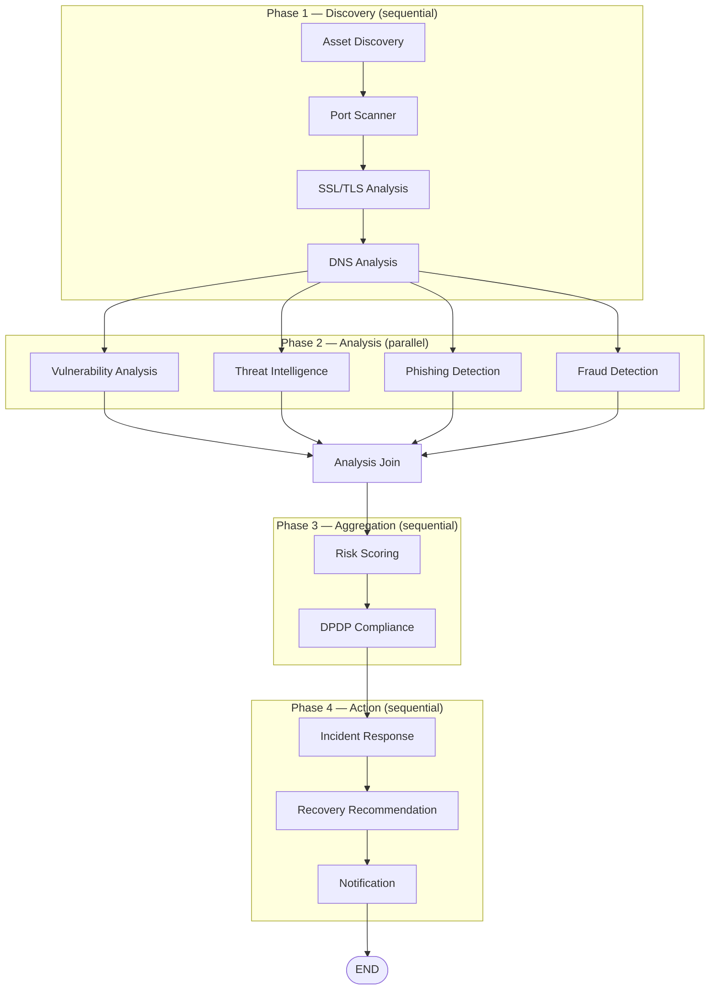

# 04: Agent Pipeline

Specifies the 13-agent LangGraph pipeline that `03_BACKEND.md` §6.1 queues via Celery and §9 names as the sole caller-boundary for `claude_service.py`. This document owns: the DAG structure, every agent's inputs/tools/rules/outputs, the deterministic rules engines, the full Claude prompt set, the IR playbook format, and the DPDP clause checklist. It does not restate the `scans`/`findings` schema (`03_BACKEND.md` §4.1), the Celery task boundary (`03_BACKEND.md` §6), or the notification delivery mechanics (`03_BACKEND.md` §7) — all referenced here only at their integration points.

## 1. Core Principle: Rules-before-LLM

Every security decision — whether a finding exists, its severity, its `raw_data` — is produced by a deterministic Python function with no LLM call inside it. Claude is invoked exactly four times in the pipeline, always after the deciding rule has already run, always scoped to explaining or drafting language around a decision already made:

| Claude call | Node | Never does |
|---|---|---|
| Executive summary | Risk Scoring (Agent 9) | Compute or adjust the score |
| Compliance narrative | DPDP Compliance (Agent 10) | Determine clause pass/fail |
| Remediation steps | Recovery Recommendation (Agent 12) | Invent a fix not implied by the finding's evidence |
| WhatsApp summary | Notification (Agent 13) | Add findings not already in the report |

This is the same boundary `03_BACKEND.md` §9 enforces structurally (one service module holds the Anthropic client); this document is where that boundary is specified in prompt-level detail.

## 2. Orchestration Framework

| Layer | Choice | Reason |
|---|---|---|
| Graph engine | LangGraph 0.2.x | Stateful DAG, production-ready |
| Agent pattern | Tool-calling nodes | Each agent is a Python function calling external services from `03_BACKEND.md` §8 |
| Parallelism | LangGraph `Send` API | Phase 2 agents (5–8) run in parallel |
| State | `TypedDict` | Typed, serializable, inspectable — persisted verbatim to `scans.langgraph_state` |

## 3. Pipeline DAG



```python
# backend/app/agents/pipeline.py
from langgraph.graph import StateGraph, END
from .state import AgentState
from . import (
    asset_discovery, port_scanner, ssl_analyzer, dns_analyzer,
    vuln_analysis, threat_intel, phishing_detection, fraud_detection,
    risk_scoring, dpdp_compliance, incident_response,
    recovery_recommendation, notification
)

def build_pipeline() -> StateGraph:
    workflow = StateGraph(AgentState)

    workflow.add_node("asset_discovery", asset_discovery.run)
    workflow.add_node("port_scanner", port_scanner.run)
    workflow.add_node("ssl_analyzer", ssl_analyzer.run)
    workflow.add_node("dns_analyzer", dns_analyzer.run)
    workflow.add_node("vuln_analysis", vuln_analysis.run)
    workflow.add_node("threat_intel", threat_intel.run)
    workflow.add_node("phishing_detection", phishing_detection.run)
    workflow.add_node("fraud_detection", fraud_detection.run)
    workflow.add_node("analysis_join", analysis_join_node)
    workflow.add_node("risk_scoring", risk_scoring.run)
    workflow.add_node("dpdp_compliance", dpdp_compliance.run)
    workflow.add_node("incident_response", incident_response.run)
    workflow.add_node("recovery_recommendation", recovery_recommendation.run)
    workflow.add_node("notification", notification.run)

    workflow.set_entry_point("asset_discovery")
    workflow.add_edge("asset_discovery", "port_scanner")
    workflow.add_edge("port_scanner", "ssl_analyzer")
    workflow.add_edge("ssl_analyzer", "dns_analyzer")

    workflow.add_conditional_edges(
        "dns_analyzer",
        lambda _: ["vuln_analysis", "threat_intel", "phishing_detection", "fraud_detection"],
        ["vuln_analysis", "threat_intel", "phishing_detection", "fraud_detection"]
    )

    for agent in ["vuln_analysis", "threat_intel", "phishing_detection", "fraud_detection"]:
        workflow.add_edge(agent, "analysis_join")

    workflow.add_edge("analysis_join", "risk_scoring")
    workflow.add_edge("risk_scoring", "dpdp_compliance")
    workflow.add_edge("dpdp_compliance", "incident_response")
    workflow.add_edge("incident_response", "recovery_recommendation")
    workflow.add_edge("recovery_recommendation", "notification")
    workflow.add_edge("notification", END)

    return workflow.compile()

pipeline = build_pipeline()
```

MVP scope (per TRD §13, Phase 1) runs a 3-agent reduced graph: Asset Discovery → SSL/TLS Analysis → DNS Analysis → Risk Scoring (3-input simplified) → Recovery Recommendation → Notification. Agents 2, 5–8, and 11 activate in Phase 2/3 per the build order in §12. The reduced graph is a subset of the same DAG shape above, not a separate pipeline — Phase 1 agents wire directly to `risk_scoring`, skipping the nodes not yet built, so no edge needs rewiring when a Phase 2 agent is added; it's inserted into an existing edge, not grafted onto a new structure.

## 4. AgentState Schema

```python
# backend/app/agents/state.py
from typing import TypedDict, List, Optional, Any

class AssetInventory(TypedDict):
    domains: List[str]
    subdomains: List[str]
    ips: List[str]
    email_domains: List[str]

class Finding(TypedDict):
    finding_type: str
    agent_source: str
    severity: str  # critical | high | medium | low
    title: str
    raw_data: dict
    asset_value: str

class AgentState(TypedDict):
    # Identity
    org_id: str
    scan_id: str
    primary_domain: str

    # Phase 1: Discovery outputs
    asset_inventory: Optional[AssetInventory]
    port_findings: List[Finding]
    ssl_findings: List[Finding]
    dns_findings: List[Finding]

    # Phase 2: Analysis outputs
    vuln_findings: List[Finding]
    threat_intel_findings: List[Finding]
    phishing_findings: List[Finding]
    fraud_findings: List[Finding]

    # Phase 3: Aggregation outputs
    all_findings: List[Finding]
    risk_score: Optional[int]
    risk_band: Optional[str]  # Low | Medium | High | Critical
    risk_executive_summary: Optional[str]  # Claude-generated
    dpdp_clauses: Optional[List[dict]]
    dpdp_overall_status: Optional[str]
    dpdp_narrative: Optional[str]  # Claude-generated

    # Phase 4: Action outputs
    ir_plan: Optional[dict]
    remediation_map: dict  # finding_id -> remediation text
    notifications_sent: List[str]
    errors: List[str]
```

`Finding` here is the in-flight agent representation; it maps to the `findings` table (`03_BACKEND.md` §4.1) at persistence time, where `asset_value` resolves to `asset_id` via the `assets` table and `finding_type`/`severity`/`title`/`raw_data` copy across unchanged. The full `AgentState` is persisted verbatim to `scans.langgraph_state` on completion — this is what gives Scans Detail (`01_PRODUCT_BLUEPRINT.md` §9) and the operational logging in `03_BACKEND.md` §10 a complete, inspectable record of exactly what each agent produced.

## 5. Rules-First Agent Pattern

Every agent node follows one template: fetch from an external service (`03_BACKEND.md` §8), pass the raw response to a pure rules function, wrap results as `Finding` objects, append any failure to `state["errors"]` rather than raising. This is the pattern `03_BACKEND.md` §10 references when it says agent-level errors "never raise past the pipeline boundary."

```python
# backend/app/agents/ssl_analyzer.py
from .state import AgentState, Finding
from ..rules.ssl_rules import evaluate_ssl
from ..services.ssl_labs_service import fetch_ssl_data

async def run(state: AgentState) -> dict:
    """SSL/TLS Analysis Agent — pure rules, no LLM."""
    findings: List[Finding] = []
    domains = state["asset_inventory"]["domains"] + \
              state["asset_inventory"]["subdomains"]

    for domain in domains:
        try:
            raw = await fetch_ssl_data(domain)
            rule_results = evaluate_ssl(raw)
            for rule in rule_results:
                findings.append(Finding(
                    finding_type=rule["type"],
                    agent_source="ssl_analyzer",
                    severity=rule["severity"],
                    title=rule["title"],
                    raw_data=rule["evidence"],
                    asset_value=domain
                ))
        except Exception as e:
            state["errors"].append(f"ssl_analyzer: {domain}: {str(e)}")

    return {"ssl_findings": findings}
```

```python
# backend/app/rules/ssl_rules.py — DETERMINISTIC, no LLM
def evaluate_ssl(ssl_data: dict) -> list[dict]:
    results = []
    grade = ssl_data.get("grade", "T")
    days_to_expiry = ssl_data.get("days_to_expiry", 0)

    if days_to_expiry <= 0:
        results.append({
            "type": "ssl_expired",
            "severity": "critical",
            "title": f"SSL certificate EXPIRED on {ssl_data['domain']}",
            "evidence": {"days_to_expiry": days_to_expiry, "grade": grade}
        })
    elif days_to_expiry <= 30:
        results.append({
            "type": "ssl_expiring_soon",
            "severity": "high",
            "title": f"SSL certificate expiring in {days_to_expiry} days",
            "evidence": {"days_to_expiry": days_to_expiry, "expiry_date": ssl_data["expiry_date"]}
        })

    if grade in ["C", "D", "E", "F", "T"]:
        results.append({
            "type": "ssl_weak_grade",
            "severity": "high" if grade in ["C", "D"] else "critical",
            "title": f"SSL grade {grade} on {ssl_data['domain']} — weak encryption",
            "evidence": {"grade": grade, "issues": ssl_data.get("issues", [])}
        })

    return results
```

Every other rules module (`dns_rules.py`, `port_rules.py`, `vuln_rules.py`, `threat_rules.py`, `dpdp_rules.py`) follows this exact shape: a pure function taking a plain dict, returning a list of `{ type, severity, title, evidence }` dicts, importable and unit-testable with zero network or LLM dependency. `06_DEVELOPMENT_GUIDE.md` specifies the test coverage requirement this shape is designed to make trivial to meet.

## 6. Agent Specifications

### Phase 1 — Discovery (sequential)

**Agent 1 — Asset Discovery**
- **Input:** org domain(s) from onboarding (`03_BACKEND.md` §4.1, `organizations.primary_domain` + `assets` rows created at Domain Verification per `01_PRODUCT_BLUEPRINT.md` §7)
- **Tools:** Shodan API, SecurityTrails API, `dnspython` passive subdomain enumeration
- **Rules:** Flag any discovered asset not in the org's whitelisted `assets` (`whitelisted: true` only after Domain Verification succeeds — this is what feeds the Assets screen's "not yet whitelisted" flag, `01_PRODUCT_BLUEPRINT.md` §9)
- **Output:** `AssetInventory { domains[], subdomains[], ips[], cloud_services[] }`
- **LLM:** None

**Agent 2 — Port Scanner** *(Phase 2 build)*
- **Input:** IP list from Asset Discovery
- **Tools:** Shodan host lookup (not `nmap` — avoids ToS issues on hosted infra)
- **Rules:**
  | Severity | Condition |
  |---|---|
  | Critical | RDP(3389), Telnet(23), SMB(445) open to 0.0.0.0 |
  | High | MySQL(3306), PostgreSQL(5432), MongoDB(27017) internet-exposed |
  | Medium | Non-standard HTTP ports, FTP(21) open |
- **Output:** `PortFindings { ip, port, service, severity, raw_data }`
- **LLM:** None

**Agent 3 — SSL/TLS Analysis** *(MVP)*
- **Input:** Domain list
- **Tools:** SSL Labs API, Python `ssl` library
- **Rules:** As implemented in §5 above (expired → critical, grade C/D/E/F/T or <30-day expiry → high, weak ciphers or <60-day expiry → medium, missing HSTS → low)
- **Output:** `SSLFindings { domain, grade, expiry_days, issues[], severity }`
- **LLM:** None

**Agent 4 — DNS Analysis** *(MVP)*
- **Input:** Domain list
- **Tools:** `dnspython`, MXToolbox API
- **Rules:**
  | Severity | Condition |
  |---|---|
  | High | No SPF record — spoofable email |
  | High | No DMARC — phishing easy |
  | High | No DKIM on primary MX |
  | Medium | SPF uses `~all` instead of `-all` (soft fail) |
  | Low | No DNSSEC |
- **Output:** `DNSFindings { domain, spf_status, dmarc_status, dkim_status, severity }`
- **LLM:** None

### Phase 2 — Analysis (parallel, Phase 2 build)

**Agent 5 — Vulnerability Analysis**
- **Input:** Software/service versions from Port Scanner
- **Tools:** NVD API, OSV API, CVE Search API
- **Rules:** CVSS v3 → Critical(9+) / High(7–8.9) / Medium(4–6.9) / Low(<4)
- **Output:** `VulnFindings { cve_id, cvss, description, affected_version, severity }`
- **LLM:** None

**Agent 6 — Threat Intelligence**
- **Input:** IPs, domains, email domains from Asset Discovery
- **Tools:** VirusTotal, AbuseIPDB, Have I Been Pwned
- **Rules:**
  | Severity | Condition |
  |---|---|
  | Critical | Org email domain found in HIBP breach corpus |
  | High | IP flagged by ≥3 VirusTotal vendors |
  | High | IP on AbuseIPDB (confidence ≥75%) |
  | Medium | Domain flagged suspicious by 1–2 vendors |
- **Output:** `ThreatIntelFindings { indicator, source, confidence, severity }`
- **LLM:** None

**Agent 7 — Phishing Detection**
- **Input:** Domain list
- **Tools:** PhishTank, Google Safe Browsing, custom Levenshtein similarity check
- **Rules:**
  | Severity | Condition |
  |---|---|
  | High | Registered domain, Levenshtein distance < 2 from org domain |
  | High | Org domain or typosquat on PhishTank/Safe Browsing lists |
  | Medium | Suspicious similar domain registered < 30 days ago |
- **Output:** `PhishingFindings { lookalike_domain, distance, source, severity }`
- **LLM:** None

**Agent 8 — Fraud Detection** *(Phase 3 build per TRD §13)*
- **Input:** Asset inventory, threat intel
- **Tools:** Wayback Machine API, reverse WHOIS (ViewDNS free tier)
- **Rules:**
  | Severity | Condition |
  |---|---|
  | High | Domain matching org name, registered after org's founding date |
  | Medium | Org brand present in a foreign TLD not owned by org |
- **Output:** `FraudFindings { fraudulent_domain, registration_date, severity }`
- **LLM:** None

### Phase 3 — Aggregation (sequential)

**Agent 9 — Risk Scoring**
- **Input:** All findings from Agents 1–8
- **Algorithm (deterministic):**
  ```text
  raw_score = (critical × 25) + (high × 10) + (medium × 4) + (low × 1)
  risk_score = min(100, raw_score)
  ```
- **Bands:** 0–30 Low | 31–59 Medium | 60–79 High | 80–100 Critical
- **Output:** `RiskScore { score, band, findings_summary { critical, high, medium, low } }`
- **LLM:** Claude writes a 2-sentence executive summary **after** the score is computed — see §7.1

This is the score `01_PRODUCT_BLUEPRINT.md` §8 presents under the Security Health band rather than as the dashboard's primary framing; the four-band mapping (Good/Needs Attention/At Risk/Critical) is a presentation-layer transform of the `band` value above, computed at the API or frontend layer, not a second scoring algorithm. The underlying `0–100` score and its four TRD bands (Low/Medium/High/Critical) are unchanged and remain the number CA-firm portfolio comparisons (`01_PRODUCT_BLUEPRINT.md` §1, Future Scalability) will use.

**Agent 10 — DPDP Compliance** *(Phase 2 build)*
- **Input:** Asset inventory, DNS/SSL findings
- **Rules:** Static clause checklist — see §8
- **Output:** `DPDPReport { clauses[{ id, status: pass|fail|na, evidence }], overall }`
- **LLM:** Claude generates the narrative section only — see §7.2

### Phase 4 — Action (sequential)

**Agent 11 — Incident Response** *(Phase 2 build)*
- **Input:** Top 5 critical/high findings from the Risk Report
- **Tools:** YAML IR playbook library (local, shipped with the codebase — see §9)
- **Output:** `IRPlan { steps[], priority_finding, estimated_effort }`
- **LLM:** Claude selects and tailors the relevant playbook to the org's context

**Agent 12 — Recovery Recommendation** *(MVP)*
- **Input:** Individual findings
- **Tools:** Claude API + YAML remediation knowledge base
- **Output:** `RemediationSteps` per finding, owner-friendly, no jargon
- **LLM:** Claude translates the technical fix into 3–5 plain-language steps — see §7.3

**Agent 13 — Notification** *(MVP)*
- **Input:** RiskReport, IRPlan, RemediationSteps, org notification preferences
- **Tools:** `whatsapp_service.py`, `email_service.py` (`03_BACKEND.md` §8)
- **Output:** Notifications sent, logged to `notifications` (`03_BACKEND.md` §4.1)
- **LLM:** Claude compresses the report into a <160-word WhatsApp message — see §7.4

Delivery mechanics (consent gating, the message template, the webhook reply flow) are owned by `03_BACKEND.md` §7; this node's responsibility ends at producing the compressed summary text `03_BACKEND.md`'s `whatsapp_service.py` sends.

## 7. Claude Integration — Prompt Specifications

`claude_service.py` (`03_BACKEND.md` §9) holds all four functions below. Each is called from exactly one agent node, after that node's rules have already run.

### 7.1 `explain_finding` — called from Recovery Recommendation context, cached by finding-shape

```python
async def explain_finding(finding: dict, org_context: dict) -> str:
    """Called ONLY after deterministic rules fire. Never decides severity."""
    response = client.messages.create(
        model="claude-sonnet-4-6",
        max_tokens=350,
        system=(
            "You are a cybersecurity advisor explaining findings to Indian MSME "
            "business owners with no technical background. Be concise, practical, "
            "and never alarming beyond what the evidence shows. "
            "Respond only about what is in the finding data provided."
        ),
        messages=[{
            "role": "user",
            "content": f"""
Explain this security finding in 2-3 plain-English sentences suitable for a
business owner. Include: what was found, what business risk it creates, and
the urgency of fixing it.

Organisation type: {org_context.get('industry', 'small business')}
Finding Type: {finding['finding_type']}
Severity: {finding['severity']}
Evidence: {finding['raw_data']}

Do NOT add findings not in the evidence. Speak directly to the owner.
"""
        }]
    )
    return response.content[0].text
```

This is the `plain_explanation` field on `findings` (`03_BACKEND.md` §4.1) and the text `01_PRODUCT_BLUEPRINT.md`'s Finding Detail screen shows before the raw evidence. Caching is keyed on `(finding_type, severity, a normalized hash of raw_data)` so two orgs with the identical SSL misconfiguration don't each pay a fresh Claude call — this is the "cheaper per-org as shared indicators are cached across tenants" data-moat goal from `01_PRODUCT_BLUEPRINT.md` §1 (Business Goals), implemented here as the cache key for this specific function.

### 7.2 Risk Scoring executive summary and DPDP narrative

Both follow the same pattern as `explain_finding`: a short, tightly-scoped prompt fed only the already-computed score/clauses, never raw scan data directly. The DPDP narrative prompt additionally carries the fixed disclaimer instruction — every generation includes "readiness indicator, not certification" framing, matching the persistent disclaimer `01_PRODUCT_BLUEPRINT.md` §9 requires on the Compliance screen, so the constraint lives in the generation prompt rather than being bolted on as a UI string after the fact.

### 7.3 `generate_remediation`

```python
async def generate_remediation(finding: dict) -> str:
    """Write owner-friendly fix steps for a specific finding."""
    response = client.messages.create(
        model="claude-sonnet-4-6",
        max_tokens=400,
        system=(
            "You write simple, numbered fix steps for MSME owners with "
            "basic technical staff. Steps must be actionable by a web developer "
            "or IT admin, not a security expert. Max 5 steps."
        ),
        messages=[{
            "role": "user",
            "content": f"""
Write 3-5 numbered steps to fix this issue. Use plain language.
If a vendor needs to be contacted, say so. Include estimated time to fix.

Finding: {finding['finding_type']}
Title: {finding['title']}
Raw Data: {finding['raw_data']}
"""
        }]
    )
    return response.content[0].text
```

"If a vendor needs to be contacted, say so" is the prompt-level source of the edge case `01_PRODUCT_BLUEPRINT.md`'s Finding Detail specifies: a remediation that requires contacting a third party must say so explicitly rather than imply the user can self-serve the fix. When a matching IR playbook (§9) exists for the finding type, its steps are passed into this prompt as grounding context rather than left for Claude to reconstruct from evidence alone, keeping the output consistent with the playbook's estimated effort figures.

### 7.4 `generate_whatsapp_summary`

```python
async def generate_whatsapp_summary(scan_result: dict, org: dict) -> str:
    """Compress full scan into <160-word WhatsApp message."""
    response = client.messages.create(
        model="claude-sonnet-4-6",
        max_tokens=250,
        messages=[{
            "role": "user",
            "content": f"""
Write a WhatsApp message (max 160 words) for a business owner about their
security scan. Include: risk score, top 2-3 issues, one urgent action.
End with the dashboard link placeholder {{report_url}}.

Org: {org['name']}
Risk Score: {scan_result['risk_score']}/100 ({scan_result['risk_band']})
Critical: {scan_result['findings_summary']['critical']}
High: {scan_result['findings_summary']['high']}
Top Issues: {scan_result['top_findings']}
"""
        }]
    )
    return response.content[0].text
```

Output is passed to `whatsapp_service.py`'s template substitution (`03_BACKEND.md` §7.2) — this function produces the summary content, the WhatsApp-specific formatting (emoji, Meta template variable binding) is applied at the service layer, not here.

## 8. DPDP Act 2023 — Compliance Rule Set

```python
# backend/app/rules/dpdp_rules.py
DPDP_CLAUSES = [
    {
        "id": "S4.1",
        "name": "Privacy Policy Published",
        "check": "check_privacy_policy_exists",  # HTTP GET /privacy-policy
        "section": "Section 4 — Notice to Data Principal"
    },
    {
        "id": "S8.4",
        "name": "Reasonable Security Safeguards",
        "check": "check_ssl_grade",  # from ssl_findings
        "section": "Section 8(4) — Data Fiduciary duties"
    },
    {
        "id": "S8.4b",
        "name": "No Internet-Exposed Databases",
        "check": "check_no_exposed_databases",  # from port_findings
        "section": "Section 8(4) — Data Fiduciary duties"
    },
    {
        "id": "S8.6",
        "name": "Breach Notification Readiness",
        "check": "check_incident_contact_defined",  # org settings
        "section": "Section 8(6) — Breach notification to Board"
    },
    {
        "id": "S9",
        "name": "Email Authentication (anti-spoofing)",
        "check": "check_spf_dmarc_present",  # from dns_findings
        "section": "Section 9 — Protection of children's data + general principle"
    },
    {
        "id": "S11",
        "name": "Consent Withdrawal Mechanism",
        "check": "check_contact_form_exists",  # HTTP GET /contact
        "section": "Section 11 — Right to withdraw consent"
    }
]
```

Each `check` function is a pure predicate over already-collected agent data (or a lightweight HTTP probe for the two clauses that check for a page's existence), returning `pass | fail | na` plus the evidence that justified it. This is the `clauses` array persisted to `compliance_reports` (`03_BACKEND.md` §4.1) and read by `GET /compliance/latest`. None of these checks involve Claude; the DPDP narrative (§7.2) is generated only from the already-computed `clauses` array, never from a fresh reading of DPDP Act text — this keeps the compliance surface within the "readiness indicator, not certification" claim `01_PRODUCT_BLUEPRINT.md` requires everywhere DPDP appears, since Qelvix is asserting what its own deterministic checks found, not offering a legal opinion.

## 9. IR Playbook Format

YAML, shipped with the codebase at `playbooks/`, loaded by Incident Response (Agent 11) and referenced by Recovery Recommendation (§7.3) when a finding type has a matching playbook:

```yaml
# playbooks/ssl_expired.yaml
id: ssl_expired
name: SSL Certificate Expired
severity: critical
triggers:
  - finding_type: ssl_expired
steps:
  - step: 1
    title: "Contact your hosting provider or domain registrar immediately"
    detail: "Log into your hosting panel (GoDaddy, Hostinger, cPanel, etc.) and
      navigate to SSL Certificates. Look for a Renew button."
    effort_minutes: 15
  - step: 2
    title: "If using Let's Encrypt (free SSL)"
    detail: "SSH into your server and run: sudo certbot renew --force-renewal
      Then restart your web server: sudo systemctl restart nginx"
    effort_minutes: 10
  - step: 3
    title: "Verify the fix"
    detail: "Visit https://www.ssllabs.com/ssltest/analyze.html?d=yourdomain.com
      and confirm you get an A or B grade."
    effort_minutes: 5
estimated_total_minutes: 30
escalate_to: hosting_support_if_no_access
```

MVP ships five playbooks: `ssl_expired.yaml`, `open_database_port.yaml`, `email_breach.yaml`, `no_spf_dmarc.yaml`, `dpdp_violation.yaml`. A playbook's `triggers[].finding_type` maps directly to the `finding_type` values each rules engine in §6 emits, so adding a new rule that produces a new `finding_type` and adding its playbook are independent, unordered tasks — neither blocks the other.

## 10. False Positive Feedback Loop

When a finding is marked `false_positive` via `PUT /findings/{id}/status` (`03_BACKEND.md` §5), the required `false_positive_reason` (`03_BACKEND.md` §4.2) is written but not yet fed back into rule tuning automatically at MVP — the loop is closed manually: `false_positive_reason` values are queried periodically to identify rules producing disproportionate false-positive rates, and the relevant rules module (§5–§6) is adjusted in a normal code change. An automated feedback mechanism (e.g., a rule confidence weight adjusted from aggregate false-positive rate) is a Phase 3+ candidate, not specified further here since it isn't in TRD scope and would be a genuinely new rules-engine capability, not a documentation gap.

## 11. Partial Failure Semantics

Per `03_BACKEND.md` §6.2, an agent's own failure is caught and appended to `state["errors"]`, never raised. This means the pipeline always reaches `notification` (Agent 13) even if, say, Threat Intelligence's VirusTotal call times out — the scan completes with whatever findings the other agents produced, and `state["errors"]` carries the record of what didn't run. A scan is only marked `status: failed` (rather than `completed` with a non-empty `error_log`) if a failure occurs outside an agent's own try/except — for example, the pipeline invocation itself raising before any node completes. This distinction is what `03_BACKEND.md` §6.2 and `02_FRONTEND.md` §5's `select`-function check both key off: `failed` is a pipeline-level catastrophe, `completed` with `error_log` populated is a normal, expected partial result that the UI must never present as a clean success.

## 12. Build Order

Matches TRD §13 exactly; agent numbers below correspond to §6 above.

| Phase | Weeks | Agents activated |
|---|---|---|
| Phase 1 — MVP | 1–6 | 1 (domain/subdomain only), 3, 4, 9 (3-input simplified), 12, 13 |
| Phase 2 — Core Product | 7–12 | 2, 5, 6, 7, 10, 11; PDF export, scan history/trend |
| Phase 3 — Scale & GTM | 13–20 | 8; white-label multi-org scoring (reuses Agent 9, portfolio-scoped per `01_PRODUCT_BLUEPRINT.md` §1 (Future Scalability)) |

## 13. Design Decisions

- **Security Health band is a presentation transform of `RiskScore.band`, not a second scoring algorithm** (§6, Agent 9). `01_PRODUCT_BLUEPRINT.md` §8 already established this as a Beyond-the-Brief decision; stated here explicitly so a future agent implementer doesn't infer a second scoring rule is needed inside this pipeline. The rules engine output is unchanged from TRD §3.3; only the dashboard's framing of it changed, and that framing lives in the frontend/API layer, not in Agent 9 itself.
- **`explain_finding` caching keyed by finding-shape** (§7.1). Not specified as a caching strategy in TRD v1.0; added here because `01_PRODUCT_BLUEPRINT.md` §1 (Business Goals) commits to "cheaper per-org as shared indicators are cached across tenants," and this is the mechanism that makes that true for the highest-volume Claude call in the pipeline.
- **False-positive feedback loop is manual at MVP** (§10). `01_PRODUCT_BLUEPRINT.md` requires capturing the reason; TRD v1.0 never specified an automated tuning mechanism. Documented as manual-by-default rather than left ambiguous, so `06_DEVELOPMENT_GUIDE.md` doesn't need to scaffold automation that isn't actually in scope.

---

Owner: Qelvix Engineering Team
