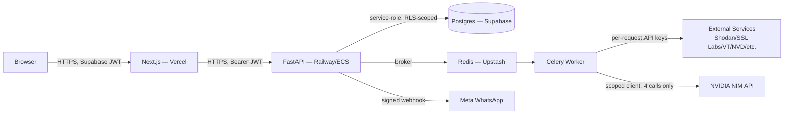

# 07: Security & Compliance

Authoritative security and compliance reference for Qelvix. Assumes `01`–`06` as frozen source of truth. This document resolves every point deferred to it by name: RLS policy definitions (`03_BACKEND.md` §4.1), rate limiting and consent/erasure mechanics (`03_BACKEND.md` §6.3, §4.2), Meta webhook signature validation (`03_BACKEND.md` §7.1), and the Phase 3 audit log (`03_BACKEND.md` §10). It does not restate schema, endpoints, or agent behavior already specified — only the controls layered on top of them.

## 1. Security Architecture

Qelvix's attack surface is smaller than a typical multi-service SaaS product by construction: one FastAPI backend, one Next.js frontend, one Celery worker pool, no microservices, no service-to-service auth to design. The architecture's actual security-relevant property is that it **holds security data about its customers** — findings, vulnerabilities, exposed assets — which makes the platform itself a high-value target: a breach of Qelvix doesn't just expose Qelvix's data, it hands an attacker a pre-built vulnerability map of every customer org. This shapes every control below: tenant isolation and the Rules-before-LLM boundary aren't defense-in-depth extras, they're the two properties that make the product's core promise ("we tell you what's wrong before someone else finds it") not itself a liability.



Trust boundaries: browser↔API is the only boundary a customer directly touches (authenticated via §3); API↔DB is where tenant isolation is enforced twice, redundantly, by design (§5–6); worker↔external-services is outbound-only and holds no customer credentials (Qelvix's own API keys, not the customer's); worker↔DeepSeek is the single, narrow boundary specified in §13–16.

## 2. Zero Trust Principles

Applied concretely, not as a slogan:

- **No implicit trust between layers.** The API never trusts a client-supplied `org_id` (`03_BACKEND.md` §5.1) — every tenant-scoped request re-derives `org_id` from the verified JWT on every single request, not once at session start.
- **No implicit trust in the database layer either.** RLS (§6) is enforced even though the application layer already filters by `org_id` — this is deliberate redundancy: an application-layer bug (a missed `.filter(org_id=...)`) is caught by the database layer rather than becoming a cross-tenant leak.
- **No implicit trust of the LLM.** DeepSeek's output is never treated as a decision, only as generated text attached to a decision already made by deterministic code (`04_AGENT_PIPELINE.md` §1) — this is Zero Trust applied to the AI component specifically, and is the architectural reason prompt injection (§14) is a lower-severity class of risk here than in a system where the LLM's output drives action.
- **No standing credentials where a scoped one will do.** The Celery worker holds Qelvix's own external-API keys, never a customer's — Qelvix never asks for or stores a customer's cloud credentials, API keys, or internal system access; every scan is performed from the outside, using only public/passive reconnaissance techniques the tool list in `03_BACKEND.md` §8 already implies. This is a Zero Trust property with a direct customer-trust payoff: a Qelvix breach cannot pivot into a customer's own infrastructure, because Qelvix never held the keys to it.
- **Verify at every hop, not just at login.** JWT validation happens on every request (§3), not cached as a "logged in" boolean; a revoked or expired token fails the very next request, not just the next login.

## 3. Authentication

Supabase Auth issues JWTs (`03_BACKEND.md` §1); this section specifies the validation and lifecycle contract the API enforces on top of that.

- **Token validation.** Every authenticated route's `get_current_org` dependency (`03_BACKEND.md` §3) verifies the JWT signature against Supabase's public key (not a shared secret — asymmetric verification means the API never needs Supabase's private signing key), checks `exp`, takes the user identity from `sub`, and reads the active `org_id` from a custom JWT claim. The `org_id` is never parsed from `sub`: organization membership is resolved through the `members` table (`03_BACKEND.md` §4.2), and the resulting active `org_id` is stored as the custom claim after validation, cached in the token thereafter and refreshed on token refresh.
- **Password requirements.** Minimum 12 characters, checked against Supabase Auth's built-in leaked-password protection (HaveIBeenPwned-backed) at signup and password change — not a custom strength-scoring implementation, since Supabase's is already correctly implemented and a bespoke one is a common source of subtly-wrong entropy calculations.
- **MFA.** TOTP-based MFA available via Supabase Auth from MVP, required (not merely available) for the `owner` role once an org has ≥1 additional `admin`/`member` (`03_BACKEND.md` §4.2) — the point at which a compromised owner account has blast radius beyond one person.
- **Session tokens are short-lived** (1 hour access token, Supabase default), refreshed via a long-lived refresh token stored in an `httpOnly`, `Secure`, `SameSite=Lax` cookie — never in `localStorage`, which is readable by any script on the page and therefore the wrong storage location for anything a successful XSS could exfiltrate.
- **Account lockout.** Supabase Auth's rate limiting on failed login attempts (progressive backoff) is left enabled at its default, not disabled or loosened for developer convenience in any environment that shares infrastructure with production.

## 4. Authorization (RBAC)

Roles are `owner | admin | member` (`03_BACKEND.md` §4.2). Full matrix, resolving the deferred detail from `03_BACKEND.md` §3's `require_role` dependency:

| Action | Owner | Admin | Member |
|---|---|---|---|
| View Dashboard, Findings, Scans, Assets | ✅ | ✅ | ✅ |
| Trigger manual scan | ✅ | ✅ | ✅ |
| Change finding status (acknowledge/resolve/false-positive) | ✅ | ✅ | ✅ |
| Edit org settings (domain, notification prefs, scan schedule) | ✅ | ✅ | ❌ |
| Invite/remove members, change roles | ✅ | ✅ (cannot promote to `owner`) | ❌ |
| View billing/plan | ✅ | ✅ | ❌ |
| Danger Zone (org deletion) | ✅ | ❌ | ❌ |
| Demote/remove the sole remaining `owner` | ❌ (blocked at API layer regardless of caller) | ❌ | ❌ |

Enforced via `require_role(*roles)` (`03_BACKEND.md` §3) on every gated route — this is a route-level check, not a UI-level one; `01_PRODUCT_BLUEPRINT.md` §4's UI-level role restrictions (hidden or explained buttons) are a UX layer on top of this enforcement, never a substitute for it. A `member` calling a `admin`-only endpoint directly (bypassing the UI) receives a 403 regardless of what the frontend would have shown them.

**Privilege escalation prevention:** role changes are themselves role-gated (an `admin` cannot grant `owner`), and the sole-owner constraint (`03_BACKEND.md` §4.2, §9) is checked inside the same transaction as any role-change or member-removal mutation, not as a pre-check that could race against a concurrent second removal.

**Phase 3 — portfolio (cross-org) authorization.** The matrix above is the MVP model: roles scoped to a single organization. The CA-firm / MSME-association persona (`01_PRODUCT_BLUEPRINT.md` §2) requires cross-org authorization — a firm's staff acting across a portfolio of client orgs, with separation between firm staff and client staff. This is a Phase 3 extension of the same RBAC model and is not implemented in the MVP; it is recorded here as planned work, not an existing control, and will layer portfolio-level roles on top of the per-org roles above rather than replacing them.

## 5. Tenant Isolation

Every table holding customer data carries `org_id` (`03_BACKEND.md` §4.1) and is isolated by two independent, non-substitutable layers:

1. **Application layer.** Every query in every router is scoped by the `org_id` derived from `get_current_org` (§3) — never accepted from the request body, query string, or path.
2. **Database layer.** RLS policies (§6) enforce the same boundary independently, so a bug in layer 1 (a forgotten filter, a copy-pasted query missing the scope) is caught before it becomes a breach rather than after.

No table, view, or raw SQL query bypasses `org_id` scoping except the two documented service-role exceptions in §6 (Celery background writes, admin tooling) — both of which are themselves audited (§21).

## 6. Row Level Security

Resolves the RLS policies deferred from `03_BACKEND.md` §4.1. Every tenant-scoped table (`organizations`, `assets`, `scans`, `findings`, `compliance_reports`, `notifications`, `members`) uses the same policy shape:

```sql
-- Pattern applied to every tenant-scoped table (example: findings)
CREATE POLICY tenant_isolation_select ON findings
  FOR SELECT
  USING (org_id = (auth.jwt() ->> 'org_id')::uuid);

CREATE POLICY tenant_isolation_insert ON findings
  FOR INSERT
  WITH CHECK (org_id = (auth.jwt() ->> 'org_id')::uuid);

CREATE POLICY tenant_isolation_update ON findings
  FOR UPDATE
  USING (org_id = (auth.jwt() ->> 'org_id')::uuid)
  WITH CHECK (org_id = (auth.jwt() ->> 'org_id')::uuid);

-- No DELETE policy defined for findings — deletion is never exposed to
-- end users (status transitions to false_positive/resolved instead, per
-- 03_BACKEND.md §4.1); absence of a DELETE policy means RLS blocks all
-- row deletion by the authenticated role by default, which is the
-- intended behavior, not an oversight to fix later.
```

`organizations` itself uses a variant scoped by row `id` rather than an `org_id` column (`id = (auth.jwt() ->> 'org_id')::uuid`), since an org's own table has no separate foreign key to itself. `members` additionally restricts `UPDATE`/`DELETE` on the `role` column to callers whose own `members` row has `role IN ('owner','admin')`, enforced via a `WITH CHECK` subquery against the caller's own membership row — this is the database-layer mirror of the `require_role` check in §4, not a replacement for it.

**Service-role bypass.** The Celery worker and any admin/support tooling connect using Supabase's `service_role` key, which bypasses RLS by design (Supabase's documented behavior for trusted backend processes) — this is the one legitimate, audited exception. The worker never accepts or forwards a client-supplied `org_id` for a write it performs on the client's behalf; it only ever writes `org_id` values it derived itself from the `scans` row that triggered the task (`03_BACKEND.md` §6.1), so a compromised worker process is a serious incident but not a request-forgery vector for an attacker who doesn't already control the worker. `service_role` key usage is logged distinctly from authenticated-user activity in the audit log (§21).

**Testing requirement.** RLS policies are covered by a dedicated test suite that asserts cross-tenant access fails — for every tenant-scoped table, a test creates two orgs, seeds data for both, and asserts org A's authenticated context cannot read, write, or list org B's rows. This suite runs in CI (`06_DEVELOPMENT_GUIDE.md` §16) and blocks merge on failure; it is the single highest-value test category in the codebase given the platform's data sensitivity (§1).

## 7. Session Management

- Access tokens: 1-hour expiry (Supabase default), validated on every request (§3) — never a "trust until logout" model.
- Refresh tokens: `httpOnly` `Secure` `SameSite=Lax` cookie, rotated on each use (Supabase's refresh-token rotation, which invalidates the prior token on use — a stolen-and-replayed old refresh token is rejected).
- Logout invalidates the refresh token server-side immediately (not just client-side cookie deletion) — a logged-out session cannot be resurrected by replaying a captured refresh token.
- Concurrent sessions are permitted (multiple devices) at MVP; a "sign out all devices" action (invalidating every refresh token for a user) is available via Supabase Auth's admin API and exposed as a Settings-screen action for the Danger-Zone-adjacent case of a suspected compromised session.
- Session fixation is structurally prevented — Supabase issues a new token pair on every login, never reuses a pre-authentication session identifier.

## 8. Secrets Management

- **Local/CI:** `.env`, gitignored from the first commit, validated by a pre-commit `detect-secrets` hook (`06_DEVELOPMENT_GUIDE.md` §18).
- **Staging/production:** Railway environment variables (MVP) or AWS Secrets Manager (scale, per `03_BACKEND.md` §12's infra table) — never baked into a Docker image layer, never logged (§21's log-scrubbing rule below).
- **Rotation.** Every credential in `03_BACKEND.md` §11's environment variable list has a defined rotation owner and cadence: API keys for external services (Shodan, VirusTotal, etc.) rotated on any suspected exposure and reviewed quarterly; `NVIDIA_API_KEY` and `SUPABASE_SERVICE_KEY` (the two highest-blast-radius secrets — full LLM spend and full RLS bypass, respectively) rotated on the same quarterly cadence at minimum, immediately on any team member offboarding who had access.
- **Least-privilege scoping.** The Supabase service key used by the Celery worker is the `service_role` key, distinct from any key exposed to the frontend (`NEXT_PUBLIC_SUPABASE_ANON_KEY`, `06_DEVELOPMENT_GUIDE.md` §3) — the anon key is RLS-bound and safe for browser exposure by Supabase's own design; the service key is never sent to a browser under any circumstance, and a code-review check for `SUPABASE_SERVICE_KEY` appearing in any `frontend/` file is a review-blocking finding.
- **No secret ever appears in a log line** — the structured logger (`03_BACKEND.md` §10, `06_DEVELOPMENT_GUIDE.md` §13) redacts any field named `*_key`, `*_token`, `*_secret`, or `password` at the logging-formatter level, not by convention alone, so a future accidental `logger.info(f"config: {settings}")` doesn't leak the whole environment.

## 9. Encryption

- **In transit.** TLS 1.2+ enforced on every hop: browser↔Vercel (Vercel-managed cert), Vercel↔API (HTTPS only, HTTP requests redirected), API↔Supabase (Supabase-enforced TLS), API↔Redis (Upstash TLS endpoint, not the plaintext port), worker↔external services (HTTPS-only clients; a service module using a plaintext endpoint is a review-blocking finding).
- **At rest.** Supabase Postgres encrypts at rest by default (AES-256, provider-managed); Upstash Redis likewise. No customer data is ever persisted outside these two managed stores — no local disk caching of findings, scan results, or PII on the API or worker instances themselves, which are treated as stateless compute.
- **Field-level encryption.** Not applied broadly (the RLS + at-rest encryption combination is the primary control), but the WhatsApp number and notification email — the two fields with the most direct real-world contactability risk if leaked — are candidates for application-level encryption at column level in a future hardening pass; not implemented at MVP, documented here as a known gap rather than silently deferred (see §31, AI Risk Register's non-AI-specific counterpart isn't in scope for that register, so it's recorded here instead).
- **DeepSeek API traffic** is TLS-encrypted by NVIDIA NIM's API by default; no additional transport control needed beyond using the standard client (`03_BACKEND.md` §9).

## 10. Data Protection

- **Data minimization.** Qelvix collects only what the product needs to function: domains, discovered assets, scan findings, contact info for notifications, and account/role data. It never requests or stores customer cloud credentials, internal source code, or internal network access (§2) — the entire scanning model is external/passive by design, which is itself a data-protection control, not just an architecture choice.
- **PII inventory.** Personal data in the schema (`03_BACKEND.md` §4.1) is limited to: `organizations.notification_email`, `organizations.whatsapp_number`, and `members.user_id` (linked to Supabase `auth.users`, which holds the actual email/auth identity). Findings and scan data are about the organization's infrastructure, not about individuals, and are not treated as PII — this distinction matters for the DPDP/GDPR mapping in §32.
- **Data retention.** Scan history, findings, and notifications are retained for the lifetime of the org's account plus 90 days post-deletion-request (to allow accidental-deletion recovery), then hard-deleted — not soft-deleted indefinitely. `scans.langgraph_state` (the full agent state snapshot, `04_AGENT_PIPELINE.md` §4) follows the same retention window; it's diagnostic data, not a permanent record, and has no reason to outlive the scan it describes plus a reasonable debugging window (90 days).
- **DPDP/erasure workflow.** `DELETE /org/me` (`03_BACKEND.md` §5) triggers a defined sequence, not an immediate hard delete: (1) org marked `pending_deletion` with a 30-day grace window during which an owner can cancel via a re-authentication-gated action, (2) at grace-window expiry, a scheduled job hard-deletes all rows across every tenant-scoped table for that `org_id` via `ON DELETE CASCADE` (`03_BACKEND.md` §4.1's foreign keys already cascade correctly for this), (3) the deletion event itself is retained in the audit log (§21) with the org's name/domain but no other content, as the minimum record needed to prove compliance with an erasure request without retaining the erased data itself.

## 11. Secure File Uploads

Applies to the Phase 2 well-known-file domain-verification upload (`05_DESIGN_SYSTEM.md` §5, `01_PRODUCT_BLUEPRINT.md` §7) — the only user-supplied file upload in the current product scope.

- **Type restriction.** Accepts only the exact expected verification file format (a plain-text file with a specific expected content pattern); MIME type and file extension are both checked, and the check is against an allowlist (`text/plain`), never a denylist.
- **Size limit.** Hard cap well below any legitimate verification file's size (e.g. 10 KB) — a verification file has a known, tiny expected shape, so there's no legitimate reason to accept anything larger.
- **No execution path.** The uploaded file is never served back as executable content, never placed in a path a web server would interpret (no upload into a `public/` or CGI-capable directory) — it's read, its content validated against the expected token, and then either discarded or stored purely as an evidence record, never re-served to any client as a static asset.
- **Storage.** If retained as evidence, stored in Supabase Storage under an org-scoped path with the same RLS-equivalent access policy pattern as §6, not on the API/worker's local filesystem.
- **Malware scanning.** Not implemented for this specific upload type given the tiny expected content and non-execution path above make it a low-value control here; if a future feature accepts richer file uploads (e.g. a compliance-evidence document upload), this section is revisited and a scanning step (e.g. ClamAV or a cloud AV API) added before that feature ships, not retrofitted after.

## 12. API Security

- **Authn/authz.** §3–4, enforced on every route without exception via the two FastAPI dependencies.
- **Transport.** HTTPS-only (§9); HTTP requests to the API are redirected, never served.
- **CORS.** Restricted to the known frontend origin(s) (`FRONTEND_URL`, `03_BACKEND.md` §11) per environment — no wildcard `*` origin in any environment, including local development, where the explicit `http://localhost:3000` is used instead so the CORS configuration itself is tested against the same logic that runs in production.
- **CSRF.** Not applicable to the Bearer-JWT-in-header authentication pattern used for all state-changing routes (`03_BACKEND.md` §5.1) — CSRF exploits cookie-based ambient authority, which this API doesn't rely on for mutations; the refresh-token cookie (§7) is `SameSite=Lax`, which further blocks cross-site use even for the one cookie in the system.
- **Security headers.** `Strict-Transport-Security`, `X-Content-Type-Options: nosniff`, `X-Frame-Options: DENY` (or equivalent CSP `frame-ancestors 'none'`), `Content-Security-Policy` restricting script sources to self and known CDNs (per `02_FRONTEND.md`'s use of cdnjs for select libraries), set at the Vercel edge for the frontend and via FastAPI middleware for the API.
- **Webhook signature validation** (resolves the deferred detail from `03_BACKEND.md` §7.1): `POST /webhooks/whatsapp` validates the `X-Hub-Signature-256` header against a HMAC-SHA256 computed with the Meta App Secret over the raw request body, rejecting with 401 before any processing if the signature doesn't match — computed over the raw bytes, not a re-serialized JSON body, since re-serialization can silently change byte content and break a legitimate signature. `POST /webhooks/scan-status` (internal, Celery→API) is not internet-exposed in production topology; where it must cross a network boundary, it's authenticated with a shared internal token distinct from any customer-facing credential.

## 13. AI / LLM Security

The four DeepSeek call sites (`04_AGENT_PIPELINE.md` §7) are the entire LLM attack surface. This is a materially smaller surface than a general agentic-AI product, and the controls below are scoped to what actually applies rather than importing generic "AI agent security" guidance wholesale.

- **No autonomous tool use.** DeepSeek, in this system, does not call tools, does not decide what to fetch, and does not take any action on Qelvix's behalf. Every one of the four calls is: assemble already-computed data → send a tightly-scoped prompt → receive text → store that text in a specific field (`plain_explanation`, `remediation_steps`, the DPDP `narrative`, the WhatsApp summary). This eliminates entire classes of agentic-AI risk (unauthorized tool invocation, runaway multi-step planning, tool-selection manipulation) by construction, not by a runtime guardrail that could fail — there is no code path where the LLM's output triggers a further action.
- **No user-supplied text reaches a DeepSeek prompt unfiltered.** Every prompt in `04_AGENT_PIPELINE.md` §7 is built from structured, already-validated data — finding records the rules engines produced, org metadata, computed scores — not from a raw user-typed field. The one place user-authored text exists near this boundary is `findings.false_positive_reason` (`03_BACKEND.md` §4.2), which is never included in any DeepSeek prompt; it's a human-readable audit field only, read by other humans (§21), not fed back into generation.
- **Output is never executed or rendered unsanitized.** DeepSeek's text output is stored and displayed as plain text/markdown in the frontend (`01_PRODUCT_BLUEPRINT.md`'s Finding Detail explanation/remediation fields) — rendered through the same sanitized markdown path as any other user-facing text, never `dangerouslySetInnerHTML`'d or interpreted as executable content. See §20 for the specific validation applied.
- **Cost/abuse boundary.** The `explain_finding` cache (`04_AGENT_PIPELINE.md` §7.1) is also a security control, not just a cost optimization: it bounds the rate at which new, unique prompts reach the NVIDIA NIM API even under a burst of scan triggers, which is relevant to both cost-based denial-of-wallet risk and to keeping per-org DeepSeek usage roughly proportional to genuinely new findings rather than replay.

## 14. Prompt Injection Defense

Because no DeepSeek output drives an action (§13), classic prompt injection's most severe consequence — an LLM tricked into taking an unauthorized action or exfiltrating data via a tool call — is not reachable in this architecture. The residual risk is narrower: **could injected content in a finding's `raw_data` (sourced from an external scan target, which is attacker-influenceable — an attacker controls their own server's headers, DNS TXT records, SSL cert fields, etc.) cause DeepSeek to generate misleading explanation/remediation text?**

- **Structural mitigation.** `raw_data` is inserted into the prompt as a labeled, bounded data field (`04_AGENT_PIPELINE.md` §7.1's prompt template: `Evidence: {finding['raw_data']}`), with an explicit system-prompt instruction that the model should describe the evidence, not follow any instruction contained within it, and a further explicit instruction (`"Do NOT add findings not in the evidence"`) that bounds the model's output to what the deterministic rule already established.
- **Blast radius if injection succeeds anyway.** Worst case, a manipulated explanation is confusing or wrong in its *phrasing* — the finding's `finding_type`, `severity`, and `raw_data` (the fields that actually drive the risk score, the notification trigger, and the IR playbook selection, per `04_AGENT_PIPELINE.md` §6, §9) are already fixed by rules-engine output before DeepSeek is ever invoked, and are never regenerated or reinterpreted from the LLM's response. A successful injection cannot change a finding's severity, cannot suppress a critical alert, and cannot fabricate a finding that doesn't exist in `all_findings` — the notification and risk-scoring pipeline reads structured fields, not DeepSeek's prose.
- **Detection.** DeepSeek responses that are anomalously long, contain URLs not present in the input evidence, or that fail a basic structural sanity check (e.g. `generate_whatsapp_summary`'s 160-word budget wildly exceeded) are flagged for the log-level review in §21 rather than silently accepted — not because a failure here is catastrophic (per the blast-radius point above) but because it's a signal worth a human glance.
- **What is explicitly not implemented, and why.** No separate "prompt injection classifier" model sits in front of these four calls — given the narrow, non-action-taking scope of every call site, the cost of an additional model in the loop isn't justified by the residual risk it would catch beyond what the structural mitigation above already bounds. This is a scope-appropriate decision, revisited if a future feature gives DeepSeek output any action-taking authority it doesn't have today.

## 15. Tool Calling Security

Not applicable in the sense the term is usually used (an LLM autonomously invoking tools) — DeepSeek never calls a tool, function, or external API in this system (§13). The thirteen "agents" in `04_AGENT_PIPELINE.md` are deterministic Python nodes that call tools (Shodan, SSL Labs, etc.); DeepSeek is never in that call path. The security-relevant analogue here is: **which code is allowed to call an external service, and with what credentials** — covered under §8 (API/service-key least privilege) and `03_BACKEND.md` §8's service-module boundary (one module per external integration, no ad hoc HTTP calls scattered through agent code).

## 16. Agent Sandboxing

The 13 pipeline agents (`04_AGENT_PIPELINE.md` §6) are not sandboxed as isolated execution environments (containers-per-agent, gVisor, etc.) because they don't execute arbitrary or untrusted code — each is a fixed, reviewed Python function calling a fixed set of external services and a pure rules function, deployed as part of the reviewed backend codebase (`06_DEVELOPMENT_GUIDE.md` §11's workflow). The relevant isolation boundary is process-level, not per-agent: the Celery worker process itself runs with least-privilege credentials (§2, §8 — Qelvix's own API keys only, no customer infrastructure access), and a compromise of the worker process is scoped by what those credentials can reach, which is: external read-only scanning APIs, the NVIDIA NIM API via the one service module, and the database via the `service_role` key (§6). Agent-to-agent boundaries are enforced by the `AgentState` TypedDict contract (`04_AGENT_PIPELINE.md` §4) — one agent cannot write outside its designated state keys because the LangGraph node signature only returns the keys it's declared to update, which is a correctness property that also happens to prevent a modified/compromised single agent from corrupting unrelated pipeline state.

## 17. Rate Limiting

Resolves the mechanism deferred from `03_BACKEND.md` §6.3 (free-tier scan limit) and extends it to the rest of the API:

| Scope | Limit | Enforcement |
|---|---|---|
| Free-tier manual scan trigger | 1 full scan per org per 24 hours | Checked in `POST /scans/trigger` against `scans.started_at` for that `org_id`, before enqueueing — a 429 with a clear "next available" timestamp, not a silent no-op |
| Authenticated API, general | 100 requests/min per `org_id` | Redis-backed sliding window (Upstash, already provisioned for Celery broker — reused, not a second Redis instance) |
| Unauthenticated routes (`/auth/*`) | 10 requests/min per IP | Same Redis-backed mechanism, keyed by IP since no `org_id` exists pre-auth; protects against credential-stuffing beyond what Supabase Auth's own lockout (§3) provides |
| `POST /webhooks/whatsapp` | Not rate-limited by Qelvix (Meta's own delivery patterns apply) but signature-gated (§12) before any processing occurs | — |
| Notification test endpoint (`POST /notifications/test`) | 5 requests/hour per org | Prevents using the test endpoint as an unmetered WhatsApp/email send channel |

Rate-limit responses use standard `429` with `Retry-After`, and are logged distinctly (§21) so sustained rate-limit hits from one source are visible as a pattern, not just individually dropped requests.

## 18. DDoS Protection

- **Edge layer.** Vercel (frontend) and the chosen backend host (Railway/ECS, `03_BACKEND.md` §12) both sit behind provider-level DDoS mitigation by default — this is inherited infrastructure protection, not a Qelvix-built control, and is verified as enabled rather than assumed.
- **Application layer.** Rate limiting (§17) is the primary application-level control against both malicious flooding and accidental self-inflicted load (a misconfigured client retry loop).
- **Cost-based DoS ("denial of wallet").** The scan-trigger limit (§17) is as much a cost-control as an availability control — an unrate-limited scan trigger is a vector for burning through Shodan/VirusTotal free-tier quota or DeepSeek API spend, which is a real availability risk for a bootstrapped product even without malicious intent (a buggy client polling `POST /scans/trigger` in a loop has the same effect as an attack).
- **Amplification avoidance.** No Qelvix-controlled endpoint returns a response disproportionately larger than its request (no open reflection vector) — list endpoints are paginated by default (`06_DEVELOPMENT_GUIDE.md` §17), which also bounds this class of risk incidentally.

## 19. Input Validation

- **API layer.** Pydantic models validate every request body, query param, and path param before a route handler body executes (`03_BACKEND.md` §3, §10) — type, required/optional, and format constraints (e.g. domain format on `PUT /org/me`, enum membership on `PUT /findings/{id}/status`) are declared once in the model, never re-validated ad hoc inside handler logic.
- **False-positive reason and other free-text fields.** Length-capped (matching the character-counter UI in `05_DESIGN_SYSTEM.md` §4.3), stored as plain text, never interpolated into a SQL query (parameterized queries via SQLAlchemy throughout — no raw string-formatted SQL anywhere in the codebase, a review-blocking finding if introduced) and never fed into a DeepSeek prompt (§13).
- **Domain/asset input.** Domain values (Signup, Asset addition, `03_BACKEND.md` §5) are validated against RFC-compliant domain syntax before being accepted, and before any scan is triggered against them — this is both a correctness control and an abuse control, since an unvalidated "domain" field could otherwise be used to direct Qelvix's scanning infrastructure at an arbitrary IP/hostname the org doesn't own (see also the whitelisting behavior in `04_AGENT_PIPELINE.md` §6, Agent 1, which further bounds this to only verified assets before treating discovery results as authoritative).
- **File upload.** §11.
- **Webhook payloads.** Validated against the expected Meta WhatsApp payload schema after signature verification (§12) — schema validation happens after auth, not instead of it, since a well-formed payload with a bad signature is still rejected.

## 20. Output Validation

- **DeepSeek output rendering.** Every DeepSeek-generated field (`plain_explanation`, `remediation_steps`, DPDP `narrative`, WhatsApp summary — `04_AGENT_PIPELINE.md` §7) is rendered through the frontend's standard sanitized-markdown component, the same one used for any other markdown content in the product — never raw HTML injection, no `dangerouslySetInnerHTML`. This closes the specific risk of a prompt-injection attempt (§14) escalating from "confusing text" to "executed script" even in the already-narrow blast radius described there.
- **WhatsApp message length.** `generate_whatsapp_summary`'s 160-word budget (`04_AGENT_PIPELINE.md` §7.4) is enforced server-side with a hard truncation fallback before sending, not trusted as a prompt instruction alone — Meta's own message-length limits also apply and are respected independently.
- **Structured-field consistency.** Any DeepSeek output that's parsed as structured data (none currently — all four call sites return prose, per `04_AGENT_PIPELINE.md` §7) would require schema validation before use; noted here as a standing rule for any future call site that changes this, per the structured-output pattern already described for artifact use elsewhere in this system.
- **Report/PDF export** (Phase 2, `03_BACKEND.md` §5) assembles DeepSeek-generated text into a WeasyPrint-rendered document — the same sanitization applies before it reaches the template, so a PDF export path can't become a second, unsanitized rendering surface for the same content that's already sanitized in-app.

## 21. Audit Logging

Resolves the Phase 3 audit log deferred from `03_BACKEND.md` §10 and `05_DESIGN_SYSTEM.md` §7.11's Audit Log screen.

```sql
CREATE TABLE audit_log (
  id UUID PRIMARY KEY DEFAULT gen_random_uuid(),
  org_id UUID REFERENCES organizations(id) ON DELETE CASCADE,
  actor_type TEXT NOT NULL,      -- user | service_role | system
  actor_id UUID,                  -- members.user_id when actor_type = 'user'
  action TEXT NOT NULL,           -- e.g. finding.status_changed, member.role_changed, org.deleted
  resource_type TEXT NOT NULL,    -- finding | member | organization | scan | notification
  resource_id UUID,
  metadata JSONB DEFAULT '{}',    -- before/after values where relevant, never full PII payloads
  ip_address INET,
  occurred_at TIMESTAMPTZ DEFAULT NOW()
);

ALTER TABLE audit_log ENABLE ROW LEVEL SECURITY;
-- Same tenant-isolation SELECT policy pattern as §6; audit_log has no
-- UPDATE or DELETE policy for any role, including service_role via the
-- application layer — audit records are append-only by design, and any
-- correction is itself a new audit entry, never an edit to history.
```

**What is logged:** every role/permission change, every finding status transition (including `false_positive_reason`, since that's the human-readable justification an auditor would need), org settings changes, member invite/removal, `service_role`-authenticated writes (§6), Danger Zone actions, and every DPDP erasure workflow step (§10). **What is never logged:** full request/response bodies, secrets (§8), or DeepSeek prompt/response content beyond a boolean success/failure and duration (`06_DEVELOPMENT_GUIDE.md` §13) — the audit log is a record of *who did what to which resource*, not a data-replication mechanism, and keeping it narrow is itself a data-minimization control (§10).

Retention matches the data-retention window in §10 (org lifetime + 90 days), except the deletion-event record itself, which is retained indefinitely in a minimal form as the compliance evidence described there.

## 22. Monitoring

Extends the operational logging in `03_BACKEND.md` §10 and `06_DEVELOPMENT_GUIDE.md` §13 with the alerting layer neither previously specified:

| Signal | Threshold | Action |
|---|---|---|
| API error rate (5xx) | >2% of requests over 5 min | Page on-call (or, at MVP team size, direct notification to the founding engineer) |
| RLS cross-tenant test suite failure in CI | Any failure | Blocks merge (§6) — not a monitoring alert, a hard gate |
| Sustained rate-limit hits from one org/IP | Pattern over 15 min (§17's logging) | Reviewed for abuse vs. legitimate burst; not auto-blocked without review at current scale |
| Celery task failure rate (outside per-agent try/except, per `04_AGENT_PIPELINE.md` §11) | Any pipeline-level (not agent-level) failure | Immediate alert — this is the `status: failed` case, distinct from the expected partial-failure `error_log` case |
| NVIDIA NIM API error rate | >10% of calls failing over 15 min | Alert — likely a key/quota issue (§8's `CRITICAL` log level) affecting explanation/remediation/notification quality across all active orgs |
| `service_role` key usage from an unexpected source (not the known Celery worker IP range) | Any occurrence | Immediate alert — this is the single highest-severity monitoring signal in the system, since it indicates the RLS bypass credential may be compromised |

At MVP scale, this is implemented via the hosting platform's built-in alerting (Railway/Vercel notifications) plus a lightweight external uptime/error monitor (e.g. Sentry for application errors, already a natural fit given the FastAPI/Next.js stack) rather than a dedicated SIEM — proportionate to team size, with the explicit intent to graduate to a dedicated security monitoring tool at the Phase 3 SOC2-readiness point referenced in `03_BACKEND.md` §10.

## 23. Incident Response

- **Severity classification.** Sev1 (active data breach, cross-tenant data exposure, compromised `service_role` or `NVIDIA_API_KEY` credential): immediate, all-hands, customer notification path activated. Sev2 (degraded scanning/notification delivery, non-security availability issue): standard on-call response, no customer notification required unless it crosses the DPDP-relevant threshold below. Sev3 (isolated bug, no security or availability impact): normal bug-triage process.
- **Breach notification.** Any Sev1 involving actual or suspected unauthorized access to customer data triggers the DPDP Act 2023 breach-notification obligation referenced in `04_AGENT_PIPELINE.md` §8's compliance clause `S8.6` — Qelvix's own obligation here mirrors what it checks for on behalf of customers (`04_AGENT_PIPELINE.md` §8), so the incident response process and the product's own compliance-narrative generation are drawing on the same underlying DPDP breach-notification timeline requirement.
- **Containment steps for the highest-severity scenario (compromised `service_role` key, §22's top monitoring signal):** rotate the key immediately (§8), audit `audit_log` (§21) for the compromise window to scope the actual blast radius, and — because RLS is the second independent layer (§5–6) — assess whether the exposure was limited by the application layer having already been correctly scoped, or whether it's a genuine cross-tenant exposure requiring the breach-notification path above.
- **Post-incident.** Every Sev1/Sev2 gets a written postmortem (root cause, timeline, remediation, and — where applicable — which control in this document should have caught it earlier) filed as a durable record; a recurring root cause across multiple postmortems is a signal to revisit this document's Design Decisions rather than treat each incident as isolated.

## 24. Backup & Disaster Recovery

- **Database.** Supabase's automated daily backups (point-in-time recovery on paid tiers) — verified as enabled, not assumed default; MVP free tier's backup retention window is explicitly checked against the product's own data-retention commitments in §10 and upgraded to a paid tier before that gap becomes customer-facing.
- **Recovery objectives.** RPO (Recovery Point Objective) target: ≤24 hours, matching the daily backup cadence at MVP; RTO (Recovery Time Objective) target: ≤4 hours for full service restoration, given the stateless API/worker design (§9) means recovery is primarily a database-restore-and-redeploy operation, not a complex multi-service coordination problem.
- **What is NOT backed up separately:** external service API responses (Shodan, SSL Labs, etc.) — these are re-fetchable on the next scan and have no standalone recovery value; `scans.langgraph_state` is backed up as part of the normal database backup, not specially, since it's ordinary row data.
- **Restore testing.** A restore-from-backup drill is performed at a minimum quarterly cadence against a non-production environment, not merely assumed to work because the backup job reports success — a backup that has never been restored is unverified, not a real recovery capability.
- **Multi-tenant blast radius in a restore.** Because all tenants share one database (isolated by RLS, §5–6, not by separate databases), a restore event affects every org simultaneously — this is a known tradeoff of the current architecture, appropriate at current scale, and revisited if a future enterprise/CA-firm customer (`01_PRODUCT_BLUEPRINT.md`'s Future Scalability) requires stronger isolation guarantees than shared-database RLS provides.

## 25. Supply Chain Security

- **Dependency provenance.** Both `requirements.txt` (backend) and `package.json` (frontend) pin exact or narrowly-ranged versions, not unbounded `^`/`*` ranges for security-sensitive packages (`openai`, `fastapi`, `sqlalchemy`, `next`, `@supabase/*`) — a wide version range on these means an upstream compromise ships to Qelvix automatically on the next build, which is the exact risk class pinning defends against.
- **Install-time integrity.** `pip install` runs against PyPI's package hashes where `requirements.txt` includes them for security-critical packages; `npm ci` (not `npm install`) is used in CI and deploy pipelines specifically because it enforces the committed `package-lock.json` exactly, refusing to silently resolve a different dependency tree than what was reviewed.
- **Third-party service dependency risk.** The external services in `03_BACKEND.md` §8 (Shodan, VirusTotal, NVD, etc.) are themselves a supply-chain dependency for finding *accuracy* — a compromised or degraded third-party API doesn't compromise Qelvix's own security, but could silently degrade scan quality. This is why each agent's per-item try/except (`04_AGENT_PIPELINE.md` §5) treats a service failure as a logged, visible partial failure rather than either crashing or silently returning empty results as if the check passed clean.
- **NVIDIA NIM as a dependency.** Scoped to the four call sites (§13); an NVIDIA NIM API outage degrades explanation/remediation quality (visible to the user as missing `plain_explanation`, per `06_DEVELOPMENT_GUIDE.md` §22's troubleshooting entry) but never blocks a scan from completing or a finding from being correctly scored, since Rules-before-LLM means the LLM is never on the critical path for the security-relevant outputs.

## 26. Dependency Scanning

- **Automated scanning.** Dependabot (or equivalent) enabled on both `requirements.txt`/`package-lock.json`, configured to open PRs for security advisories automatically, reviewed on the cadence in `06_DEVELOPMENT_GUIDE.md` §18 — not just on CVE-alert-driven ad hoc review.
- **CI-gated scanning.** `pip-audit` (backend) and `npm audit --audit-level=high` (frontend) run as a CI step (`06_DEVELOPMENT_GUIDE.md` §16's CI gate) — a new dependency introducing a known high/critical vulnerability fails the build, the same gate as a failing test.
- **Triage SLA.** Critical severity: patched or mitigated within 48 hours of disclosure. High: within 1 week. Medium/Low: normal dependency-update cadence, not a fire drill.
- **License scanning.** Not currently automated at MVP scope; new dependencies are manually checked for license compatibility (no GPL-family copyleft dependencies in a product intended for commercial licensing) as part of the code-review checklist (`06_DEVELOPMENT_GUIDE.md` §19) rather than a separate tool, proportionate to current dependency-change volume.

## 27. Infrastructure Security

- **Network topology.** The Celery worker and API are the only components with outbound access to external scanning services and the NVIDIA NIM API; the frontend (Vercel) never talks to any external service other than the Qelvix API and Supabase Auth directly (`02_FRONTEND.md`'s architecture) — this keeps the credential-holding surface to exactly the backend, not duplicated into the frontend's deploy environment.
- **Least-privilege compute.** Railway/ECS deploy credentials (CI/CD's own access to infrastructure, §28) are scoped to deploy-only permissions, not full account access — a compromised CI credential can ship a bad deploy but can't, for example, directly read the production database or modify IAM/account settings.
- **Environment separation.** Local, staging, and production use entirely distinct Supabase projects and Redis instances (`06_DEVELOPMENT_GUIDE.md` §3) — no environment ever points at another's data store, which also means a staging-environment bug can never leak production customer data by misconfiguration alone.
- **Managed-service posture.** Supabase and Upstash are both managed services with their own security posture (encryption at rest, provider patching, §9) — Qelvix doesn't self-host Postgres or Redis at current scale, which removes an entire category of infrastructure-patching responsibility from the team's own surface, an intentional tradeoff given team size.

## 28. CI/CD Security

- **Pipeline permissions.** GitHub Actions workflows (`06_DEVELOPMENT_GUIDE.md` §16) use the minimum `permissions:` scope needed per job (e.g. a test job gets no write access to the repo; only the deploy job gets deploy credentials), not the default broad token scope.
- **Secret injection.** Deploy credentials and API keys used in CI are GitHub Actions encrypted secrets, never committed to a workflow YAML file in plaintext, and never printed to build logs (§8's log-scrubbing principle applies equally to CI output).
- **Branch protection.** `main` requires the full CI gate (`06_DEVELOPMENT_GUIDE.md` §16) to pass and requires review approval before merge (`06_DEVELOPMENT_GUIDE.md` §19's checklist) — direct pushes to `main` are disabled at the repository settings level, not merely discouraged by convention.
- **Supply-chain integrity of the pipeline itself.** GitHub Actions third-party actions are pinned to a commit SHA, not a mutable tag (`@v1` can be silently repointed by the action's maintainer; a pinned SHA cannot), for any action with write access to secrets or deploy credentials.
- **Artifact integrity.** The Docker image built by CI (`03_BACKEND.md` §2) is the exact image deployed — no separate "build for staging, rebuild for production" step that could introduce drift between what was tested and what ships; the same image is promoted, not rebuilt, across environments once environment-specific config (§3) is injected at runtime rather than build time.

## 29. Secure Coding Standards

Extends `06_DEVELOPMENT_GUIDE.md` §5's general coding standards with the security-specific rules:

- No raw SQL string formatting — SQLAlchemy's parameterized query construction only, throughout (`03_BACKEND.md` §1's ORM choice already structurally supports this; the rule is that no one drops to raw `text()` with interpolated values).
- No `eval`, `exec`, or dynamic import of anything derived from user or external-scan input, anywhere in the codebase — a rules engine or service module that needs to branch on external data does so via an explicit `if`/`match` over known values, never dynamic code construction.
- Every new dependency added to `requirements.txt`/`package.json` is a deliberate PR line item, reviewed like any other code change (§26's scanning is a backstop, not the primary review).
- Timing-safe comparison for any secret/signature comparison (§12's webhook signature check uses `hmac.compare_digest`, not `==`) — a naive string comparison is timing-attackable and this is a one-line fix that's easy to get wrong by default.
- Error messages returned to clients (`03_BACKEND.md` §10's error envelope) never include stack traces, internal file paths, or raw exception text in any non-development environment — the structured `{ code, message }` shape is deliberately opaque about internals; full detail goes to the log (§21), not the response body.

## 30. OWASP Top 10 Mapping (2021)

| OWASP Category | Qelvix Control |
|---|---|
| A01 Broken Access Control | RBAC (§4) + RLS (§6) as two independent layers; every tenant-scoped route requires `get_current_org` |
| A02 Cryptographic Failures | TLS everywhere (§9), provider-managed at-rest encryption, no secrets in logs (§8) |
| A03 Injection | Parameterized queries only (§29), no LLM-output-to-action path to inject into (§13–14), input validation at the Pydantic layer (§19) |
| A04 Insecure Design | Rules-before-LLM as an architectural (not bolt-on) control (`04_AGENT_PIPELINE.md` §1); tenant isolation designed in from the schema (`03_BACKEND.md` §4.1), not retrofitted |
| A05 Security Misconfiguration | CORS restricted per environment (§12), security headers set at the edge, environment separation (§27) |
| A06 Vulnerable and Outdated Components | Dependency scanning + SLA (§26), pinned versions (§25) |
| A07 Identification and Authentication Failures | Supabase Auth with MFA for owners (§3), short-lived tokens, rotated refresh tokens (§7) |
| A08 Software and Data Integrity Failures | CI/CD pipeline integrity (§28), signed webhook validation (§12), no untrusted deserialization of dynamic code (§29) |
| A09 Security Logging and Monitoring Failures | Audit log (§21), alerting thresholds (§22), postmortem process (§23) |
| A10 Server-Side Request Forgery | Domain/asset input validation before any outbound scan (§19); scanning targets are restricted to validated, whitelisted org assets (`04_AGENT_PIPELINE.md` §6, Agent 1), which bounds what the worker's outbound scanning capability can be pointed at |

## 31. AI Risk Register

Risks specific to the LLM component, scoped to the four actual call sites (§13) rather than a generic AI-product risk list.

| Risk | Likelihood | Impact | Mitigation | Residual Risk |
|---|---|---|---|---|
| Prompt injection via attacker-controlled scan-target data (§14) | Medium (attacker controls their own infrastructure's metadata) | Low (bounded to explanation-text quality, per §14's blast-radius analysis) | Structural: fixed decisions before LLM invocation, bounded prompt template, output sanitization (§20) | Low — accepted |
| DeepSeek hallucinating a remediation step not grounded in the finding's evidence | Low-Medium | Medium (a wrong fix step wastes a customer's time, though never masks a real finding since severity/existence are rules-determined) | IR playbook grounding where available (`04_AGENT_PIPELINE.md` §7.3), explicit "don't add findings not in evidence" instruction | Low-Medium — monitored via §22's spot-review of anomalous outputs |
| NVIDIA NIM API outage or degradation | Low-Medium (external dependency) | Low (degrades explanation/remediation text only; scoring and notification triggering unaffected, §25) | Rules-before-LLM keeps the LLM off the critical path by design | Low — accepted |
| Cost/quota exhaustion from unbounded DeepSeek calls | Low (rate-limited at the trigger point, §17) | Medium (could affect availability of explanation generation across all orgs if unbounded) | Explain-finding caching (§13), scan-trigger rate limit (§17) | Low — monitored via §22 |
| Sensitive data (PII) inadvertently included in a DeepSeek prompt | Low (prompts are built from finding/org metadata, not free-text PII fields per §13) | Medium-High if it occurred (data leaves Qelvix's infrastructure boundary to a third-party processor) | No free-text user field is ever included in a prompt (§13); org metadata passed is limited to non-PII fields (industry, name) | Low — enforced by the prompt-construction pattern itself, verified in code review whenever a prompt template changes |
| Model behavior drift on a DeepSeek model version update | Low-Medium | Medium (explanation/remediation tone or accuracy could shift) | Model version pinned explicitly in `claude_service.py` (`03_BACKEND.md` §9's example uses a specific model string, never "latest"); version changes are a deliberate, tested PR, not an automatic upgrade | Low-Medium — managed via the standard code-review process (§19), not a runtime risk |

## 32. Compliance Mapping

### SOC 2

Qelvix is not currently SOC 2 certified (this is Phase 3-referenced readiness work, per `03_BACKEND.md` §10). Controls in this document map to the Trust Services Criteria a future audit would assess:

| TSC | Mapped controls |
|---|---|
| Security | §3–9, §12, §17–18, §27–28 |
| Availability | §22–24 |
| Processing Integrity | Rules-before-LLM (`04_AGENT_PIPELINE.md` §1), input/output validation (§19–20) |
| Confidentiality | §5–6, §8–9, §21 (audit trail of access) |
| Privacy | §10, §32 GDPR/CCPA mapping below |

The audit log (§21) is specifically the artifact a SOC 2 auditor would sample first; its append-only design and tenant-isolated RLS policy are written with that eventual audit in mind.

### ISO 27001

Not currently certified. Relevant Annex A control families and where they're addressed: A.5 (Organizational controls) — incident response (§23), supplier/vendor risk for external services (§25); A.8 (Technological controls) — access control (§4–6), cryptography (§9), secure development (§28–29), vulnerability management (§26). A formal ISMS (documented risk assessment cadence, management review process) is not yet instantiated — this document is the technical control foundation an ISMS would sit on top of, not a substitute for the organizational process an ISO 27001 certification requires.

### GDPR

Applies to any EU-resident data subject whose personal data Qelvix processes (relevant if a customer org has EU-based members, or in future EU market expansion). Mapped:

- **Lawful basis:** contract performance (providing the security-scanning service the org signed up for) for org/member data; legitimate interest for WhatsApp/email notification delivery, with explicit consent additionally captured for WhatsApp specifically (`03_BACKEND.md` §4.2's consent field) — GDPR doesn't strictly require opt-in consent for legitimate-interest-based service notifications, but the WhatsApp consent capture (already required by `01_PRODUCT_BLUEPRINT.md`'s product design and by WhatsApp Business API policy itself) satisfies the stricter bar regardless.
- **Data subject rights:** right to erasure implemented via the DPDP erasure workflow (§10), which satisfies GDPR's equivalent right through the same mechanism — no separate GDPR-specific deletion path needed since the underlying data model and deletion cascade are the same regardless of which regulation is the applicable trigger. Right to access: `GET /org/me` and related endpoints already expose an org's own data in full; a formal "export my data" bundling endpoint is not yet built and is a Phase 3 candidate alongside SOC2 readiness.
- **Data Processing Agreement (DPA):** required with any EU customer; Qelvix acts as processor for the org's own data and, notably, is *not* a processor of the org's customers' data, since Qelvix never touches anything beyond the org's own public-facing infrastructure surface (§2) — this narrows Qelvix's own DPA obligations relative to a product that ingested customer end-user data.
- **International transfer:** Supabase and NVIDIA NIM's infrastructure regions are the relevant transfer-mechanism consideration for any EU customer; Standard Contractual Clauses (SCCs) via each vendor's own DPA are the mechanism relied upon, not a Qelvix-built one. *Note: NVIDIA's DPA/SCC terms for the NIM service should be checked and verified before production use.*

### CCPA

Applies to California-resident personal data. Mapped similarly to GDPR given significant overlap: right to know/access and right to delete map to the same endpoints described above; Qelvix does not sell personal data (no data broker relationship, no ad-tech integration anywhere in the architecture — the entire external-service list in `03_BACKEND.md` §8 is scanning/threat-intel tooling, not advertising or data-monetization infrastructure), so the CCPA "right to opt out of sale" has no applicable mechanism to build because the underlying practice it addresses doesn't exist in this product.

## 33. Security Review Checklist

Applied to any PR touching authentication, authorization, data access, external service integration, or the DeepSeek service module — a supplement to `06_DEVELOPMENT_GUIDE.md` §19's general review checklist, not a replacement:

- [ ] New/changed tenant-scoped table has RLS enabled with the standard policy pattern (§6) in the same migration.
- [ ] New endpoint uses `get_current_org` and, if role-restricted, `require_role` (§3–4) — verified by an explicit test asserting both an authorized and unauthorized role/org.
- [ ] No client-supplied `org_id` accepted anywhere in a tenant-scoped write path (§5).
- [ ] No new secret introduced without an entry in the rotation-owner list (§8).
- [ ] No new raw SQL, `eval`, or dynamic code execution introduced (§29).
- [ ] New external service integration uses its own `services/` module (`03_BACKEND.md` §8), least-privilege API key, and the per-item try/except pattern (`04_AGENT_PIPELINE.md` §5) — no new agent that raises instead of degrading gracefully.
- [ ] Any new or modified DeepSeek prompt template reviewed for §13–14's boundary: no free-text user field introduced into a prompt without justification, output still flows only into the four sanctioned fields.
- [ ] New user-facing text field (including anything DeepSeek-generated) renders through the sanitized-markdown path (§20), never raw HTML injection.
- [ ] Webhook or other unauthenticated-by-JWT endpoint has an equivalent alternative verification (signature, shared token) documented and tested (§12).
- [ ] Audit-log-worthy actions (role change, deletion, status transition with justification) emit an `audit_log` row (§21).

## 34. Production Readiness Checklist

Gate before any environment is exposed to real customer data:

- [ ] RLS cross-tenant test suite (§6) green in CI, run against the target environment's actual schema, not just local.
- [ ] All secrets in `03_BACKEND.md` §11's list present in the target environment's secret store (§8), none defaulted or placeholder.
- [ ] `SUPABASE_SERVICE_KEY` and `NVIDIA_API_KEY` rotation owners assigned and rotation cadence scheduled (§8).
- [ ] MFA enforced for `owner` role per the multi-member threshold (§3) — verified functionally, not just configured.
- [ ] Rate limiting (§17) verified functional against the target environment's Redis instance, not just unit-tested against a mock.
- [ ] Security headers (§12) verified present on actual deployed responses (a header set only in local dev config is a common gap).
- [ ] Backup enabled and a restore drill completed against a non-production copy of the target environment's data store (§24) — not merely "backup is configured."
- [ ] Monitoring/alerting (§22) wired to an actual notification channel a human will see, tested with a deliberate synthetic alert before go-live.
- [ ] Incident response severity classification and escalation path (§23) documented and known to whoever is on call, not only written in this document.
- [ ] Dependency scan (§26) clean of any unpatched critical/high finding at time of launch.
- [ ] DPDP/GDPR/CCPA-mapped data subject rights endpoints (erasure, access) functionally verified end-to-end against a real test org, not just code-reviewed (§10, §32).
- [ ] Webhook signature validation (§12) verified against Meta's actual signing behavior in the target environment, not only against a synthetic test signature.

---

Owner: Qelvix Engineering Team
