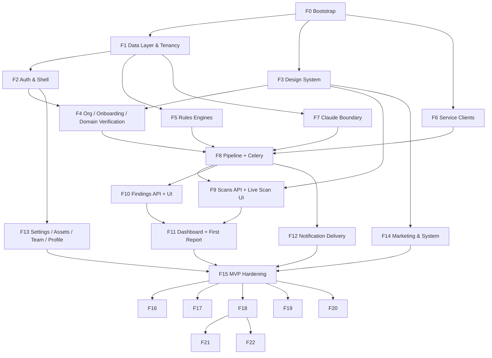

# 09: Implementation Roadmap

The dependency-ordered sequence of capability phases that takes Qelvix from an empty repository to a production MVP, and from there through the Phase 2 and Phase 3 scopes fixed in `01_PRODUCT_BLUEPRINT.md` §3 and `04_AGENT_PIPELINE.md` §12.

Phases are named `F0`–`F22`. They are **capability milestones**, not calendar units — a phase ends when the system can demonstrably do something it could not do before, and when its exit criteria hold. Time-boxing happens one level down, in `10_SPRINT_PLANNING.md`.

Read this document with `08_IMPLEMENTATION_METHODOLOGY.md` open. Phase content is derived from §3 (contract-first vertical slices), phase ordering from §4 (dependency depth), and every exit criterion from §14 (Definition of Done).

---

## 0. Phase Map

| Phase | Capability | Product phase | Sprints |
|---|---|---|---|
| **F0** | Repository, toolchain, CI, DevOS control files | MVP | S01 |
| **F1** | Complete schema, migrations, RLS, tenancy test harness | MVP | S02 |
| **F2** | Auth, `get_current_org`, `require_role`, app shell, route groups | MVP | S03 |
| **F3** | Design tokens, UI primitives, shared components | MVP | S04 |
| **F4** | Org profile, onboarding chain, domain verification, consent capture | MVP | S05–S06 |
| **F5** | Deterministic rules engines (SSL, DNS, asset, risk scoring) | MVP | S07 |
| **F6** | External service clients + committed fixtures | MVP | S08 |
| **F7** | Claude boundary — `claude_service.py`, caching, injection defence | MVP | S09 |
| **F8** | LangGraph MVP pipeline + Celery execution + persistence | MVP | S10–S11 |
| **F9** | Scans API + live scan UI + scan detail | MVP | S12 |
| **F10** | Findings API + Findings List + Finding Detail + lifecycle | MVP | S13–S14 |
| **F11** | Dashboard + First Report Reveal | MVP | S15 |
| **F12** | WhatsApp + email delivery, webhook, notifications log | MVP | S16 |
| **F13** | Settings, Assets, Team & Roles, Profile | MVP | S17 |
| **F14** | Marketing surfaces, legal, system screens | MVP | S18 |
| **F15** | MVP hardening: performance, a11y, security, launch readiness | MVP | S19–S20 |
| **F16** | Agent 2 (Port Scanner) + Agent 5 (Vulnerability Analysis) | Phase 2 | S21–S22 |
| **F17** | Agent 6 (Threat Intel) + Agent 7 (Phishing Detection) | Phase 2 | S23–S24 |
| **F18** | Agent 10 (DPDP Compliance) + Compliance screen | Phase 2 | S25–S26 |
| **F19** | Agent 11 (Incident Response) + playbook expansion | Phase 2 | S27 |
| **F20** | Reports/PDF, scan trend history, command palette, Docs/Status/Help | Phase 2 | S28–S29 |
| **F21** | Agent 8 (Fraud Detection) + multi-org portfolio | Phase 3 | S30–S31 |
| **F22** | Billing, API keys, audit log, SOC 2 readiness | Phase 3 | S32–S35 |

### Dependency graph

### Critical path

`F0 → F1 → F2 → F4 → F8 → F9 → F11 → F15`

F3, F5, F6, and F7 sit off the critical path and can be pulled forward or run in parallel by a second contributor. F13 and F14 are deliberately late: they are Tier 2/3 screens with no downstream dependents, and putting the Landing Page before a working scan means building the promise before the thing promised.

### Standing rules for every phase

Applied to all phases; not repeated in each section.

- **Entry:** the previous phase's exit criteria hold; `main` is green on `make verify-full`.
- **Every task** follows `08` §19's loop and Task DoD (`08` §14.1).
- **Every phase ends** with CP-Phase (`08` §13): a Gemini 3.1 Pro architecture audit against `docs/impl/INVARIANTS.md`, with findings resolved or filed.
- **Frozen documents are never edited.** A conflict produces an ADR (`08` §16.2).
- **Zero carry.** Unfinished work is re-scoped into new cards, never dragged across a phase boundary as an open state.

---

## F0 — Repository, Toolchain & DevOS Bootstrap

### Goal
A repository where an AI implementation session can start and be verified. Nothing product-specific is built; everything that makes later sessions repeatable is.

### Prerequisites
Supabase project created. Free-tier keys obtained for the services in `03` §11. Node 20+, Python 3.11+, Docker installed.

### Deliverables
- Monorepo skeleton exactly matching `06` §1 / `03` §2 / `02` §2 — every directory created, with `.gitkeep` where empty, so no model ever has to invent a location.
- `docker-compose.yml` with `postgres` and `redis` (`README`, Quick Start).
- Backend toolchain: `requirements.txt`, `ruff`, `mypy` strict config, `pytest` with markers (`unit`, `tenancy`, `contract`), `pytest-asyncio`, `httpx`.
- Frontend toolchain: Next.js 14 App Router, TypeScript strict, Tailwind, shadcn/ui initialised, ESLint (`next/core-web-vitals` + `typescript-eslint` strict), Prettier, Vitest + RTL, Playwright.
- `.env.example` covering every variable in `03` §11; `.env` gitignored from the first commit (`INV-29`).
- Pre-commit hooks: format, lint, `detect-secrets`.
- `Makefile`: `verify`, `verify-full`, `contract`, `migrate`, `dev`, `test`.
- CI workflow implementing gates **G1–G7** (`08` §12.1).
- Contract tooling: `make contract` exports `docs/contracts/openapi.json` and generates `frontend/lib/api/types.generated.ts`; G6 diffs both.
- **DevOS control files:** `AGENTS.md`, `docs/impl/INVARIANTS.md`, `CONTEXT_PACKS.md`, `LEDGER.md`, `SESSION_LOG.md`, `AMENDMENTS.md`, `BLOCKERS.md`, `DECISIONS/`.
- `docs/` populated with `README.md` and `01`–`07` (frozen) and `08`–`12` (living).

### Dependencies
None.

### Expected outputs
A repository that clones, installs, boots both services, and passes an empty-but-real CI run. `AGENTS.md` loads automatically in Antigravity.

### Validation checklist
- [ ] `git clone && make dev` brings up frontend, backend, Postgres, Redis with no manual steps beyond filling `.env`
- [ ] `make verify` green on an empty codebase in under 90 seconds
- [ ] `make verify-full` green, including a placeholder Playwright spec
- [ ] CI runs all seven gates on a trial PR and blocks on a deliberately introduced lint error
- [ ] `detect-secrets` blocks a commit containing a fake API key
- [ ] `make contract` produces a snapshot; a manual edit to it fails G6
- [ ] `docs/impl/INVARIANTS.md` contains INV-01..INV-30 verbatim from `08` §8
- [ ] `AGENTS.md` is under 150 lines

### Exit criteria
A task card from `11` can be executed end-to-end with no environment setup, and its verification command exists and runs.

### Risk analysis
| Risk | Likelihood | Impact | Mitigation |
|---|---|---|---|
| Toolchain configured loosely (`mypy` non-strict, TS not strict) to avoid early friction | High | High — every later session inherits the looseness, and tightening later means a mass refactor | Strict from commit one. `INV-14`, `INV-26`. Non-negotiable in F0 review |
| Contract generation deferred as "we'll add it when there are endpoints" | High | High — G6 is the primary anti-drift mechanism (`08` §6.1); adding it later means retrofitting types across every existing hook | Build G6 in F0 against a single placeholder endpoint |
| `AGENTS.md` grows into a second copy of the docs | Medium | Medium — dilutes every session's context | Hard 150-line ceiling, enforced in CI as a line-count check |
| CI gates skipped locally, discovered only on PR | Medium | Low | `make verify` is fast by design; pre-push hook runs it |

### Review checklist
- [ ] Directory structure matches `03` §2, `02` §2, `06` §1 exactly — no invented folders
- [ ] No secrets in the repository; `.env` gitignored in the initial commit
- [ ] Strict mode confirmed on both type-checkers
- [ ] All seven CI gates present and blocking
- [ ] Frozen docs committed unmodified

---

## F1 — Data Layer & Tenancy Spine

### Goal
The complete database exists, with RLS, and cross-tenant access is provably impossible at both layers.

### Prerequisites
F0 exit criteria met.

### Deliverables
- SQLAlchemy 2.0 async models for every table in `03` §4.1: `organizations`, `assets`, `scans`, `findings`, `compliance_reports`, `notifications` — plus `members` from `03` §4.2.
- The `03` §4.2 extensions: `findings.previous_status`, `findings.false_positive_reason`.
- Alembic migrations creating all tables, with `ENABLE ROW LEVEL SECURITY` in the same migration as each table (`INV-04`).
- RLS policies per `07` §6: the tenant-isolation predicate and the service-role bypass used by Celery workers.
- `app/database.py` async engine + `get_db_session` dependency (`03` §3).
- `app/config.py` via `pydantic-settings`, reading only `03` §11's variables.
- Tenancy test harness: `pytest -m tenancy` asserting, per tenant-scoped table, that Org A cannot read or write Org B's rows — tested **independently at both layers**.
- Seed script producing two organizations with disjoint data, for tenancy tests and local development.

### Dependencies
F0.

### Expected outputs
`alembic upgrade head` produces the full schema. The tenancy suite passes and fails loudly if any single RLS policy is dropped.

### Validation checklist
- [ ] Schema diff against `03` §4.1 is empty — every column, type, default, and `UNIQUE` constraint matches
- [ ] `members` table present with `UNIQUE(org_id, user_id)` and RLS enabled
- [ ] `findings.previous_status` and `findings.false_positive_reason` present and nullable
- [ ] Every `ENABLE ROW LEVEL SECURITY` line has a corresponding `CREATE POLICY`
- [ ] Tenancy suite passes; deliberately dropping one policy makes it fail
- [ ] Application-layer isolation tested independently of RLS (disable RLS, assert app-layer filter still blocks)
- [ ] `alembic downgrade base && alembic upgrade head` is clean
- [ ] Migration files match the naming convention in `06` §6

### Exit criteria
Every table in `03` §4 exists with RLS; the tenancy suite is green and is wired into gate G2.

### Risk analysis
| Risk | Likelihood | Impact | Mitigation |
|---|---|---|---|
| RLS policy written so permissively it never blocks anything, while tests still pass | Medium | Critical — silent cross-tenant leak | Tenancy suite includes negative assertions (Org A read of Org B **must** return zero rows); test the test by dropping the policy |
| Service-role bypass over-applied, so ordinary API requests run unrestricted | Medium | Critical | Bypass credential used only by the Celery worker's session factory; a dedicated test asserts the API session cannot use it |
| Autogenerated migration misses a constraint | High | Medium | `06` §10.1 requires hand-verification; card acceptance criteria include reading the generated file line by line |
| Model drifts from the SQL in `03` §4.1 through small "improvements" | Medium | High — `04` and `07` both build against that exact shape | Schema diff check in the validation checklist; `03` §4.1 supplied verbatim in the task context |

### Review checklist
- [ ] Every table tenant-scoped by `org_id` has RLS enabled in its creating migration
- [ ] No table added beyond `03` §4 without an ADR
- [ ] `get_db_session` yields one session per request and closes on response
- [ ] No credential in code; all from `config.py`
- [ ] CP-Security run (`08` §13)

---

## F2 — Authentication, Authorization & Application Shell

### Goal
A user can sign up, verify email, log in, and land in a role-aware application shell. Every authenticated endpoint is tenant-scoped by construction.

### Prerequisites
F1 exit criteria met.

### Deliverables

**Backend**
- Supabase Auth integration: `POST /auth/register`, `/auth/login`, `/auth/refresh` (`03` §5).
- `get_current_org` per `03` §3: validates the JWT, takes identity from `sub`, reads active `org_id` from the custom claim, populates the claim after validating membership via `members`. Raises 401 on invalid token or absent claim. **`org_id` is never parsed from `sub`.**
- `require_role(*roles)` parameterized dependency, sourced from `07` §4's authorization matrix.
- Session management per `07` §7; rate limiting on auth routes per `07` §17.
- The reference router: `routers/org.py`'s `GET /org/me`, demonstrating both dependencies. This file is named in later task cards as the pattern to copy.

**Frontend**
- `(auth)` route group with no persistent chrome, one primary action and one secondary link per screen (`01` §4): Login, Signup, Forgot Password, Reset Password, Verify Email.
- `middleware.ts` auth redirect + locale detection (`02` §2).
- `(app)` layout: role-aware Sidebar with the groups from `01` §4, Header with org switcher (inert, present), notification bell, user menu.
- `next-themes` with dark as default, light as explicit toggle, no system auto-detect (`02` §8).
- Root layout: theme provider, TanStack Query client.
- Supabase session handling and typed API client base with automatic `Authorization: Bearer`.

### Dependencies
F1 (members table, RLS). F3 may run in parallel; F2 uses unstyled or minimally-styled shells until F3 lands tokens.

### Expected outputs
Signup → email verification → login → `/dashboard` shell renders. An unauthenticated request to any `(app)` route redirects. An endpoint without `get_current_org` fails its own test.

### Validation checklist
- [ ] Every authenticated endpoint has `get_current_org`; a test asserts 401 without a token
- [ ] `require_role` tested for every role in `07` §4's matrix, both authorised and unauthorised directions
- [ ] A JWT for Org A cannot read Org B's `/org/me` — tested
- [ ] `org_id` supplied as a query param or body field is ignored, not honoured
- [ ] Sidebar hides controls a role cannot use rather than disabling them (`01` §4)
- [ ] Auth screens have exactly one primary CTA and at most one secondary link
- [ ] Dark theme default; light toggle in the user menu; no system-preference detection
- [ ] Auth rate limits per `07` §17 enforced and tested
- [ ] Every auth screen implements loading, error, empty, success (`INV-25`)

### Exit criteria
An account can be created and used; the app shell renders role-aware navigation; `routers/org.py` exists as the reference implementation for every later endpoint.

### Risk analysis
| Risk | Likelihood | Impact | Mitigation |
|---|---|---|---|
| `org_id` derived from `sub` or accepted from the client | Medium | Critical — tenant isolation bypass | `03` §3 quoted verbatim in the task context; explicit negative test; `INV-03` on every API card thereafter |
| Custom JWT claim not populated, so `get_current_org` 401s legitimately-authenticated users | High | Medium — blocks all downstream work | Claim population is its own task card with its own test, ahead of the dependency |
| Role checks implemented in the frontend only | Medium | High | `06` §15: business rules are API-layer. Sidebar visibility is UX, never enforcement; both tested |
| Sidebar built as a static list with disabled items | Medium | Low | `01` §4 is explicit; review checklist item |

### Review checklist
- [ ] `get_current_org` and `require_role` present on every authenticated route
- [ ] No hand-rolled `org_id` filter anywhere
- [ ] Auth token never written to `localStorage` if `07` §7 specifies otherwise
- [ ] Client Components used only where `02` §6's conditions apply
- [ ] CP-Security run

---

## F3 — Design System Materialization

### Goal
`05_DESIGN_SYSTEM.md` exists as code. Every later screen composes; none invents.

### Prerequisites
F0. Runs in parallel with F1/F2.

### Deliverables
- `05` §3 tokens as CSS custom properties and Tailwind theme extension: colour (both themes, §3.1), spacing (§3.2), radius/border/elevation/motion/opacity/z-index (§3.3), layout (§3.4), icon and component sizing (§3.5).
- Type scale from `05` §1.1 wired to Tailwind.
- shadcn primitives in `components/ui/`, token-sourced, otherwise unmodified: Button, Input, Textarea, Password Input, Search, Select/Combobox, Checkbox/Radio/Switch, Tabs, Accordion, Card, Tooltip/Popover, Table, Badge, Alert/Toast, Dialog/Drawer, Pagination.
- Shared components from `01` §11 that more than one feature needs: `EmptyState` (parameterized), `Skeleton` (parameterized to each widget's real shape), `DataChart` (Recharts wrapper, dynamic import, `05` §7 tokens), `MarkdownViewer`, `JSONViewer`, `CodeBlock` (copy-enabled), `SeverityBadge`, `RoleBadge`.
- `ConsentCheckbox` per `05` §4.9 — distinct from Checkbox, carrying required legal copy as real body text.
- `axe-core` wired into CI against a component gallery route.
- A component gallery route (dev-only) rendering every primitive in every variant and both themes — the artifact a model is pointed at when asked "does this exist."

### Dependencies
F0.

### Expected outputs
A gallery demonstrating every component in both themes, axe-clean, with no hardcoded colour or spacing anywhere in it.

### Validation checklist
- [ ] Every token in `05` §3 exists as a CSS custom property; values match exactly
- [ ] Contrast pairs meet WCAG 2.1 AA in both themes (`05` §8)
- [ ] No severity or status signalled by colour alone — every one carries text or icon (`INV-28`)
- [ ] `DataChart` is the only Recharts import site; dynamically imported (`INV-24`)
- [ ] `EmptyState` and `Skeleton` are parameterized, not per-screen copies
- [ ] `MarkdownViewer` renders Claude-generated markdown safely, never as raw HTML (`INV-27`)
- [ ] Gallery route is axe-clean in both themes
- [ ] `prefers-reduced-motion` respected by every animated primitive (`02` §10)

### Exit criteria
Every component in `01` §11 that is not feature-specific exists, is tokenized, is accessible, and is discoverable in the gallery.

### Risk analysis
| Risk | Likelihood | Impact | Mitigation |
|---|---|---|---|
| Feature phases invent components because they didn't find the existing one | High | High — `INV-22` violation, permanent duplication | Gallery route as the searchable index; mandatory Pre-Flight search (`08` §10) on every component card |
| Token values approximated rather than copied | Medium | Medium — visual drift, contrast failures | `05` §3 supplied verbatim; automated check that no feature file contains a hex literal |
| shadcn primitives patched at call sites later | Medium | Medium | `INV-21` on every frontend card; review checklist item |
| `MarkdownViewer` renders unsanitised HTML | Low | High — XSS via LLM output | `07` §20 output validation; explicit test with a hostile markdown fixture |

### Review checklist
- [ ] Zero hex literals or arbitrary pixel values outside the token definitions
- [ ] Every primitive covers the variants listed in its `05` §4 subsection
- [ ] Accessibility subsections of `05` §4 satisfied per component
- [ ] No feature-specific component built in this phase

---

## F4 — Organization, Onboarding & Domain Verification

### Goal
A new user completes the linear onboarding chain and reaches a verified domain with notification consent captured — the hard gate before any scan can legally run.

### Prerequisites
F2 and F3 exit criteria met.

### Deliverables

**Backend**
- `PUT /org/me`, `DELETE /org/me` (Danger Zone → DPDP erasure workflow per `07`).
- `POST /org/me/domain/verify-token` — issues the DNS TXT / well-known-file verification value.
- `POST /org/me/domain/verify-check` — polled by the Domain Verification screen.
- `POST /org/me/assets`, `GET /org/me/assets`.
- WhatsApp consent lifecycle written to `organizations.settings` as `{ whatsapp_consent, whatsapp_consent_at }` (`03` §4.2), with the semantics in `07`.

**Frontend**
- `(onboarding)` route group with the server-side linear step guard (`02` §3): Organization → Domain Verification → Notifications → First Scan → First Report. Each page checks org onboarding state and redirects forward or backward.
- Organization Setup, Domain Verification, Notification Setup screens per `01` §7, field for field.
- `DomainVerificationInstruction` and `CodeBlock` for the DNS TXT record, with the thumb-reachable mobile copy action (`01` §7, `02` §11).
- `notificationSetupSchema` and `domainVerificationSchema` per `02` §7, including the `refine` that makes consent required when a WhatsApp number is present.
- Contract snapshot regenerated; typed clients and query hooks for all of the above.

### Dependencies
F2 (auth, shell), F3 (components). F8 provides the actual scan behind the First Scan step — those two onboarding screens are shells here and complete in F9.

### Expected outputs
A user signs up and reaches domain-verified, consent-captured state. Deep-linking to `first-scan` before verification redirects backward.

### Validation checklist
- [ ] Both verification methods work end-to-end (DNS TXT, well-known file)
- [ ] Step guard is server-side; deep-linking forward redirects (`02` §3)
- [ ] Consent cannot be bypassed: submitting a WhatsApp number without consent fails at **both** client schema and API validation
- [ ] Consent stored with timestamp in `organizations.settings`, not a new column (`INV-15`)
- [ ] Legal copy rendered as real body text, not a tooltip or a link-only reference (`01` §7, `05` §4.9)
- [ ] Every state from each screen's `01` table implemented, including the verification-pending and verification-failed cases (`INV-25`)
- [ ] `DELETE /org/me` triggers the DPDP erasure workflow and is gated to owner role
- [ ] Contract snapshot regenerated; no hand-written response interface (`INV-19`)

### Exit criteria
Onboarding is completable and blocking. No scan can be triggered for an unverified domain — enforced at the API, not just hidden in the UI.

### Risk analysis
| Risk | Likelihood | Impact | Mitigation |
|---|---|---|---|
| Domain verification enforced in the UI but not the API | Medium | Critical — scanning an unowned domain is a legal exposure, not a bug | Verification state checked in `POST /scans/trigger` (F9), with a test asserting 403 for unverified orgs |
| Consent treated as a checkbox rather than a legally-weighted capture | Medium | High | `01`'s Notification Setup spec and `05` §4.9 supplied verbatim; `ConsentCheckbox` is a distinct component by design |
| Step guard implemented client-side | High | Medium | `02` §3 is explicit; review item |
| DNS propagation delay presented as a failure | High | Low — but it is the single most likely onboarding drop-off | `01`'s spec for the pending state; explicit "not yet visible, retry" copy distinct from "verification failed" |

### Review checklist
- [ ] Verification endpoints do not accept `org_id` from the client
- [ ] Consent write is atomic with the settings update
- [ ] Onboarding redirect logic lives in the layout, not duplicated per page
- [ ] Zod schemas colocated in `lib/schemas/` per `02` §7
- [ ] CP-Security run (consent + erasure workflow)

---

## F5 — Deterministic Rules Engines

### Goal
The product's actual security judgement exists, as pure functions, fully tested, with no LLM and no I/O anywhere near it.

### Prerequisites
F1 (for `Finding` shape awareness). Independent of F2–F4; can run in parallel.

### Deliverables
- `rules/ssl_rules.py` — every branch from `04` §6 Agent 3's table.
- `rules/dns_rules.py` — every branch from `04` §6 Agent 4's table (SPF, DMARC, DKIM, and the rest of the specified set).
- `rules/asset_rules.py` — asset classification per `04` §6 Agent 1, MVP scope (domain/subdomain only).
- `rules/scoring_rules.py` — the 3-input simplified Risk Scoring of `04` §6 Agent 9, producing `RiskScore` with its band.
- Unit tests covering **every severity branch** in every table — the highest-leverage test category in the codebase (`06` §10.4, §12).
- A `finding_type` registry test asserting the emitted set is exactly the documented set, snake_case, with no duplicates (`INV-08`).

### Dependencies
F1.

### Expected outputs
Pure, synchronous, side-effect-free functions with effectively 100% branch coverage. `pytest -m unit backend/tests/rules` green.

### Validation checklist
- [ ] Every threshold in every `04` §6 table for agents 1, 3, 4, 9 has at least one test case
- [ ] No function in `rules/` imports a service module, LangGraph, SQLAlchemy, or `anthropic`
- [ ] All rules functions are synchronous (`INV-10`'s stated exception)
- [ ] Branch coverage on `rules/` is effectively 100%
- [ ] Security Health band is a presentation transform of `RiskScore.band`, not a second scoring algorithm (`04` §13)
- [ ] Emitted `finding_type` values recorded in the LEDGER entry (`08` §16.3)

### Exit criteria
Severity decisions are deterministic, auditable, and covered. Nothing in `rules/` can produce a different answer given the same input.

### Risk analysis
| Risk | Likelihood | Impact | Mitigation |
|---|---|---|---|
| A threshold transcribed slightly wrong | Medium | High — silent product-correctness bug, not a crash (`06` §10.4) | Test cases derived from the spec table, not from the implementation (`08` §11.1); table supplied verbatim in the card |
| A second scoring path introduced for the dashboard's Security Health band | Medium | Medium | `04` §13 states this explicitly; called out in the card and the review checklist |
| Rules made `async` "for consistency" | Medium | Low but corrosive — implies I/O that isn't there | `06` §5 exception stated in the card |
| An LLM call introduced to handle an ambiguous case | Low | Critical — breaks the product's core claim | `INV-02`; `rules/` import allowlist enforced by a lint rule |

### Review checklist
- [ ] Pure functions: same input, same output, no I/O, no clock, no randomness
- [ ] Every branch tested against the spec table
- [ ] `finding_type` values snake_case and unique across all rules modules
- [ ] No `anthropic` import reachable from `rules/`

---

## F6 — External Service Clients & Fixtures

### Goal
Every external dependency is behind a module boundary that returns plain dicts, with committed fixtures, so nothing downstream ever touches a live API in a test.

### Prerequisites
F0. Independent of F1–F5.

### Deliverables
- MVP clients under `services/`: asset discovery sources, `ssl_labs_service.py`, DNS resolution, `whatsapp_service.py` (Meta WhatsApp Business Cloud API), `email_service.py` (Resend).
- Each returns a plain dict; no provider-specific type crosses the module boundary (`INV-13`).
- Committed fixture responses alongside each module, shaped like the real provider output (`06` §12).
- Timeout, retry, and rate-limit handling, with the `06` §14 distinction enforced: timeout/rate-limit is retryable and `WARNING`; auth failure is not retryable and `ERROR`.
- Structured logging per `06` §13 with `org_id` where present.
- WhatsApp template registration per `03` §7.2, and the delivery-failure path.

### Dependencies
F0.

### Expected outputs
Every client callable with a fixture in tests and against a real key in local development. No test in the suite reaches the network.

### Validation checklist
- [ ] No provider SDK type appears in any signature outside `services/`
- [ ] Fixtures committed and used by every test touching a client
- [ ] No test makes a live external call — verified by running the suite with networking disabled
- [ ] Timeout vs. auth-failure handling distinguished and separately tested (`06` §14)
- [ ] Free-tier rate limits respected; backoff implemented
- [ ] No API key in code; all from `config.py` (`INV-29`)
- [ ] Logs carry `org_id` and never contain credentials

### Exit criteria
The agent phase can be built entirely against fixtures.

### Risk analysis
| Risk | Likelihood | Impact | Mitigation |
|---|---|---|---|
| Tests hit live APIs, burning shared free-tier quota and going flaky | High | Medium — named in `06` §21 | Network-disabled test run in CI; fixture pattern is a card acceptance criterion |
| Fixture invented from the docs rather than captured from a real response | High | Medium — the client is then correct against a shape that doesn't exist | Fixtures captured from a real call during the card, and the capture recorded in the LEDGER |
| Provider type leaks and infects the rules engines | Medium | High — breaks rules purity | `INV-13`; import-boundary lint rule |
| WhatsApp template not approved, blocking F12 | High | High — approval is externally gated and slow | Submit for approval **during F6**, not when F12 starts. Tracked as an explicit long-lead item |

### Review checklist
- [ ] One module per provider; plain dict return
- [ ] Fixture committed, versioned, and referenced
- [ ] Retry/timeout/auth-failure semantics correct per `06` §14
- [ ] Structured logs, no secrets, `org_id` present

---

## F7 — Claude Integration Boundary

### Goal
`claude_service.py` exists, is the only module in the codebase that can reach the Anthropic API, and is hardened against the LLM-specific risks in `07`.

### Prerequisites
F1. Independent of F2–F6.

### Deliverables
- `services/claude_service.py` implementing the `04` §7 functions needed at MVP: `explain_finding` (§7.1), `generate_remediation` (§7.3), `generate_whatsapp_summary` (§7.4), and the Risk Scoring executive summary (§7.2). The DPDP narrative function is declared in the same module but activates in F18.
- Prompts stored in this module (or a `prompts/` package it owns) — never inline in an agent node (`08` §7.4).
- `explain_finding` caching keyed by finding-shape (`04` §7.1, §13) — the mechanism behind the cross-tenant cost claim in `01` §1.
- Prompt-injection defences per `07` §14: scanned content is treated as untrusted data, never as instruction.
- Output validation per `07` §20: length limits, format assertions, and a defined behaviour when the model returns something unusable.
- Graceful degradation: a Claude failure never fails a scan. A finding with no `plain_explanation` still renders its raw evidence and remediation (`01` §9, `06` §22).
- Logging per `INV-30`: call made, duration, success — never full prompt or response above `DEBUG`.
- A CI check that `anthropic` is imported nowhere except this module (`INV-01`).

### Dependencies
F1.

### Expected outputs
Four callable functions with cache, defences, tests, and a lint rule that makes `INV-01` mechanically enforced rather than review-dependent.

### Validation checklist
- [ ] `grep -r "anthropic" backend/app --include=*.py` returns only `claude_service.py`; CI enforces this
- [ ] No prompt string outside this module
- [ ] Cache key derived from finding shape, not from `org_id` — otherwise cross-tenant sharing, the point of the cache, cannot happen (`04` §13)
- [ ] Cached content carries no tenant-identifying data
- [ ] Injection fixtures (scanned content containing instruction-shaped text) do not alter behaviour
- [ ] Output validation rejects oversized or malformed responses without raising into the pipeline
- [ ] A Claude failure degrades to missing explanation, never to a failed scan
- [ ] No full prompt/response logged above `DEBUG`
- [ ] Every function tested with a mocked client; no live API call in CI

### Exit criteria
The boundary is closed and mechanically enforced. `04` §1's four-call table is the complete inventory of LLM invocation in the system.

### Risk analysis
| Risk | Likelihood | Impact | Mitigation |
|---|---|---|---|
| A later phase adds a direct client call for convenience | High over the project's life | Critical — breaks the product's central claim | CI import check; `INV-01` on every backend card; named first in `06` §21 |
| Scanned content, which is attacker-controllable, treated as instruction | Medium | High | `07` §14 defences; hostile fixtures in the test suite |
| Cache key includes tenant data, defeating cross-tenant reuse | Medium | Medium — silently removes the cost advantage | Cache-key test asserting two orgs with an identical finding shape hit the same entry |
| Claude output rendered as trusted HTML | Low | High | `INV-27`; `MarkdownViewer` from F3 is the only render path |
| Explanation generation becomes a scan-blocking dependency | Medium | Medium | Degradation test: pipeline completes with the Claude client hard-failing |

### Review checklist
- [ ] Single module, four functions, no other client instantiation
- [ ] Rules-before-LLM: no function here accepts a parameter that would let it influence severity (`INV-02`)
- [ ] Cache correctness and tenant-safety tested
- [ ] Injection and output-validation fixtures present
- [ ] CP-Security run

---

## F8 — Agent Pipeline (MVP) & Scan Execution

### Goal
A scan runs end to end: Celery picks up the task, the LangGraph pipeline executes the MVP node set, findings and risk score persist, and partial failure behaves exactly as specified.

### Prerequisites
F5, F6, F7 exit criteria met. F4 for verified-domain gating.

### Deliverables
- `agents/state.py` — `AgentState` implemented **complete** per `04` §4, including fields only Phase 2/3 agents populate (`08` §7.2).
- MVP agent nodes: `asset_discovery`, `ssl_analyzer`, `dns_analyzer`, `risk_scoring`, `recovery_recommendation`, `notification` — each following the `04` §5 pattern: fetch → rules → `Finding` construction, with try/except per item.
- `agents/pipeline.py` — built once, MVP node set and edges, as a subset of the `04` §3 DAG. **No second graph builder.**
- `celery_worker.py` with `run_full_scan` per `03` §6.1, plus the Sunday 02:00 IST schedule for active orgs (`03` §6.1).
- Scan persistence: `scans.langgraph_state` snapshot, `findings_summary`, `risk_score`, `started_at`/`completed_at`, `error_log`.
- Partial failure semantics per `04` §11 and `03` §6.2, with the three tests from `08` §7.5.
- The five MVP IR playbooks (`04` §9): `ssl_expired.yaml`, `open_database_port.yaml`, `email_breach.yaml`, `no_spf_dmarc.yaml`, `dpdp_violation.yaml`.
- A `finding_type` ↔ playbook trigger contract test (`INV-08`).
- Celery worker session using the RLS service-role bypass from F1, and only that.

### Dependencies
F5, F6, F7, F4.

### Expected outputs
`POST /scans/trigger` for a verified org produces a completed scan with persisted findings and a risk score, in local development against real external APIs and in CI against fixtures.

### Validation checklist
- [ ] `AgentState` matches `04` §4 field for field, including Phase 2/3 fields
- [ ] Exactly one graph builder in `pipeline.py`
- [ ] MVP edges wire Phase 1 agents directly to `risk_scoring`, per `04` §3's subset rule
- [ ] A node whose service raises appends to `state["errors"]` and does not propagate (`INV-06`)
- [ ] The pipeline reaches `notification` even when an agent fails
- [ ] A scan completing with a non-empty `error_log` persists as `status: completed`, not `failed` (`INV-07`)
- [ ] `status: failed` occurs only for failures outside a node's own try/except
- [ ] `langgraph_state` snapshot persisted and inspectable
- [ ] Every `finding_type` emitted by F5's rules has a matching playbook trigger
- [ ] Scan on an unverified domain is rejected at the API with 403
- [ ] Worker uses the service-role session; tenancy suite still green
- [ ] Per-agent duration logged (`06` §17)

### Exit criteria
An end-to-end scan runs, persists, and degrades correctly. This is the phase where Qelvix first does the thing it exists to do.

### Risk analysis
| Risk | Likelihood | Impact | Mitigation |
|---|---|---|---|
| A separate MVP pipeline builder is created alongside a "full" one | High | High — guarantees divergence when Phase 2 agents land | `04` §3 quoted in `CTX-AGENT`; card explicitly forbids a second builder; CP-Phase audit checks |
| `AgentState` built to MVP scope only | High | Medium — every existing node must be revisited each time it grows | Complete state is a card acceptance criterion (`08` §7.2) |
| An agent raises instead of appending to `state["errors"]` | Medium | High — breaks partial-failure for the whole pipeline (`06` §11.3) | Per-node test asserting a raising service is absorbed |
| Scan hangs in `running` | Medium | Medium — named in `06` §22 | Celery task timeout; scan-level timeout writing `failed` with an `error_log` |
| Worker's service-role bypass used from a request path | Low | Critical | Separate session factories; test asserts the API session lacks the bypass |
| New `finding_type` shipped without a playbook | Medium | Medium — silent remediation-quality regression (`06` §21) | Contract test in this phase |

### Review checklist
- [ ] Node edges match each agent's phase in the `04` §3 DAG
- [ ] No Claude call outside `claude_service.py` (`INV-01`)
- [ ] Rules functions unchanged by this phase — nodes consume them, never reimplement
- [ ] Per-item try/except present in every node
- [ ] CP-Security run (worker credentials, service-role scope)

---

## F9 — Scans API & Live Scan Experience

### Goal
A user triggers a scan and watches it progress per agent, then reads the completed result — including when it completed partially.

### Prerequisites
F8, F3, F4.

### Deliverables

**Backend**
- `POST /scans/trigger` (queues the Celery task; rejects unverified domains and enforces plan-based quota per `06` §15).
- `GET /scans` (paginated history), `GET /scans/{id}` (detail + findings summary), `GET /scans/{id}/report`.
- `POST /webhooks/scan-status` — internal, Celery posts completion (`03` §5), signature-validated (`INV-29`).
- Contract snapshot regenerated.

**Frontend**
- Scan Detail (live + completed) per `01` §9 — Tier 1, full spec.
- `AgentStatusList` and `ScanProgressIndicator` with Framer Motion transitions for queued → running → done (`02` §10), gated by `useReducedMotion`.
- Polling per `02` §5: `refetchInterval` function, 2s while running, stopped on terminal status. Not `setInterval`.
- Partial-failure rendering enforced in the query `select` (`INV-07`).
- Scans History (Tier 2) per `01` §9.
- First Scan (live) onboarding screen completed against the real pipeline.
- `aria-live="polite"` on progress regions (`02` §12).

### Dependencies
F8 (pipeline), F3 (components), F4 (verification gate).

### Expected outputs
Triggering a scan from the UI shows live per-agent progress and resolves to a readable result. A partial scan is visibly partial.

### Validation checklist
- [ ] Polling stops on `completed` and `failed`; no request pressure from an idle open tab
- [ ] Partial state enforced in `select`, so no component can read `completed` and skip the check
- [ ] `01`'s scan states all implemented: queued, running, completed, partial, failed (`INV-25`)
- [ ] Deep-linking to `/scans/:id` works as a server-rendered page (`01` §4, `02` §3)
- [ ] Back navigation returns to the list's filtered state (`01` §4)
- [ ] Quota-exceeded and permission-denied states render per `01` §3's System entries
- [ ] Progress region announces via `aria-live`; motion respects `prefers-reduced-motion`
- [ ] `route loading.tsx` renders this screen's specific skeleton, not a spinner
- [ ] Webhook signature validated
- [ ] Contract snapshot regenerated; no hand-written types (`INV-19`)

### Exit criteria
The live-scan moment — the product's first real moment of value per `01` §3 — works and is honest about partial results.

### Risk analysis
| Risk | Likelihood | Impact | Mitigation |
|---|---|---|---|
| Partial scans presented as clean successes | High | High — directly contradicts `04` §11 and erodes trust | `select`-level enforcement, tested; review item |
| `setInterval` polling that never stops | Medium | Medium — battery and quota cost, plus rate-limit pressure | `02` §5 pattern is a card acceptance criterion |
| Live progress built as fake choreography rather than real agent state | Medium | High | Progress derived from persisted `langgraph_state`/agent status only |
| Long scans read as hung | Medium | Medium | Per-agent status and elapsed time surfaced; `01`'s spec followed |

### Review checklist
- [ ] Query key `['scans', orgId, ...]` (`INV-18`)
- [ ] No `fetch` in feature components (`INV-17`)
- [ ] Server Component for initial render; client slice only for polling
- [ ] Every specified state implemented

---

## F10 — Findings API & Findings Experience

### Goal
The primary action queue works: findings are listed, filtered, deep-linked, explained, and moved through their lifecycle.

### Prerequisites
F8, F9, F3.

### Deliverables

**Backend**
- `GET /findings` with `severity`, `status`, `finding_type`, `asset_id` filters matching `01`'s filter-bar names one-to-one, paginated (`INV-11`).
- `GET /findings/{id}` returning joined asset context in one call (`03` §5.1), using explicit `joinedload`/`selectinload` (`06` §17).
- `PUT /findings/{id}/status` returning the updated resource (`INV-12`), requiring `false_positive_reason` when transitioning to `false_positive` (`03` §4.2).
- `previous_status` maintained; the `regressed` label computed at the API layer, not stored as a fifth status (`03` §4.2).

**Frontend**
- Findings List (Tier 1) per `01` §9: `FilterBar`, `FindingCard`, `SeverityBadge`, `Pagination`, `EmptyState`.
- Filter and pagination state in URL search params, so a filtered view is a bookmarkable link (`INV-20`, `01` §4).
- Finding Detail (Tier 1) per `01` §9: explanation via `MarkdownViewer`, raw evidence via `JSONViewer`, remediation as ordered-list markup, `FindingStatusControl`.
- Optimistic status updates with rollback and list invalidation (`02` §5).
- The false-positive reason capture flow.
- The degraded case: a finding with no `plain_explanation` still renders evidence and remediation (`01` §9, `06` §22).

### Dependencies
F8 (findings exist), F9 (scan context), F3.

### Expected outputs
A user filters to critical open findings, opens one, reads a plain-language explanation, follows remediation, and marks it resolved — with the list reflecting it immediately and correctly.

### Validation checklist
- [ ] Filter param names match `01`'s filter bar exactly; no translation layer (`03` §5.1)
- [ ] Filters and pagination live in the URL; a copied link reproduces the view
- [ ] Back from detail returns to the filtered list state (`01` §4)
- [ ] Optimistic update rolls back on error and invalidates the list on success
- [ ] `false_positive` without a reason is rejected by the API, not only by the client
- [ ] A finding whose `previous_status` is `resolved` and is now `open` displays as regressed
- [ ] `regressed` is not persisted as a status value
- [ ] Missing `plain_explanation` degrades gracefully
- [ ] Remediation uses ordered-list markup (`01`, `02` §12)
- [ ] Severity never colour-only (`INV-28`)
- [ ] No N+1 on detail; explicit eager loading (`06` §17)
- [ ] Every state from `01`'s tables implemented for both screens

### Exit criteria
The finding lifecycle in `01` §12 works end to end, including regression and false-positive paths.

### Risk analysis
| Risk | Likelihood | Impact | Mitigation |
|---|---|---|---|
| `regressed` added as a fifth status value | Medium | High — the rules engines would then need to know about it, contradicting `03` §4.2 | `03` §4.2 quoted in the card; schema check in review |
| Filters held in Zustand instead of the URL | Medium | Medium — breaks `01` §4's deep-linking rule | `INV-20`; E2E test copies a filtered URL into a fresh session |
| Optimistic update leaves stale counts | Medium | Low | Invalidation on success is a card acceptance criterion |
| False-positive reason enforced client-side only | Medium | Medium — the loop in `04` §10 depends on the data existing | API-level validation test |

### Review checklist
- [ ] Query key includes `orgId` and all filter params (`INV-18`)
- [ ] Single `FindingCard` and single `SeverityBadge` implementation (`INV-22`)
- [ ] Claude-generated content rendered through `MarkdownViewer` only (`INV-27`)
- [ ] Mutation returns the updated resource

---

## F11 — Dashboard & First Report Reveal

### Goal
The daily-use home screen and the first-value moment both work, framed as `01` §8 specifies.

### Prerequisites
F9, F10.

### Deliverables
- `GET /dashboard/summary` (health band, risk score, counts, trend) and `GET /dashboard/assets` (`03` §5).
- Dashboard per `01` §8 and `05` §6's dashboard rules: `SecurityHealthStatus`, `RiskScoreGauge`, `TrendSparkline`, priority-ordered single-column stack on mobile (`02` §11).
- First Report Reveal onboarding screen per `01` §7, with its guided next action.
- Security Health band computed as a presentation transform of `RiskScore.band` (`04` §13) — not a second algorithm.
- Charts through `DataChart` only, dynamically imported (`INV-24`).

### Dependencies
F9, F10.

### Expected outputs
A returning user opens the Dashboard and knows their state in one glance. A new user reaching First Report Reveal is given one clear next action.

### Validation checklist
- [ ] The risk score does not animate or count up on load (`02` §10, `INV-23` framing) — this is a deliberate product decision in `01` §8
- [ ] Security Health band derives from `RiskScore.band`; no second scoring path exists
- [ ] `05` §6's dashboard rules followed (widget hierarchy, density, empty behaviour)
- [ ] Mobile stack is priority-ordered per `01` §8, not a naive reflow
- [ ] Empty state for an org with zero findings is a designed state, not a blank grid
- [ ] Recharts imported only inside `DataChart`, dynamically
- [ ] LCP < 2.5s, INP < 200ms, CLS < 0.1 on Dashboard (gate G5)
- [ ] All specified states implemented

### Exit criteria
Both screens match `01` and pass the performance budget. The MVP's core loop — scan, read, act — is complete.

### Risk analysis
| Risk | Likelihood | Impact | Mitigation |
|---|---|---|---|
| Dashboard manufactures drama around the score (count-up, alarm colours) | High — it is the default instinct | Medium — contradicts `01`'s explicit framing about an already-anxious reader | `01` §8 and `02` §10 quoted verbatim; review item |
| A second scoring calculation appears in the API or frontend | Medium | High | `04` §13 stated in the card; CP-Phase audit |
| Recharts bundle regresses the performance budget | Medium | Medium | Dynamic import mandatory; G5 blocks |
| Dashboard becomes a widget dumping ground | Medium | Medium | `05` §6's rules are the authority; anything not in `01` §8 needs an ADR |

### Review checklist
- [ ] No new scoring logic
- [ ] Charts via `DataChart` only
- [ ] Performance budget green
- [ ] Empty, loading, error, partial states all present

---

## F12 — Notification Delivery

### Goal
The WhatsApp-first alerting loop closes: a completed scan produces a message the owner actually receives, with the reply path working and every send logged.

### Prerequisites
F8 (notification node), F6 (clients, approved template), F4 (consent).

### Deliverables
- WhatsApp delivery per `03` §7.1 and the template in §7.2, gated on stored consent.
- Email delivery per `03` §7.3's schedule (Resend).
- `POST /webhooks/whatsapp` handling inbound replies such as `DETAILS` (`03` §5), with signature validation.
- `GET /notifications` log and `POST /notifications/test` (`03` §5).
- Notifications Log screen (Tier 2) per `01` §9.
- Every send written to the `notifications` table with channel, content, status, and provider `meta`.
- Delivery-failure handling: a failed send is recorded as `failed`, retried per policy, and never silently dropped.

### Dependencies
F8, F6, F4.

### Expected outputs
A completed scan produces a WhatsApp message summarising it, generated by `generate_whatsapp_summary` (`04` §7.4) — which adds no findings not already in the report.

### Validation checklist
- [ ] No message sent without stored consent; tested
- [ ] Message content comes from `generate_whatsapp_summary`, never assembled ad hoc
- [ ] The summary contains no finding absent from the report (`04` §1)
- [ ] Inbound webhook signature validated before processing (`INV-29`)
- [ ] Every send logged with channel, status, and `meta`
- [ ] Failed sends recorded as `failed` and visible in the log
- [ ] `POST /notifications/test` sends to both channels and is role-gated
- [ ] Template matches the Meta-approved version exactly
- [ ] Opt-out honoured immediately and permanently

### Exit criteria
The acquisition/retention/notification channel described in `README` works end to end, with an auditable log.

### Risk analysis
| Risk | Likelihood | Impact | Mitigation |
|---|---|---|---|
| Meta template approval not granted in time | High | High — blocks the phase entirely | Submitted in F6; F12 sequenced after a buffer; email path built first so the phase is not fully blocked |
| Message sent without consent | Low | Critical — legal and DPDP exposure | Consent check at the service boundary, not the caller; tested |
| Claude adds findings to the summary that aren't in the report | Medium | High — the summary is what the owner acts on | Output validation in F7; assertion test comparing summary content against report finding IDs |
| Silent send failures | Medium | Medium — named in `06` §22 | Every attempt logged; failure surfaced in the Notifications Log |

### Review checklist
- [ ] Consent enforced at the service boundary
- [ ] Signature validation on the inbound webhook
- [ ] Summary generated only through `claude_service.py`
- [ ] All sends logged
- [ ] CP-Security run

---

## F13 — Settings, Assets, Team & Roles, Profile

### Goal
The remaining MVP application screens, so the product is administrable rather than only usable.

### Prerequisites
F2, F3, F4.

### Deliverables
- Settings (Tier 1) per `01` §9: WhatsApp number, email, scan schedule, org profile, Danger Zone.
- Assets (Tier 2) per `01` §9, backed by `GET /org/me/assets`, with whitelisting.
- Team & Roles (Tier 2): `GET/POST/PUT/DELETE /org/me/members*` (`03` §5), `MemberRow`, `RoleBadge`, `InviteForm`. Application-layer enforcement that an org is never left without an owner (`03` §4.2).
- Profile (Tier 2) per `01` §9.
- Permission Denied and Quota Exceeded as states, not routes (`01` §3).

### Dependencies
F2, F3, F4.

### Expected outputs
An owner can change notification settings, manage the asset inventory, invite a member, and assign a role — with role gating enforced at the API.

### Validation checklist
- [ ] Sole-owner demotion and removal both rejected at the API with a clear error (`03` §4.2)
- [ ] Every member endpoint role-gated and tested in both directions
- [ ] Scan-schedule changes written to `organizations.settings`, not new columns (`INV-15`)
- [ ] Danger Zone uses a blocking Modal per `05` §4.18 and `01` §11
- [ ] A role that cannot perform an action does not see a bare disabled button (`01` §4)
- [ ] Asset whitelisting persists and is honoured by the next scan
- [ ] Permission Denied and Quota Exceeded render as designed states
- [ ] All specified states implemented per screen

### Exit criteria
Every MVP-phase application screen in `01` §3 exists and matches its spec.

### Risk analysis
| Risk | Likelihood | Impact | Mitigation |
|---|---|---|---|
| Owner-count constraint attempted in SQL | Medium | Low — but it will not hold | `03` §4.2 states it is application-layer; card is explicit |
| Role gating in the UI only | Medium | High | API tests in both directions for every member endpoint |
| New settings columns added ad hoc | Medium | Medium — named in `06` §21 | `INV-15`; schema review |
| Danger Zone deletion without the DPDP erasure workflow | Low | Critical | `DELETE /org/me` from F4 is the only deletion path; tested |

### Review checklist
- [ ] `require_role` on every member mutation
- [ ] Settings written to the JSONB field
- [ ] Blocking modal for destructive actions only
- [ ] All screen states implemented

---

## F14 — Marketing & System Surfaces

### Goal
The public conversion surface and the system fallbacks, built last because they describe a product that now exists.

### Prerequisites
F3. Content accuracy depends on F11 being complete.

### Deliverables
- Landing Page (Tier 1) per `01` §6, with the sticky marketing nav and footer (`01` §4).
- Pricing, About, Contact, Legal (Privacy, Terms, Scanning Policy, DPA) per `01` §3.
- 404 and Maintenance (`01` §3).
- `(marketing)` layout with marketing chrome, which never appears inside the app shell (`01` §4).
- `next-intl` wiring with `en` shipped and the routing structure ready for `hi` (`02` §13).

### Dependencies
F3. Legal content must exist before any production domain verification runs (`01` §3: required before verification can legally proceed).

### Expected outputs
A visitor lands, understands the offer, and reaches signup. Legal pages are complete and linked.

### Validation checklist
- [ ] Landing matches `01` §6's section order and CTA hierarchy
- [ ] Exactly one visually dominant CTA per section (`01` §4)
- [ ] No marketing chrome inside `(app)`; no app chrome in `(marketing)`
- [ ] Legal pages present and reachable from the footer and from onboarding
- [ ] LCP < 2.5s, INP < 200ms, CLS < 0.1 on Landing (gate G5)
- [ ] Marketing routes axe-clean
- [ ] `next-intl` in place with `en`; no hardcoded UI strings bypassing it
- [ ] Product claims on the page match what F8–F12 actually ship

### Exit criteria
The public surface is live-ready and truthful about current capability.

### Risk analysis
| Risk | Likelihood | Impact | Mitigation |
|---|---|---|---|
| Landing claims Phase 2/3 capability | High | High — trust and potentially regulatory exposure for a security product | Claims cross-checked against `01` §3's phase column at review |
| Legal pages left as placeholders | Medium | Critical — blocks lawful domain verification | Treated as a hard blocker in the F14 exit criteria, not copy polish |
| Marketing bundle regresses the perf budget | Medium | Medium | G5 blocks; images via `next/image` (`02` §14) |
| i18n retrofitted later | Medium | Medium | `next-intl` wired now even with one locale (`02` §13) |

### Review checklist
- [ ] Claims verified against shipped capability
- [ ] Legal content complete, not placeholder
- [ ] Route-group chrome separation correct
- [ ] Performance and a11y gates green

---

## F15 — MVP Hardening & Launch Readiness

### Goal
The MVP is production-ready by `07`'s standards, not merely feature-complete.

### Prerequisites
F0–F14 exit criteria met.

### Deliverables
- Full security review against `07` §33; OWASP Top 10 mapping verified against `07` §30.
- Production readiness checklist `07` §34 executed item by item.
- Rate limiting (`07` §17) and DDoS protection (`07` §18) verified in a staging environment.
- Monitoring and alerting (`07` §22); Celery per-agent duration monitoring (`06` §17).
- Backup and disaster recovery (`07` §24) — tested by an actual restore, not a documented procedure.
- Incident response runbook (`07` §23).
- Dependency scan and supply-chain review (`07` §25, §26).
- Performance pass: all list endpoints paginated, N+1 audit, Claude call cost review (`06` §17).
- Accessibility sweep: every route axe-clean, keyboard-only walkthrough of every Tier 1 flow.
- E2E completeness: signup → first scan, domain verification (both methods), finding status transitions, WhatsApp consent capture (`06` §12).
- Load test on the scan path with realistic concurrency.
- CP-Phase architecture audit across the **entire** MVP, not just this phase.
- Ledger and Amendments reconciled; all open blockers closed or explicitly deferred with an owner.

### Dependencies
All MVP phases.

### Expected outputs
A system that can be deployed and operated, with a tested recovery path and a known performance envelope.

### Validation checklist
- [ ] `07` §33 security checklist complete
- [ ] `07` §34 production readiness checklist complete
- [ ] Backup restore performed successfully into a clean environment
- [ ] Rate limits verified under test load
- [ ] No secret in any repository, image, or log
- [ ] All seven CI gates green on `main`
- [ ] Full Playwright suite green
- [ ] Every route axe-clean; Tier 1 flows keyboard-navigable end to end
- [ ] Every screen in `01` §3 marked MVP exists and matches spec
- [ ] Screen/component coverage script reports no unbuilt MVP screen and no unspecified component (`08` §16.4)
- [ ] Alembic migration step blocks deploy on failure (`06` §16)
- [ ] Rollback procedure documented and rehearsed
- [ ] Zero open blockers without an owner

### Exit criteria
`07` §34 passes. MVP ships.

### Risk analysis
| Risk | Likelihood | Impact | Mitigation |
|---|---|---|---|
| Hardening compressed under launch pressure | High | Critical — this is a security product; a breach is existential, not embarrassing | Two sprints allocated; `07` §34 is a hard gate, not a target |
| Accumulated drift discovered only here | Medium | High — expensive to correct at this point | CP-Phase audits at every prior phase are what prevent this |
| DR documented but never tested | High | Critical | Exit criterion requires an actual restore |
| Load characteristics unknown until real users arrive | Medium | High | Load test on the scan path is a deliverable |

### Review checklist
- [ ] Every `07` §33 and §34 item evidenced, not asserted
- [ ] Restore tested
- [ ] Full architecture audit clean or with tracked remediation
- [ ] Documentation set reconciled with the shipped system

---

## Phase 2 — Core Product (F16–F20)

Scope fixed by `01` §3's phase column and `04` §12's build order. Each phase follows the four-step agent build in `08` §7.3.

### F16 — Port Scanner (Agent 2) & Vulnerability Analysis (Agent 5)

- **Goal:** open-port and CVE findings enter the pipeline.
- **Prerequisites:** F15.
- **Deliverables:** `rules/port_rules.py`, `rules/vuln_rules.py` with full branch tests; `shodan_service.py`, `nvd_service.py` with fixtures; `port_scanner` and `vuln_analysis` nodes; DAG insertion at the correct phase edges; playbooks for every new `finding_type`; risk scoring extended from the 3-input simplified form to include the new inputs per `04` §6 Agent 9.
- **Dependencies:** F5 (rules pattern), F6 (client pattern), F8 (DAG).
- **Validation:** new nodes inserted into existing edges, not grafted (`04` §3); Agent 5 runs in the parallel Phase 2 group and reaches `analysis_join`; every new `finding_type` has a playbook; scoring change reviewed as a product-correctness change with before/after scores on fixture data.
- **Exit criteria:** both agents active, findings surfacing, scoring migration understood and documented.
- **Risks:** a Phase 2 agent wired past `analysis_join` silently drops parallel findings (`06` §11.4) — DAG edge test required. Risk-score change alters every org's score overnight — requires an explicit product decision and an ADR before merge.
- **Review:** edge placement, `analysis_join` reached, playbooks present, scoring change documented.

### F17 — Threat Intelligence (Agent 6) & Phishing Detection (Agent 7)

- **Goal:** breach and phishing findings enter the pipeline.
- **Prerequisites:** F16.
- **Deliverables:** `rules/threat_rules.py`, `rules/phishing_rules.py`; `virustotal_service.py` and breach-data client with fixtures; both nodes in the parallel group; playbooks; Findings UI filters extended to the new `finding_type` values.
- **Dependencies:** F16.
- **Validation:** partial-failure behaviour verified specifically for these agents — `04` §11 uses a VirusTotal timeout as its worked example; free-tier rate limits respected; new filter values appear without a translation layer (`03` §5.1).
- **Exit criteria:** both agents active; a timeout in either degrades to a partial scan, never a failed one.
- **Risks:** external rate limits cause routine partial scans that users read as breakage — surface partial state clearly and cache aggressively. Breach data is personal data — `07` §10 handling applies.
- **Review:** rate-limit handling, partial-failure tests, PII handling in `raw_data`.

### F18 — DPDP Compliance (Agent 10) & Compliance Screen

- **Goal:** DPDP Act 2023 readiness reporting, as a readiness indicator and never a certification (`README`).
- **Prerequisites:** F17.
- **Deliverables:** `rules/dpdp_rules.py` implementing the full clause checklist in `04` §8, deterministically; `dpdp_compliance` node; `compliance_reports` persistence; the DPDP narrative function activated in `claude_service.py`; `GET /compliance/latest` and `GET /compliance/{scan_id}`; Compliance screen per `01` §9 with `ComplianceChecklistRow` and `05` §7.9's compliance progress visualisation.
- **Dependencies:** F17, F7.
- **Validation:** clause pass/fail is decided by `dpdp_rules.py` alone — Claude writes the narrative and never determines a status (`04` §1); every clause in `04` §8 covered and branch-tested; the UI says readiness, never compliance or certification; evidence shown per clause.
- **Exit criteria:** a scan produces a clause-by-clause readiness report with an auditable evidence trail.
- **Risks:** LLM narrative implies a status the rules did not produce — assert narrative status terms against the computed statuses. Users read readiness as certification — copy reviewed specifically for this, since it is a legal exposure.
- **Review:** rules-only clause decisions, full clause coverage, careful language.

### F19 — Incident Response (Agent 11) & Playbook Expansion

- **Goal:** findings map to structured response guidance beyond per-finding remediation.
- **Prerequisites:** F18.
- **Deliverables:** `incident_response` node per `04` §6 Agent 11; playbook coverage for every `finding_type` emitted by agents 1–7 and 10; playbook loading and validation with a schema check at startup (`04` §9).
- **Dependencies:** F16–F18.
- **Validation:** every emitted `finding_type` has a playbook; a malformed playbook fails fast at startup rather than silently at scan time; `recovery_recommendation` prefers playbook guidance over unguided generation (`06` §11.5).
- **Exit criteria:** no orphaned `finding_type` remains.
- **Risks:** playbook/`finding_type` drift as agents grow — the contract test from F8 is extended to cover the full set and is a blocking gate.
- **Review:** playbook schema validation, full coverage, correct precedence over unguided generation.

### F20 — Reports, Trends, Command Palette & Public Docs

- **Goal:** the remaining Phase 2 surfaces.
- **Prerequisites:** F18.
- **Deliverables:** `pdf_service.py` (WeasyPrint) and `GET /scans/{id}/report.pdf` (`03` §5); Reports screen (`01` §9); scan history trend visualisation via `TrendSparkline` and `DataChart`; Command Palette per `05` §4.6, dynamically imported, fully keyboard-operable (`02` §12); global search; Docs, Status, and Help Center (`01` §3); Accept Invite and MFA Setup (`01` §3).
- **Dependencies:** F18.
- **Validation:** PDF generation does not block a request thread; the palette is fully keyboard-operable with no mouse-only action; the trend chart goes through `DataChart`; the palette is not in the first-paint bundle (`02` §14).
- **Exit criteria:** every screen marked Phase 2 in `01` §3 exists.
- **Risks:** WeasyPrint is heavy and slow — generate asynchronously and deliver by link. Command palette becomes a second navigation model that drifts from the sidebar — it dispatches the same actions, never its own.
- **Review:** async PDF generation, keyboard operability, bundle impact, action parity with existing navigation.

---

## Phase 3 — Scale & GTM (F21–F22)

### F21 — Fraud Detection (Agent 8) & Multi-Org Portfolio

- **Goal:** the final agent, plus the CA-firm / MSME-association portfolio view.
- **Prerequisites:** F20.
- **Deliverables:** `rules/fraud_rules.py` and the `fraud_detection` node; portfolio-scoped scoring reusing Agent 9 (`04` §12) with no second scoring algorithm; the org switcher activated — present since MVP precisely so this is not a header redesign (`01` §4); portfolio dashboard; `members`-based cross-org access.
- **Dependencies:** F20, F1 (`members`), F2 (JWT `org_id` claim).
- **Validation:** the `orgId` component of every query key (`INV-18`) prevents cross-tenant cache bleed on switch — the reason the convention exists (`02` §5); tenancy suite extended to multi-org membership; switching orgs never serves cached data from the previous org.
- **Exit criteria:** a CA firm can view a portfolio of client organizations with isolation intact.
- **Risks:** cross-tenant data exposure through cache or a broadened RLS predicate — highest-severity risk in the project; requires a dedicated CP-Security and a full tenancy re-verification.
- **Review:** RLS predicates under multi-org membership, cache isolation on switch, no second scoring path.

### F22 — Billing, API Keys, Audit Log & SOC 2 Readiness

- **Goal:** commercial and compliance infrastructure.
- **Prerequisites:** F21.
- **Deliverables:** Billing with Razorpay and plan enforcement at the API layer (`06` §15); API Keys with scoped credentials and rotation (`07` §8); Audit Log per `07` §21; SOC 2 readiness work per `07` §32.
- **Dependencies:** F21.
- **Validation:** plan limits enforced server-side and never trusted from the client (`06` §15); API keys scoped to a single org and revocable; the audit log is append-only and captures the actor, action, and target for every privileged operation.
- **Exit criteria:** `07` §32's SOC 2 mapping is evidenced.
- **Risks:** audit logging retrofitted, leaving a coverage gap in earlier phases — decide the retention window and the backfill position explicitly, and document the gap honestly rather than implying coverage that does not exist.
- **Review:** server-side plan enforcement, key scoping and rotation, audit completeness and immutability.

---

## Roadmap Maintenance

This document is living. Three standing obligations:

1. **After every CP-Phase**, update the completed phase's actual deliverables where they diverged from plan, and adjust downstream phases accordingly. A roadmap that describes an intention nobody followed is worse than no roadmap, because it is consulted and trusted.
2. **A new phase is added, never quietly absorbed.** Work that does not fit an existing phase gets its own phase with all nine fields, or it gets deferred. Absorbing it is how phases stop being verifiable.
3. **Phase reordering requires an ADR**, because the ordering encodes dependencies (`08` §4) and reordering it silently breaks assumptions that later task cards were written against.

---

Owner: Qelvix Engineering Team
Status: Living document
