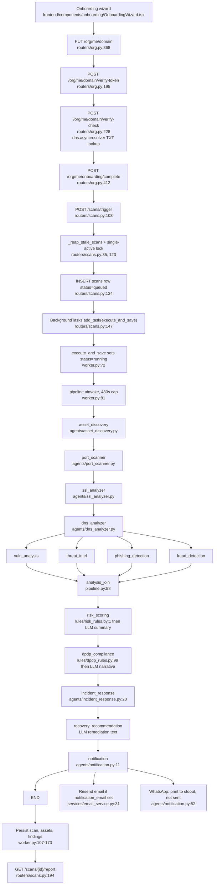

# Architecture

Scope: the real request path and the real scan lifecycle, from domain entry to notification, naming the module at each hop, plus the trust boundary that keeps the LLM out of scoring.

## Processes

There is one process in the request path: the FastAPI application built by `create_app` in `backend/app/main.py:25`. It registers nine routers (`backend/app/main.py:61-69`) and one unauthenticated `/health` endpoint (`backend/app/main.py:71`).

Scans run inside that same process. `POST /scans/trigger` imports `execute_and_save` and hands it to FastAPI's `BackgroundTasks` (`backend/app/routers/scans.py:145-149`). `BackgroundTasks` runs the coroutine on the server's event loop after the response is sent.

A Celery application and a `run_scan_pipeline` task exist in `backend/app/worker.py:26` and `backend/app/worker.py:178`. Nothing in the repository calls `.delay()`, `.apply_async()` or `send_task`. A grep for those names across the repo returns only the definition itself, a comment in `backend/app/routers/scans.py:111`, a comment in `backend/app/routers/webhooks.py:26`, and the loose script `backend/test_pipeline.py:49`, which calls the task function synchronously rather than enqueuing it. Celery is therefore dead code in the deployed path. Redis is started by `docker-compose.yml` and read by nothing at request time; `settings.redis_url` is only used to construct the unused Celery app (`backend/app/worker.py:18`).

The orchestrator inside `execute_and_save` is a compiled LangGraph `StateGraph`. `backend/app/agents/pipeline.py:80` constructs `StateGraph(AgentState)`, `backend/app/agents/pipeline.py:124` returns `workflow.compile()`, and `backend/app/agents/pipeline.py:127` binds the compiled graph to the module-level name `pipeline`. `backend/app/worker.py:82` invokes it with `pipeline.ainvoke(initial_state)`. This is a real compiled graph, not a sequential loop.

## Request lifecycle for an authenticated call

1. The browser calls the API with a Supabase access token in an `Authorization: Bearer` header (`frontend/lib/api/client.ts:127`).
2. `HTTPBearer` extracts the credential and `get_current_user_token` verifies it (`backend/app/dependencies.py:22`). Tokens with `alg: HS256` are verified against `SECRET_KEY`; everything else is verified against the signing key fetched from the Supabase JWKS endpoint constructed at `backend/app/dependencies.py:19`. Audience must be `authenticated`; 30 seconds of clock leeway is allowed.
3. `get_current_org` reads `sub` and an `org_id` claim, checking the token root, then `app_metadata`, then `user_metadata` (`backend/app/dependencies.py:91`). Both must parse as UUIDs. It returns a `CurrentOrg` carrying `user_id` and `org_id`.
4. Endpoints that expose tenant data additionally depend on `get_onboarded_org`, which reads `organizations.onboarding_completed` and raises 403 with the machine-readable detail `onboarding_incomplete` if it is false (`backend/app/dependencies.py:109`).
5. Endpoints that mutate additionally depend on `require_role(...)`, which looks up the caller's row in `members` and compares the role (`backend/app/dependencies.py:130`).
6. The handler opens a session through `get_db_session` (`backend/app/database.py:26`) and filters every query on `current_org.org_id`.

## Scan lifecycle

### Graph topology

Edges are declared in `backend/app/agents/pipeline.py:102-122`.

- Entry point: `asset_discovery` (`pipeline.py:102`).
- Phase 1 runs strictly sequentially: `asset_discovery` to `port_scanner` to `ssl_analyzer` to `dns_analyzer` (`pipeline.py:103-105`).
- Phase 2 fans out from `dns_analyzer` through a conditional edge whose router function ignores state and always returns all four targets: `vuln_analysis`, `threat_intel`, `phishing_detection`, `fraud_detection` (`pipeline.py:108-112`). The condition is unconditional, so the fan-out is fixed.
- All four fan back into `analysis_join` (`pipeline.py:114-115`).
- Phase 3 and 4 run sequentially: `analysis_join` to `risk_scoring` to `dpdp_compliance` to `incident_response` to `recovery_recommendation` to `notification` to `END` (`pipeline.py:117-122`).

That is 13 agent nodes plus one plain join node.

### State

`AgentState` is a `TypedDict` with no `Annotated` reducers (`backend/app/agents/state.py:20`). Because there are no reducers, each node's returned dict is merged key by key, and the parallel branch cannot append to a shared list. `analysis_join_node` compensates by explicitly concatenating the seven per-agent finding lists into `all_findings` (`backend/app/agents/pipeline.py:66-74`).

One consequence of having no reducer on `errors`: each `resilient` wrapper reads `state["errors"]`, appends one entry, and returns the whole list (`backend/app/agents/pipeline.py:45-52`). If two parallel branches fail in the same superstep, both compute their list from the same pre-fan-out snapshot, and the last write wins. Concurrent failures in phase 2 can therefore be under-reported in `degraded_providers`. This is inferred from the absence of reducers plus LangGraph's documented merge behaviour; it was not reproduced against a running graph. Not verified: the check is to force two phase-2 agents to raise in the same run and count entries in `scans.langgraph_state->'errors'`.

### Failure isolation

Every agent node is wrapped by `resilient` (`backend/app/agents/pipeline.py:32`). The wrapper applies `asyncio.wait_for` with `AGENT_TIMEOUT_SECONDS = 90` (`pipeline.py:29`) and catches both `asyncio.TimeoutError` and every other exception. On failure it appends a string to `errors` and returns only that key, so downstream nodes still run on whatever succeeded. No finding is fabricated on failure.

`execute_and_save` wraps the whole graph in `asyncio.wait_for` with `PIPELINE_TIMEOUT_SECONDS = 480` (`backend/app/worker.py:24`, `worker.py:81`). On timeout or any other exception it sets `status = "failed"`, sets `completed_at`, writes a human-readable `error_log`, and returns (`worker.py:84-104`). A separate reaper in the router recovers scans stuck past `SCAN_MAX_RUNTIME_SECONDS = 600` (`backend/app/routers/scans.py:32`, `scans.py:35`), which is deliberately larger than the pipeline cap so the worker fails cleanly first.

### Persistence

On success `execute_and_save` opens one session and, in one transaction (`backend/app/worker.py:107-173`):

- Sets `scans.status = "completed"`, `completed_at`, `risk_score`, a `findings_summary` counted from `all_findings`, and stores the entire final state in `scans.langgraph_state` (`worker.py:111-124`).
- Inserts an `assets` row per discovered subdomain and IP, skipping values that already exist for the org (`worker.py:130-153`).
- Inserts one `findings` row per entry in `all_findings`, mapping the state's `explanation` to `plain_explanation` and looking up remediation text in `remediation_map` (`worker.py:156-171`).

The remediation lookup at `worker.py:169` uses `f.get("finding_type")` as the key, while `recovery_recommendation` stores remediation under positional keys of the form `finding_{i}` (`backend/app/agents/recovery_recommendation.py:12-15`). The keys never match, so `findings.remediation_steps` is always null. The same positional-key scheme is used by `incident_response` (`backend/app/agents/incident_response.py:27`), and `ir_plan` is never read back out of state by any router.

Nothing writes `compliance_reports`, `notifications` or `audit_log`. DPDP results survive only inside `scans.langgraph_state`, which is where `GET /scans/{scan_id}/report` reads them from (`backend/app/routers/scans.py:213`, `scans.py:226-230`).

### Notification

`notification.run` builds a summary dict, loads the organization, and branches on the two stored contact fields (`backend/app/agents/notification.py:11-53`).

- Email: if `organizations.notification_email` is set, it calls `send_scan_report_email` (`notification.py:44`), which posts to Resend when `RESEND_API_KEY` is configured and otherwise prints a stub line (`backend/app/services/email_service.py:15-16`). The sender address is hardcoded to `security@qelvix.com` (`email_service.py:33`). `send_scan_report_email` is a synchronous function called from an async node, so it blocks the event loop for the duration of the HTTP request.
- WhatsApp: if `organizations.whatsapp_number` is set, it generates a message with the LLM and prints it. No HTTP call is made (`notification.py:50-53`). The string `whatsapp_stubbed` is appended to `notifications_sent`.

`notification.py:16` reads `state.get("findings_summary", {})`, but `findings_summary` is not a key of `AgentState` and no node writes it, so the summary passed to both channels is always empty.

## Trust boundary: what the LLM may and may not do

There is exactly one LLM client module, `backend/app/services/claude_service.py`. Despite the filename, no Anthropic client exists in the repository.

Providers, in order:

1. Primary: Google Gemini through its OpenAI-compatible endpoint. Base URL `https://generativelanguage.googleapis.com/v1beta/openai/` (`claude_service.py:26`), model `gemini-3.6-flash` (`claude_service.py:29`), 15s timeout, `max_retries=0`. Keys are tried in order: `GEMINI_PRIMARY_API_KEY`, then `FALLBACK_BACKUP_GEMINI_PRIMARY_API_KEY`, then the legacy `GEMINI_API_KEY`, deduplicated, skipping unset values (`claude_service.py:32-51`).
2. Fallback: NVIDIA NIM. Base URL `https://integrate.api.nvidia.com/v1` (`claude_service.py:18`), model `meta/llama-3.1-8b-instruct` (`claude_service.py:24`), 20s timeout, `max_retries=0`.

`_call_llm_with_retry` tries Gemini first, and on any exception falls through to NVIDIA (`claude_service.py:82-102`). If both fail it returns the literal string `"AI service temporarily unavailable (both primary and fallback failed)."` rather than raising, so a provider outage produces placeholder text in the explanation field rather than a failed scan.

`DEEPSEEK_API_KEY` has a field on `Settings` (`backend/app/config.py:37`) and is read by no code. No DeepSeek client is constructed. All temperatures are 0.0.

The LLM is allowed to:

- Write `finding["explanation"]`, which lands in `findings.plain_explanation` (`backend/app/agents/risk_scoring.py:15-16`, `backend/app/worker.py:167`).
- Write `risk_executive_summary` (`risk_scoring.py:23`).
- Write `dpdp_narrative` (`backend/app/agents/dpdp_compliance.py:15`).
- Write remediation text into `remediation_map` (`backend/app/agents/recovery_recommendation.py:14`).
- Write the WhatsApp message body, which is currently printed rather than sent (`backend/app/agents/notification.py:51`).

The LLM is not allowed to:

- Assign or change a severity. Every severity literal is written by a rules module under `backend/app/rules/`. See `RULES.md` for the exhaustive list.
- Produce the risk score or band. `calculate_risk` is pure arithmetic over severity counts (`backend/app/rules/risk_rules.py:13-28`) and is called at `backend/app/agents/risk_scoring.py:18`, before the summary call at line 23. The summary receives the already-computed `risk_data` and its return value is stored in a separate key.
- Decide a DPDP clause outcome. `evaluate_dpdp_compliance` runs six deterministic check functions and builds the clause list (`backend/app/rules/dpdp_rules.py:99-127`); the overall status is computed by an `all(...)` over those statuses at `backend/app/agents/dpdp_compliance.py:17`. `generate_dpdp_narrative` is called at line 15 with the finished clause list and its output is stored only in `dpdp_narrative`.
- Create or suppress a finding. Findings are appended only by the rules modules and by the explicit stub branches inside the agents.
- Call a tool, function or external API. No tool definitions, function schemas or tool-choice parameters appear anywhere in `claude_service.py`; every call is a plain `chat.completions.create` with a fixed message list.

The enforcing property is structural rather than a runtime check: LLM return values are only ever assigned to `explanation`, `risk_executive_summary`, `dpdp_narrative` and `remediation_map`, and no code path reads those keys back into a severity, score or status decision. There is no assertion or test that enforces this, so the boundary holds by construction and would need a test to keep holding.

## Frontend

`frontend/middleware.ts:8` runs `updateSession` on every non-static request. `updateSession` creates a Supabase server client over request cookies, calls `supabase.auth.getUser()` to revalidate the token against Supabase rather than trusting cookie contents (`frontend/lib/supabase/middleware.ts:56`), redirects unauthenticated users away from the 13 protected prefixes listed at `frontend/lib/supabase/config.ts:21`, and redirects authenticated users off `/login`, `/signup` and `/forgot-password`.

Inside the `(app)` group, `OnboardingGuard` calls `GET /org/me/onboarding` and redirects to `/onboarding` unless `onboarding_completed` is true, caching the positive result in `sessionStorage` for the tab (`frontend/components/onboarding/OnboardingGuard.tsx:22-53`). On a transient backend error it fails open in the UI and relies on the backend 403 to gate the data (`OnboardingGuard.tsx:48`).

Data screens fetch directly with the Supabase access token through the `useApi` hook or bare `fetch` (`frontend/lib/api/client.ts:102`). There is no server-side API proxy; the browser talks to the FastAPI origin directly, which is why CORS is configured against a single `frontend_url` (`backend/app/main.py:41-47`).
